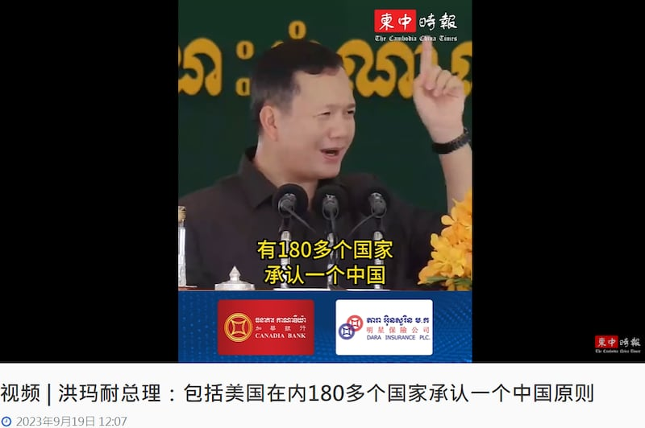
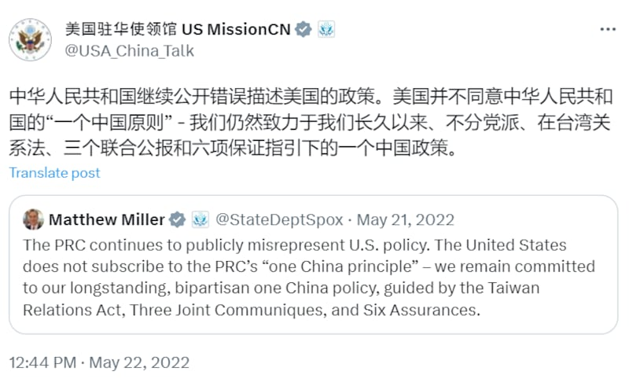

# Does the US adhere to the ‘One China principle’?

## Verdict: False

By Zhuang Jing for Asia Fact Check Lab

2023.10.05

Taipei, Taiwan

## A claim making the rounds on social media states that more than 180 U.N. member states, including the United States, subscribe to the “One China principle.” This is a core conviction of the People’s Republic of China – that Taiwan is an inalienable part of China and that it should be governed from Beijing. The posts cited remarks made by Cambodia’s new Prime Minister Hun Manet after a recent visit to Beijing.

## But the claim is false. First, the United States does not agree with the One China principle, instead adhering to its distinct "One China   *policy*  ," that takes no position on sovereignty over Taiwan. Basically, Washington  acknowledges Beijing's position, but does not take a stance on its validity. Secondly, research shows that there are 51 countries – not more than 180 – that follow a policy that "substantively approach or replicate" the People's Republic of China's "One China" principle.

Manet's video was published [here](https://cc-times.com/videos/1237) on Sept. 19 by *The Cambodia China Times.*

“Out of 193 U.N. member states, more than 180 recognize the one-China (principle), including the United States,” Manet said. “There is nothing wrong with Cambodia’s adherence to the One China principle.”

The One China principle is official Chinese policy that its government in Beijing is the sole legitimate representative of China, that Taiwan is an inalienable part of China and that resolving the question of Taiwan’s sovereignty is an internal Chinese affair, which no external force has the right to interfere in.

Manet's remarks came after his first visit to China on Sept. 14-16. China and Cambodia [issued](https://www.mfaic.gov.kh/posts/2023-09-16-Press-Release-Joint-Communiqu%C3%A9-between-the-Royal-Government-of-Cambodia-and-the-Government-of-the-People-s-Republi-18-33-30) a joint communique reaffirming Cambodia's continued adherence to its longstanding one China policy, a point that Hun [reiterated](https://pressocm.gov.kh/en/archives/85299) in a [subsequent](https://www.phnompenhpost.com/national-politics/cambodia-among-181-behind-one-china-pm) speech given on Sept. 19.

This statement was also cited by the Beijing backed outlets  [*Huanqiu Online*](https://www.douyin.com/user/MS4wLjABAAAACmUNK8yr2VV3JyWj5_zVxjC0llSWAcYSjtOV0EdyQxs?modal_id=7280808376878042409)  and the  [*Straits Plus*](https://www.douyin.com/user/MS4wLjABAAAAUtnk7_oB-bKXsXu9LULf6n5FXZAKa9RMrh3YwrM_lOo?modal_id=7280831616455380239)  on their official Douyin accounts.

The Cambodia China Times released a video saying that Cambodian Prime Minister Hun Manet claimed that more than 180 countries have recognised the one-China principle, including the United States. (Screenshot/ The Cambodia China Times)

## Washington’s “One China policy”

The United States does not agree with the One China principle, instead adhering to its distinct “One China policy,” which is purposefully ambiguous. The United States does not take a position on the resolution of the cross-Taiwan Straits situation, leaving any final resolution of their differences up to the two parties.

Current State Department Spokesperson Matthew Miller states that the U.S. does not subscribe to the PRC’s one China principle. (Screenshot/X)

“The U.S. has long abided by our one-China policy. This is distinct from Beijing’s ‘One China principle’ under which the Chinese Communist Party asserts sovereignty over Taiwan. The United States takes no position on sovereignty over Taiwan,” a U.S. State Department spokesman told AFCL, requesting anonymity per the ministry’s normal practice for background information.

The spokesman noted that Washington will continue to support a peaceful resolution of cross-straits issues in a manner consistent with the wishes and best interests of the Taiwanese people.

## Less than 181 countries

Beijing has also misleadingly claimed that all 181 countries it has diplomatic relations with recognize the “One China principle,” but that’s not accurate.

Research by Ja Ian Chong, an associate professor of political science at the National University of Singapore, [found](https://carnegieendowment.org/2023/02/09/many-one-chinas-multiple-approaches-to-taiwan-and-china-pub-89003) that 51 countries maintain positions on "One China" that approach or replicate Beijing's "One China principle."

Chong classified 181 nations into 10 different categories based on their positions toward “One China,” and those 51 countries belong to the category 1 that “recognize PRC (People’s Republic of China) as sole legitimate government of China (or representing all Chinese people) and Taiwan as part of China (province or inalienable part).”

Meanwhile, the United States is the only country that belongs to the category 7 that “recognizes PRC as the sole legitimate government of China and ‘acknowledges’ the PRC’s position that Taiwan is part of China,” according to Chong’s research.

Chong noted that his categorization is “not meant to indicate a government’s current policies but rather the language that the government has used” to refer to mainland China and Taiwan.

## *Translated by Shen Ke. Edited by Taejun Kang and Malcolm Foster.*

*Asia Fact Check Lab (AFCL) is a branch of RFA established to counter disinformation in today’s complex media environment. Our journalists publish both daily and special reports that aim to sharpen and deepen our readers’ understanding of public issues.*

[Original Source](https://www.rfa.org/english/news/afcl/fact-check-one-china-10052023103644.html)