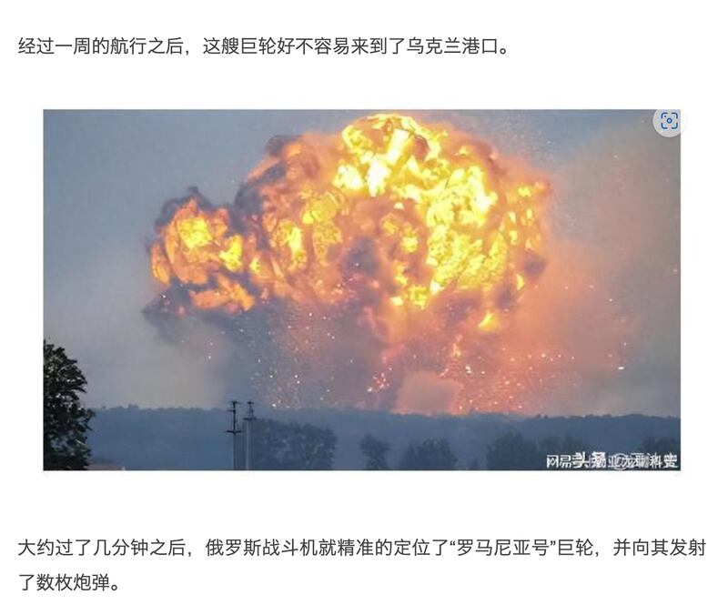
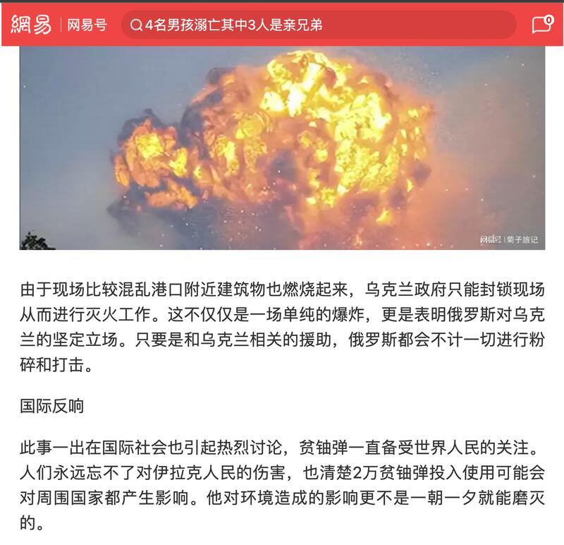
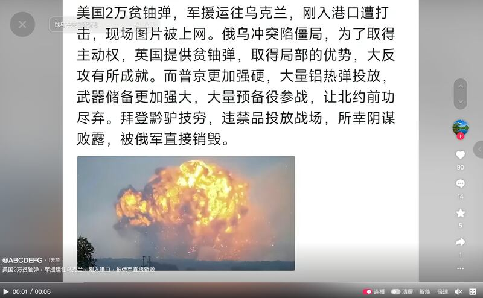
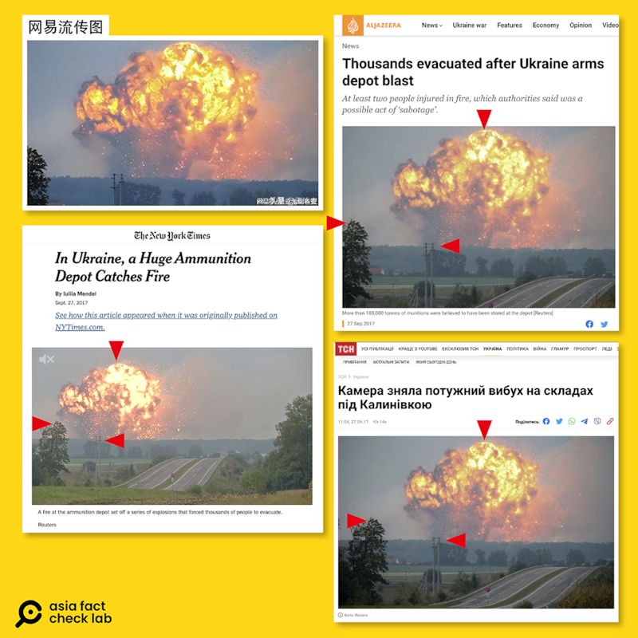

# Did Russia destroy US ship bearing uranium munitions to Ukraine?

## Verdict: False

By Dong Zhe for Asia Fact Check Lab

2023.10.06

Taiwan, Taiepi

## After the United States announced in early September that  it would supply depleted uranium munitions to Ukraine, a claim began to circulate in Chinese-language posts that a ship carrying such munitions was destroyed by Russian fighter jets, citing a photo as a proof.

## But the claim is false. The photo in fact shows an arms depot explosion which occurred in Ukraine in 2017. Keyword searches found no credible reports to back the claim.

The claim and the photo were shared in posts on popular Chinese social media platforms such as Douyin and NetEase as seen [here](https://web.archive.org/web/20230928052646/https://www.163.com/dy/article/IEQTD0UT055633SG.html) and [here](https://web.archive.org/web/20230928052644/https://m.163.com/dy/article/IES7NNVG0553FN1H.html?spss=sps_sem).

“The United States shipped 20,000 depleted uranium bombs to Ukraine. They were attacked as soon as they entered the port… The well-prepared Russian army quickly locked onto the giant ship and blew it up and sank it in the port,” one post reads in part.

The claim was accompanied by several photos with the posts specifically citing one photo of the explosion as the evidence of the Russian attack.

The claim emerged after the U.S. Department of Defense formally announced on Sept. 6 that it would supply depleted uranium munitions to Ukraine as part of US$175 million in additional military aid to the country. Officials did not state a specific date for when the shipment would be sent to Ukraine.

This announcement was met with strong criticism from Russia, and shortly thereafter claims circulated on Chinese social media about Russian jets taking down a U.S. vessel.

But the claim is false. The photo in fact shows an arms depot explosion which occurred in Ukraine in 2017.

Chinese netizens claim that Russian fighter jets sank a US ship transporting depleted uranium shells. (Screenshot/Douyin & Netease)

## Old photo

A reverse image search on Google found the matching photo published in media reports about a Ukrainian arms depot explosion in 2017 as seen [here](https://www.aljazeera.com/news/2017/9/27/thousands-evacuated-after-ukraine-arms-depot-blast) and [here](https://www.nytimes.com/2017/09/27/world/europe/ukraine-ammunition-depot-explosion.html) as well as on China's official military [website](http://www.js7tv.cn/news/201709_113461.html).

The caption of the photo, credited to Reuters, reads: “More than 180,000 tonnes of munitions were believed to have been stored at the depot.”

The explosion occurred after a depot in Kalynivka, a city about 175 kilometers (110 miles) from Kiev, caught fire, forcing local authorities to eventually evacuate more than 30,000 people from the area.

A closer look at the original photo shows that the fireball featured in the photo was enlarged and cropped before being used as alleged evidence of the destroyed ocean liner full of uranium munitions. However, the actual shape of the fireball in both pictures exactly match, as are peripheral details such as trees and electric poles in the surrounding countryside.

Below is a screenshot comparison.

## *Translated by Shen Ke. Edited by Taejun Kang and Malcolm Foster.*

*Asia Fact Check Lab (AFCL) is a branch of RFA established to counter disinformation in today’s complex media environment. Our journalists publish both daily and special reports that aim to sharpen and deepen our readers’ understanding of public issues.*

[Original Source](https://www.rfa.org/english/news/afcl/fact-check-uranium-ukraine-10062023163744.html)