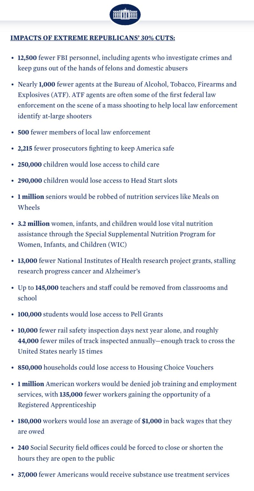

# Did the Biden administration announce FBI layoffs?

## Verdict: False

By Zhuang Jing for Asia Fact Check Lab

2023.10.10

Taipei, Taiwan

## Chinese-language posts claimed the Biden administration called for substantial budget cuts and layoffs of the FBI and the Bureau of Alcohol, Tobacco, Firearms and Explosives, or ATF, citing a statement from a White House spokesperson.

## But the claim is false. The individual cited by social media users is not a White House spokesperson, and the statement was a critique of the prospective impact of Republican legislators’ proposed spending cuts, not an administration announcement.

The claim was shared [here](https://c.m.163.com/news/a/IFTIERQ00553P06W.html) on Chinese media platform NetEast on Sept. 30.

“Extremely dangerous signals! President Joe Biden has called for budget cuts to eliminate 12,000 FBI agents and nearly 1,000 ATF agents, according to a White House spokesman. The United States is really running out of money!” the claim reads in part.

The claim emerged as Democratic and Republican congressional legislators temporarily averted a partial government shutdown by passing a 45-day temporary funding bill just hours before a midnight deadline on Oct. 1.

The bill was a stopgap that forgoes large-scale aid to Ukraine and fails to resolve fundamental budgetary differences between the two parties.

The claim was widely shared by Chinese-speaking social media users, including an influential Weibo user with more than a million followers who also shared a 21-second [clip](https://weibo.com/tv/show/1034:4951677657350197?from=old_pc_videoshow) of the alleged White House official as evidence.

As the U.S. government faces a standoff between Republicans and Democrats over next year’s fiscal budget, Chinese netizens claim that President Biden called for large budget cuts and layoffs of FBI and ATF personnel. (Screenshots/Weibo and Netease)

However, the claim is false. Below is what AFCL found.

## Not a White House spokesperson

A reverse image search on Google found the corresponding video published [here](https://www.youtube.com/watch?v=LNLl8UKaDPI) on *USA Today's* official YouTube account on Sept. 30, 2023.

The video shows Shalanda Young, director of the Office of Management and Budget – not a White House spokesperson – describing the potential effects of a federal government shutdown.

The clip’s 40-second part matches the video shared in the misleading social media posts.

“Their [Republican legislators'] bill includes devastating 30 percent cuts. You heard me: 30 percent cuts,” she says. “It would eliminate 12,000 FBI agents, almost 1,000 ATF agents, and more than 500 local law enforcement.”

Young’s comments regarding layoffs of federal employees were a critique of recent budget cuts proposed by Republican legislators in light of the looming government shutdown.

Further searches found the full [video](https://www.youtube.com/watch?v=RKS7IBlAt0M) published on the White House's official YouTube channel and [transcript](https://www.whitehouse.gov/briefing-room/press-briefings/2023/09/30/press-briefing-by-press-secretary-karine-jean-pierre-and-office-of-management-and-budget-director-shalanda-young-2/) on its website.

Young went on to note that the proposed budget cuts would potentially impact over ten million citizens in various ways, before calling for “extreme House Republicans” to stop playing politics and keep the government running.

On Sept. 29, the White House released information outlining the possible impacts of the recent budget cuts proposed by Republicans. (Screenshot/White House official website)

The White House released a fact sheet later the same day which [reiterated](https://www.whitehouse.gov/briefing-room/statements-releases/2023/09/29/by-the-numbers-impacts-of-extreme-house-republicans-30-cuts/) many points from Young's speech.

## *Edited by Taejun Kang and Malcolm Foster.*

*Asia Fact Check Lab (AFCL) is a branch of RFA established to counter disinformation in today’s complex media environment. Our journalists publish both daily and special reports that aim to sharpen and deepen our readers’ understanding of public issues.*

[Original Source](https://www.rfa.org/english/news/afcl/fact-check-biden-fbi-layoffs-10102023125700.html)