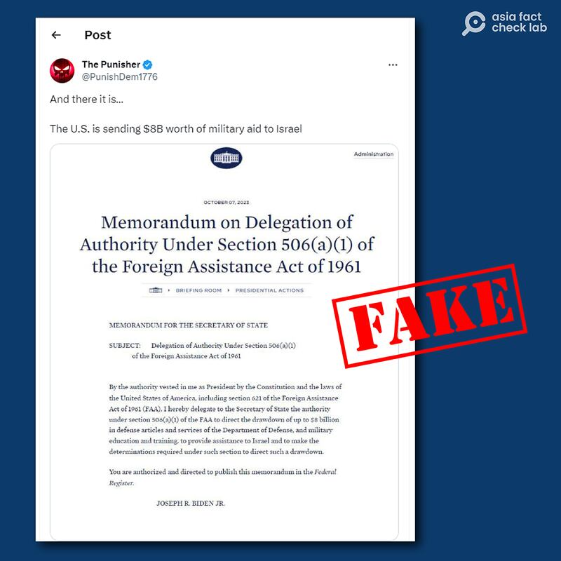
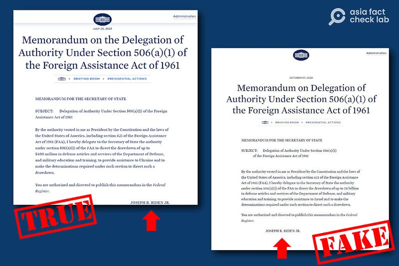

# Did the White House issue memo to fund Israel for Gaza conflict?

## Verdit: False

By Rita Cheng for Asia Fact Check Lab

2023.10.11

Washington

## Following a full-scale attack against Israel by Hamas, the Palestinian militant organization, on Oct. 7, social media users began sharing a photo of a document, claiming it shows a White House memorandum promising US$8 billion in military aid to Israel.

## However, the photo has been digitally doctored. The official White House website contains no such document. Keyword searches found no credible reports that support the claim.

The claim was shared on X, formerly known as Twitter, on Oct. 7 by a user named The Punisher, who wrote: “The U.S. is sending $8B worth of military aid to Israel,” alongside what appears to be a screenshot of a document published by The White House.

“Memorandum of Delegation of Authority Under Section 506(a)(1) of the Foreign Assistance Act of 1961 / MEMORANDUM FOR THE SECRETARY OF STATE / JOSEPH R. BIDEN JR.,” the document reads in part.

The screenshot has been widely circulated across English and Chinese social media, with Chinese online users subsequently misleadingly claiming that U.S. political figures are “intending to stir up the conflict” with online comments.

Thousands of missiles have already struck Israel in what media outlets [describe](https://www.reuters.com/world/middle-east/how-israel-was-duped-hamas-planned-devastating-assault-2023-10-08/) as the most serious attack Israel has suffered since the 1973 Arab–Israeli War. Israel's Ministry of Defense has [dubbed](https://theintercept.com/2023/10/09/israel-hamas-september-11/) it "Israel's 9/11."

After speaking with Israeli Prime Minister Netanyahu, U.S. President Joe Biden [expressed](https://www.youtube.com/watch?v=gixYhd8pjhw) support for Israel at a press conference on the day that hostilities broke out. The U.S. government continued its show of support by [lighting up](https://thehill.com/homenews/administration/4246491-white-house-to-light-up-blue-and-white-for-israel/) the White House with the Israeli flag colors of blue and white on Oct. 9, but has not publicly released any specific assistance plans as of press time.

An X user posted a screenshot of a falsified memorandum claiming the U.S. announced $8 billion in military aid to Israel on October 7. X later labeled the message as fake. (Screenshot/X)

However, the claim is false. Below is what AFCL found.

## Doctored screenshot

The White House did announce military aid to countries such as Ukraine and Taiwan earlier in 2023. AFCL discovered that the photo shared in misleading social media posts is likely to have been digitally doctored by using a version of one such earlier announcement in support of Ukraine under the Foreign Assistance Act of 1961.

A closer look at the photo shows that the date, recipient country and amount of aid appear to have been altered in the original document, and Biden’s signature has been moved from the lower right to the lower center of the document.

Below is a screenshot comparison.

A White House memo announcing military aid to Ukraine issued in July (left) was likely the original document from which the falsified document (right) was created. The majority of content in the two documents is the same (Screenshot/X and Twitter)

Keyword searches on the official White House website and several portal websites found no official or credible reports that show the U.S. published such a document promising financial aid to Israel.

The post and the doctored documents have been labeled as misinformation by X.

## *Translated by Shen Ke. Edited by Taejun Kang and Malcolm Foster.*

*Asia Fact Check Lab (AFCL) is a branch of RFA established to counter disinformation in today’s complex media environment. Our journalists publish both daily and special reports that aim to sharpen and deepen our readers’ understanding of public issues.*

[Original Source](https://www.rfa.org/english/news/afcl/fact-check-hamas-10112023132904.html)