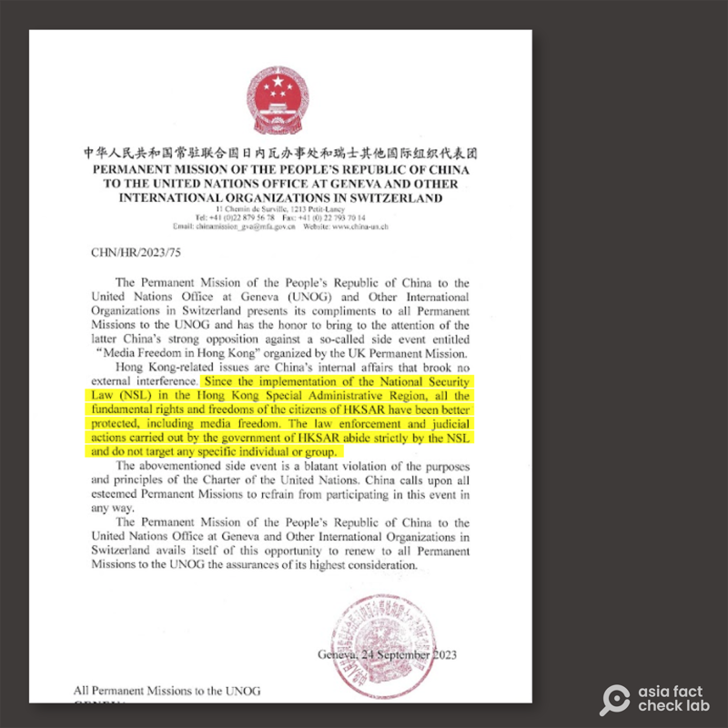
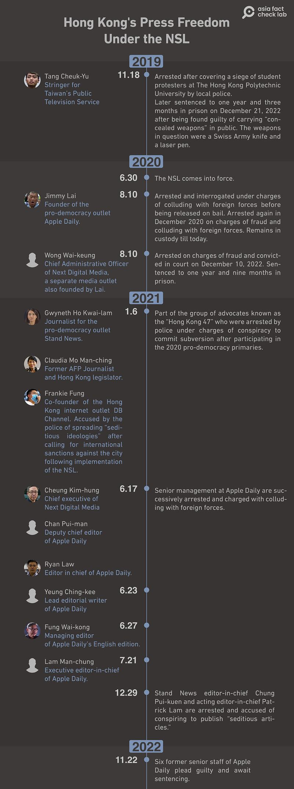

# Has the National Security Law improved Hong Kong’s press freedom?

## Verdict: Misleading

By Rita Cheng for Asia Fact Check Lab

2023.10.17

Washington

## Chinese officials claimed that Hong Kong citizens have enjoyed increased fundamental rights and liberties, including freedom of the press, in the three years since the implementation of the 2020 Hong Kong’s National Security Law, or NSL.

## However, the claim is misleading. Evidence provided by several independent organizations shows that Hong Kong’s civil society and press freedom have deteriorated significantly since the implementation of the NSL.

On Sept. 25, West Kowloon Magistrates Courts of Hong Kong ruled that Ronson Chan, chairman of the Hong Kong Journalists Association, was guilty of obstructing a public officer and sentenced to five days in jail. Chan was originally arrested in September 2022 after refusing to show his identity card to a plainclothes police officer.

The day before Chan’s sentencing, Chinese diplomats at the country’s permanent mission to the U.N. in Geneva sent a letter pressuring all countries to refrain from interfering in China’s internal affairs and prevent the U.K. from organizing an event showing solidarity with freedom of the press in Hong Kong during a session of the United Nations Human Rights Council.

The event was also intended to express support for Jimmy Lai, the convicted publisher of the now defunct anti-Beijing news outlet *Apple Daily* who recently observed the thousandth day of his imprisonment.

China claimed in the letter that all fundamental rights and freedoms of Hong Kong residents, including freedom of the press, have been better protected since the adoption of the National Security Law.

The law, which came into effect in 2020, [criminalizes](https://www.basiclaw.gov.hk/en/basiclaw/index.html) several broadly defined offenses including secession, subversion, collusion with foreign forces and terrorist activities.

The claim was repeated by both China's [Office of the Commissioner in Hong Kong](https://baijiahao.baidu.com/s?id=1764153051453535106&wfr=spider&for=pc) and the [Hong Kong government](https://baijiahao.baidu.com/s?id=1778289116630715707&wfr=spider&for=pc) and also widely [reported](http://www.takungpao.com/news/232109/2023/0510/848415.html) by pro-China media outlets, including *Ta Kung Pao.*

Chinese diplomats to the UN sent a letter asking other countries not to interfere in Chinese domestic affairs and claiming that Hong Kong residents enjoy greater press freedom under the NSL. (Screenshot/China’s Permanent Mission to the UN)

However, the claim is misleading.

## Hong Kong’s press freedom ‘in decline’

Hong Kong has witnessed a significant drop in ranking in the [World Press Freedom Index](https://rsf.org/en/index) since the adoption of the NSL.

The index is an annual ranking of countries compiled and published by Reporters Without Borders, or RSF, based upon the organization’s own assessment of the countries’ press freedom records in the previous year. It aims to reflect the level of freedom journalists, news organizations, and netizens enjoy in each country, as well as the efforts made by authorities to uphold this freedom.

The former British colony’s ranking on the index dropped from 80 in 2021 to 140 in 2023.

RFS noted that the Hong Kong government has prosecuted 28 journalists and media workers since the law was implemented, of which 12 are still in jail, including Jimmy Lai and eight employees affiliated with *Apple Daily*.

All told, at least 264 people – including non-journalists – have been arrested and 148 prosecuted under the law as of July 1, 2013, unofficial statistics show.

The trend is evident in comparable indicators. The city's overall ranking also dropped from 67 to 42 in the annual [Global Freedom Index](https://freedomhouse.org/explore-the-map?type=fiw&year=2023) published by the U.S. non-profit organization Freedom House, in which higher number indicates a greater press freedom, with the sub-index on the right to free expression and belief falling from 14 to 7 over the past decade.

A separate report [published](https://www.hkinquiry.org/mediafreedominhongkongreport) by the U.K.-based All-Party Parliamentary Group on Hong Kong in April 2023 states that eight independent news organizations in Hong Kong have closed since the NSL came into effect, either due to the arrests of their journalists or for the protection of their staff. This has in turn left over a thousand news personnel unemployed, two hundred of whom have already left the city.

AFCL compiled a non-exhaustive list of incidents in which Hong Kong journalists and media workers were arrested and jailed before and after the NSL came into effect. (Photo/AFCL)

“The demise of critical media in Hong Kong can be understood as being part of a quickened process of democratic backsliding or autocratization,” said Francis L.F. Lee, a professor at the School of Journalism and Communication at the Chinese University of Hong Kong, in his 2022 study analyzed the NSL’s impact on journalism in the city.

Lee emphasizes that during such retrogression, the state can utilize a nominally independent judicial system as a tool to control media narratives and restrict press freedom, in effect legalizing press control.

## *Translated by Shen Ke. Edited by Taejun Kang and Malcolm Foster.*

*Asia Fact Check Lab (AFCL) is a branch of RFA established to counter disinformation in today’s complex media environment. Our journalists publish both daily and special reports that aim to sharpen and deepen our readers’ understanding of public issues.*

[Original Source](https://www.rfa.org/english/news/afcl/fact-check-hong-kong-national-security-law-10172023162145.html)