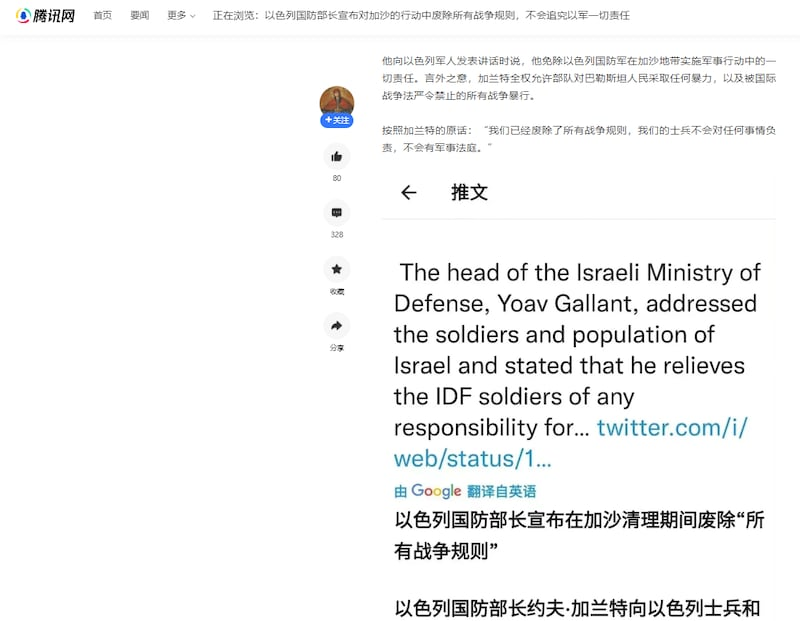
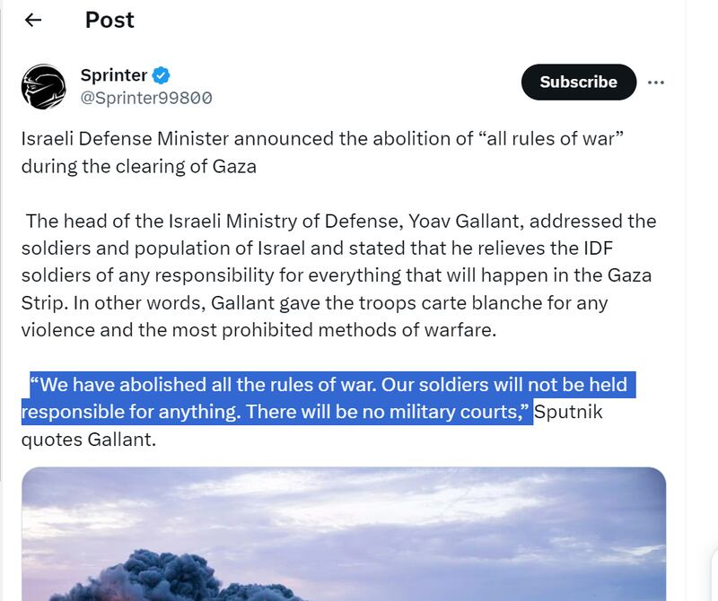
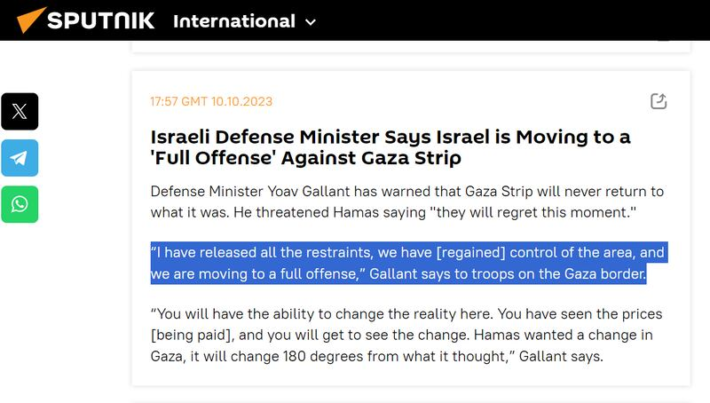

# Did Israel defense minister say rules of war are abolished in Gaza?

## Verdict: False

By Rita Cheng for Asia Fact Check Lab

2023.10.23

Washington

## Following the outbreak of a conflict in Gaza after the Islamic militant group Hamas launched a surprise attack against Israel on Oct. 7, a claim began to circulate in Chinese-language social media posts saying that Israeli Minister of Defense Yoav Gallant announced the abolition of all rules of war, in addition to exempting Israeli military personnel from possible war crimes liability.

## However, the claim is false. There are no official announcements or credible reports to show that Gallant made such remarks. AFCL discovered Chinese online users rely on unverified and second-hand information to make such a false claim.

The claim was shared in a [post](https://web.archive.org/web/20231020061450/https://k.sina.cn/article_1403915120_53ae0b70020017nlc.html?from=mil) published on popular Chinese social media platform Weibo on Oct. 12, citing the official Russian state-owned news outlet Sputnik.

“According to Sputnik, Israel’s Defence Minister announced that during the ‘Iron Sword’ military retaliation against Gaza, ‘all rules of war’ would be abolished, and that individual combat units would be free to launch offensives, decide on their own modus operandi, and strike targets without reporting them and move to a full-scale offensive, as well as exempting Israeli soldiers and officers from liability for possible war crimes,” the claim reads in part.

The identical claim was shared in a lengthy [post](https://web.archive.org/web/20231020062516/https://new.qq.com/rain/a/20231011A08M7E00) published on another popular Chinese social media service QQ, which included a screenshot of an English-language post as evidence to back its claim.

Chinese netizens circulated rumors claiming that the Israeli Defense Minister announced the abolition of all rules of war in Gaza. (Screenshot/QQ)

The rules of war, often termed as international humanitarian law, outline the dos and don’ts in times of armed conflict.

The law primarily aims to instill a sense of humanity during wars, with the goal of preserving life and mitigating distress. It governs the conduct of warfare by balancing the objectives of incapacitating the adversary while minimizing hardship.

More details can be found [here](https://www.icrc.org/en/document/rules-war-why-they-matter) on the website of the International Committee of the Red Cross.

However, the claim is false.

A combined keyword search and reverse image search on Google found that the English-language post cited by QQ user shows a tweet from X, formerly Twitter, posted by a user named Sprinter on Oct. 10.

The X user cited the Russian official media outlet Sputnik as the original source of Gallant’s reported quote.

The Weibo post also cited Sputnik as its source to back the claim.

A tweet by an X user named Sprinter was the earliest source of the rumors about Gallant’s statements. (Screenshot/X)

But keyword searches found no such statement on Sputnik's website. Instead, AFCL found a [report](https://sputnikglobe.com/20231010/live-updates-hamas-says-goals-of-operation-achieved-open-to-talks-1114055028.html) published by the outlet on Oct. 10 citing Galant as saying Israel planned to launch a full-scale offensive against Gaza.

“I have released all the restraints, we have [regained] control of the area, and we are moving to a full offense.” the Sputnik report reads in part.

The report made no mention of all rules of war.

The original Sputnik report quoted Galant as saying that Israel was about to switch to the offensive. There was no mention of abolishing the rules of war in the report. (Screenshot/Sputnik)

Keyword searches found no official announcements or credible reports to show that Gallant made remarks on “abolishing all rules of war” or “exempting Israeli soldiers and officers from liability for possible war crimes.”

## *Translated by Shen Ke. Edited by Taejun Kang and Malcolm Foster.*

*Asia Fact Check Lab (AFCL) is a branch of RFA established to counter disinformation in today’s complex media environment. Our journalists publish both daily and special reports that aim to sharpen and deepen our readers’ understanding of public issues.*

[Original Source](https://www.rfa.org/english/news/afcl/fact-check-gaza-rules-of-war-10232023132942.html)