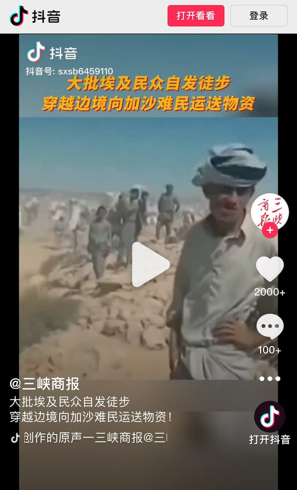
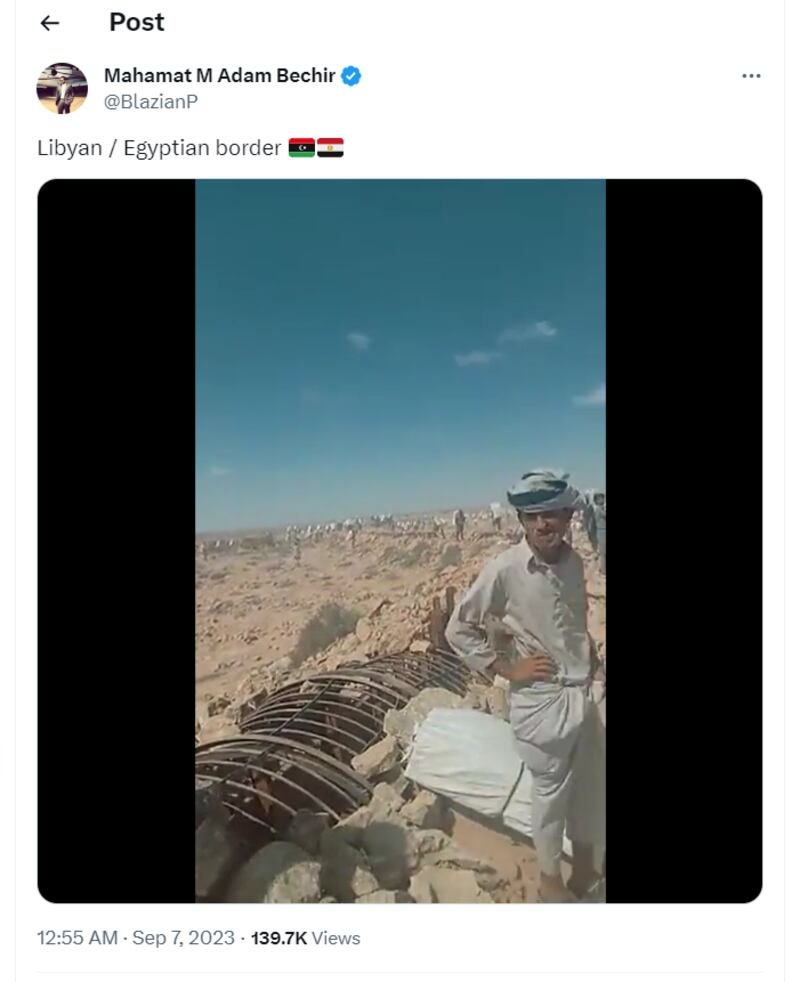

# From Netanyahu to Egypt: False claims spread amid Israel conflicts

## AFCL debunks two images widely shared online in false context.

By Dong Zhe and Rita Cheng for Asia Fact Check Lab

2023.10.24

Taipei and Washington

Following the recent surprise attack against Israel by the Islamic militant group Hamas, a photo spread among Chinese social media users who claimed it shows Israeli Prime Minister Benjamin Netanyahu sending his son to the front lines.

Separately, Chinese media outlets posted a clip alongside a claim that it shows Egyptians sending supplies on foot into Gaza amid the conflict.

Both claims are false. The photo of Netanyahu and his son was in fact taken in 2014, while the video has been circulated online since September 2023. Keyword searches found no credible reports to back the claims.

A photo of Netanyahu and his wife standing in front of their son Avner was widely circulated on Chinese social media outlets including [NetEase](http://archive.ph/wip/HJTEb) and [Weibo](http://archive.ph/wip/FlQyr).

“Netanyahu sends his own son to war, while a terrorist leader sends someone else’s son to war. That’s the difference,” reads the Weibo post posted on Oct. 12.

Following Hamas’ Oct. 7 attack, a new round of conflict erupted between the Israeli military and the militants, who are considered the de facto political power within the Gaza Strip. The conflict has already caused heavy casualties, with more than 4,000 total deaths in the week since the war began.

A purported image of the Israeli prime minister sending his son to the front line in the current Israeli- Hamas war is actually an old photo from 2014. (Screenshot/Weibo, NetEase & X)

But the claim is false.

A reverse image search on Google found the image first [appeared](https://archive.ph/SPHNh) in a report published by the Israeli online newspaper *The Times of Israel* in December 2014.

“Prime Minister Benjamin Netanyahu and his wife Sara, seen with their son Avner, at the Jerusalem’s Ammunition Hill on December 01, 2014,” the caption of the photo reads. The photo is credited to Kobi Gideon, a photographer for Israel’s Government Press Office.

Netanyahu later [noted](https://web.archive.org/web/20231012135319/https://www.facebook.com/plugins/post.php?href=https%3A%2F%2Fwww.facebook.com%2FNetanyahu%2Fposts%2F10155189411872076&show_text=true&width=500) that Avner completed his three years of military service.

Keyword searches found no credible reports or announcements that confirm Avner is participating in the current conflict between Israel-Hamas.

## Egyptian aid

Separately, local Chinese media outlets also circulated a video published on Douyin, the Chinese equivalent to TikTok, alongside a false claim that it shows Egyptians sending supplies on foot to people in Gaza.

A number of videos on Douyin purporting to show Egyptians delivering aid to Gaza after the recent outbreak of conflict between Israel and Hamas are misrepresenting videos of unrelated events. (Screenshot/Douyin)

But a reverse image search on Google found the identical video published [here](https://twitter.com/BlazianP/status/1699647500829802932) on X, formerly known as Twitter, in September 2023.

“Libyan / Egyptian border,” the caption of the video reads.

Comments left on the post suggest that the clip was filmed on the border between Yemen and Saudi Arabia and that it showed a local smuggling operation taking place.

The video purportedly showing Egyptians delivering supplies to Gaza appeared on X in September 2023. (Screenshot/X)

AFCL was not able to independently verify the location where the video was filmed, but it can confirm that the clip has no relation to the conflict between Israel and Hamas.

## *Translated by Shen Ke. Edited by Taejun Kang and Malcolm Foster.*

*Asia Fact Check Lab (AFCL) is a branch of RFA established to counter disinformation in today’s complex media environment. Our journalists publish both daily and special reports that aim to sharpen and deepen our readers’ understanding of public issues.*

[Original Source](https://www.rfa.org/english/news/afcl/netanyahu-egypt-china-10242023112641.html)