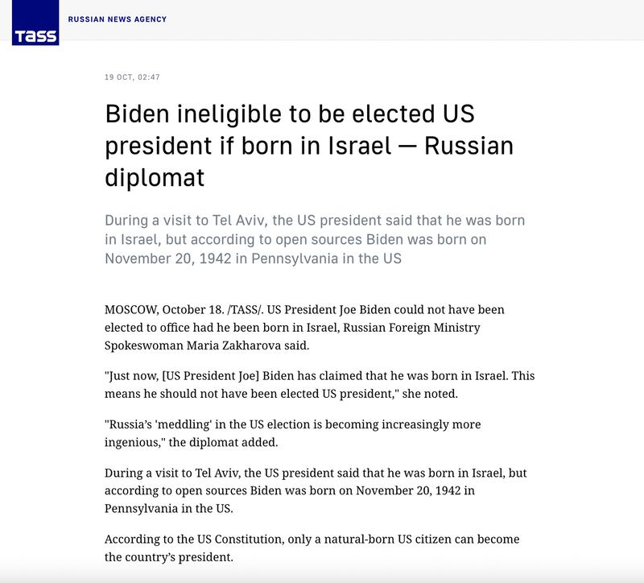
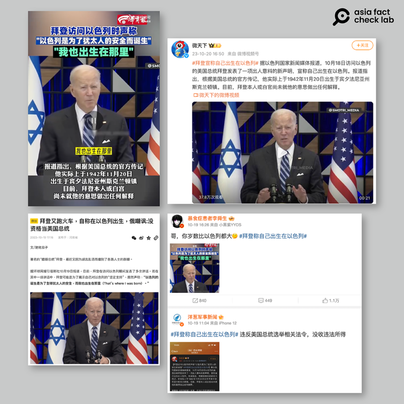

# Did Biden claim he was born in Israel?

## Verdict: False

By Zhuang Jing for Asia Fact Check Lab

2023.10.26

Taipei, Taiwan

## A claim has been widely circulated in Chinese-language social media posts that claim U.S. President Joe Biden said during his latest visit to Tel Aviv that “he was born in Israel.”

## But the claim is false. Biden’s remarks have been misrepresented. A review of a video and a transcript of his speech found no mention of him being born in Israel.

The claim was first shared in [this report](https://tass.com/politics/1693189) published by Russia's state-run news agency TASS on Oct. 19.

TASS cited Russian Foreign Ministry Spokeswoman Maria Zakharova as saying: “Just now, [US President Joe] Biden has claimed that he was born in Israel. This means he should not have been elected US president.”

The Russian Foreign Ministry questioned whether President Biden was eligible to run for U.S. president after the president reportedly stated he was born in Israel. (Screenshot/TASS)

The claim emerged as Biden departed Israel on Oct. 18 after a high-stakes diplomatic mission to demonstrate solidarity with Israel, but also to secure Israel’s commitment to allow humanitarian aid into Gaza and deliver a personal warning to exercise restraint.

It is unusual for an American president to openly visit a country at war, and such visits are often kept secret until arrival due to security concerns.

This time, however, the Biden administration disclosed the itinerary in advance and televised the visit, an uncommon move widely interpreted as an effort by the United States to dissuade Israel from deploying ground troops in Gaza.

The identical claim was also repeatedly shared on famous Chinese social media platforms such as Weibo and Netease. At one point, the hashtag #BidenSaysHeWasBornInIsrael was trending among the users.

Rumors that President Biden acknowledged he was born in Israel spread across Chinese social media. (Screenshot / Weibo and Sohu)

However, the claim is false. Biden’s remarks have been misrepresented.

Keyword searches on YouTube found a recording of Biden's speech on Oct. 18 during his visit to Tel Aviv published [here](https://www.youtube.com/watch?v=BEX_vUkKLMo) on the official YouTube channel of the U.S. Department of State.

At the clip’s 4:45 mark, he said: “The State of Israel was born to be a safe place for the Jewish people of the world. That’s why it was born. I have long said: If Israel didn’t exist, we would have to invent it.”

Such remarks can be seen in the [official transcript](https://www.whitehouse.gov/briefing-room/speeches-remarks/2023/10/18/remarks-by-president-biden-on-the-october-7th-terrorist-attacks-and-the-resilience-of-the-state-of-israel-and-its-people-tel-aviv-israel/) of the speech published on White House's website on Oct. 18.

A review of a video and a transcript of his speech found no mention of him being born in Israel.

The claim has also been debunked by other international organizations, including [Newsweek](https://www.newsweek.com/joe-biden-born-israel-speech-russia-hamas-fact-check-1836098).

## *Translated by RFA staff. Edited by Taejun Kang and Malcolm Foster*

*Asia Fact Check Lab (AFCL) is a branch of RFA established to counter disinformation in today’s complex media environment. Our journalists publish both daily and special reports that aim to sharpen and deepen our readers’ understanding of public issues.*

[Original Source](https://www.rfa.org/english/news/afcl/fact-check-biden-israel-10262023152540.html)