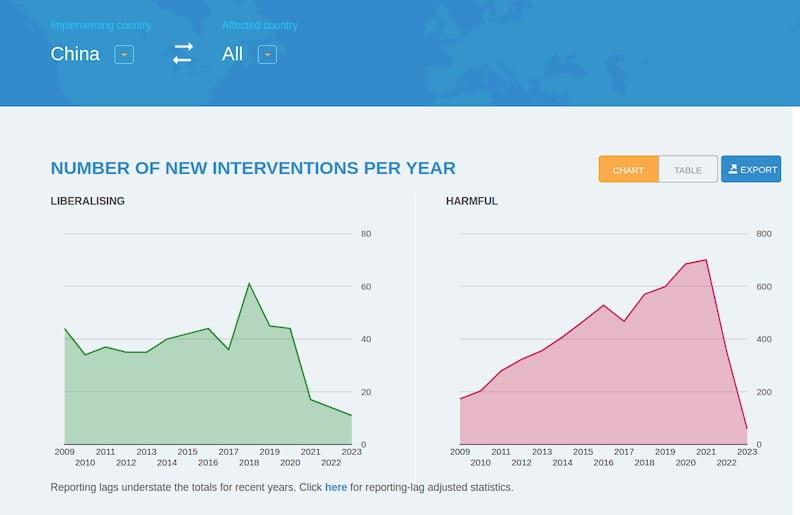
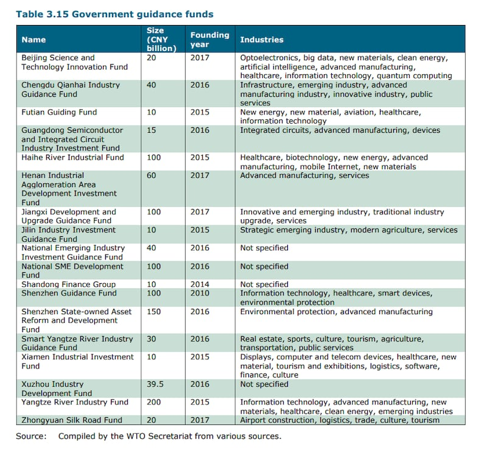

# Is China a ‘level playing field’ for trade?

## Verdict: Misleading

By Shen Ke for Asia Fact Check Lab

2023.11.07

Washington

## Following the recent decision by the European Union to investigate Chinese-made electric vehicles, a Chinese official claimed that China opposes all forms of trade protectionism, urging the EU to provide a “fair, non-discriminatory and predictable market environment.”

## But the claim is misleading. As with most countries, China has adopted some policies aimed at protecting or promoting its domestic industries, including targeted quotas, subsidies to certain key industries and rejection of patents in critical industries.

The claim was [made](https://www.fmprc.gov.cn/eng/xwfw_665399/s2510_665401/2511_665403/202309/t20230920_11145961.html) by Chinese foreign ministry spokesperson Mao Ning during a regular press conference on Sept. 20.

In response to a question on the EU’s decision to launch an anti-subsidies probe into electric vehicles manufactured in China, Mao said: “I would like to stress that China opposes all forms of trade protectionism. The action that the EU plans to take will disrupt the stability of global auto industrial and supply chains and will not serve anyone’s interests.”

“The EU needs to listen to what the industry has to say and provide a fair, non-discriminatory and predictable market environment for businesses of all countries,” she added.

## What is protectionism?

[Protectionism](https://www.wto.org/english/tratop_e/tpr_e/tp185_e.htm) is government policies intended to shield domestic producers from foreign competition, according to the World Trade Organization. Meanwhile, tariffs and import quotas are [cited](http://chinawto.mofcom.gov.cn/article/dh/cyjieshao/201001/20100106720372.shtml) as examples of typical protectionist policies by China's Ministry of Commerce, which defines protectionism as economic policies designed to protect domestic manufacturing industries from foreign competition.

The spokesperson’s comment came after European Commission President Ursula von der Leyen announced on Sept. 13 an anti-subsidy inquiry into low-cost electric cars coming from China.

At that time, she said the commission would investigate whether to impose punitive tariffs to protect EU producers against cheaper Chinese electric vehicle imports it says are benefiting from excessive state subsidies.

The commission [announced](https://ec.europa.eu/commission/presscorner/detail/en/ip_23_4752) on Oct. 4 that it officially launched the investigation.

The announcement drew criticism from some Chinese online users that say several EU nations involved in the investigation such as France and Germany are “applying a double standard.”

“So they are targeting specific Chinese brands. But what they don’t know is that such a move only shows the EU’s backwardness,” one Weibo user wrote.

“They are accusing China of manipulating the market, but the reality is that it’s them,” said another.

But the claim is misleading. China has also adopted some policies aimed at protecting or promoting its domestic industries, including targeted quotas, subsidies to certain key industries and rejection of patents in critical industries.

## China’s import tariff quotas

Existing [laws](http://english.mofcom.gov.cn/article/policyrelease/Businessregulations/201303/20130300045871.shtml) and regulations allow China to impose quotas and collect tariffs.

Beijing has implemented over 6,000 unilateral interventions that harm foreign commercial interests since 2009, while it has [imposed](https://www.globaltradealert.org/country/42/period-from_20090101/period-to_20230929) more than 90 tariffs since 2021, according to Global Trade Alert, an independent initiative that monitors trade policy announcements from around the world.

In particular, China has [exercised](http://egov.mofcom.gov.cn/xzxksx/18015/) import tariff quotas against products such as wool and sugar, alongside leveling export quotas against [aluminum](https://www.globaltradealert.org/state-act/72286/china-export-tariff-on-aluminium-raised-from-15-to-30) and [drone related products](https://www.globaltradealert.org/state-act/76649/china-government-announces-export-control-measures-for-30-drone-related-items).

According to records by the Global Trade Alert, China’s government continues to issue large numbers of policies that discriminate against foreign commercial interests. (Screenshot/Global Trade Alert)

These policies are consistent with those of the majority of modern economies, which implement a combination of [policies](https://knowledge.wharton.upenn.edu/article/is-free-trade-really-free-why-protectionism-is-alive-and-well/) designed to promote free trade and protect particular domestic industries.

Even traditionally strong proponents of free trade, such as the [United States](https://www.trade.gov/us-antidumping-and-countervailing-duties) and the [United Kingdom](https://www.gov.uk/government/publications/uk-trade-tariff-anti-dumping-and-countervailing-duties/uk-trade-tariff-anti-dumping-and-countervailing-duties), routinely impose anti-dumping and countervailing duties on imported goods believed to be priced or subsidized unjustly by foreign governments. While not obvious as tariffs and import quotas, these policies are nonetheless protectionist.

## Policies beneficial to domestic industries

State support of industries in economic areas such as agriculture and defense by itself is not unusual, with every country seeking self-sufficiency in certain key industries, [says](https://www.hudson.org/experts/101-thomas-j-duesterberg) Thomas Duesterberg, a senior expert on China's economy at the Hudson Institute.

The criticisms leveled at China have instead been directed at the scale and lack of transparency surrounding the county’s state support.

The WTO Secretariat [states](https://docs.wto.org/dol2fe/Pages/SS/directdoc.aspx?filename=q:/WT/TPR/S415R1.pdf&Open=True) in its review that it does not have a clear idea of how much state support China offers industries. The report adds that China had not disclosed total figures for either national or local subsidies and had in past notifications on subsidies omitted expenditures in sectors such as aluminum, electric vehicles, semiconductors, shipbuilding and steel.

[In response to requests](https://docs.wto.org/dol2fe/Pages/SS/directdoc.aspx?filename=q:/G/SCM/M110.pdf&Open=True) for these total figures, China stated that WTO members could choose which subsidies they disclosed based on their understanding of the [WTO agreement](https://www.wto.org/english/docs_e/legal_e/24-scm.pdf).

The review [further](https://docs.wto.org/dol2fe/Pages/SS/directdoc.aspx?filename=q:/WT/TPR/S415R1.pdf&Open=True) states that it is not clear about the purpose of government guidance funds offered to certain industries, documenting several examples which amount to over 1 trillion yuan (US$137 billion).

Despite providing the investment capital for these funds, China is adamant that they do not constitute subsidies because the Chinese government does not employ, influence, or have any affiliation with the company managing the funds. Beijing [declined to disclose](https://docs.wto.org/dol2fe/Pages/SS/directdoc.aspx?filename=q:/G/SCMQ2/CHN81.pdf&Open=True) key information clarifying the government's relationship with these funds on request.

According to the WTO, China provided several large amounts of government guidance funds to certain industries. While China insists the funds are not subsidies, the WTO Secretariat explicitly states it is unclear what their purpose is. (Screenshot/WTO)

The WTO review further mentions that information on Chinese government support offered to other large industries such as agriculture and fisheries through measures including tax incentives, but adding that fiscal appropriations remains unknown as of publication.

## *Edited by Taejun Kang and Malcolm Foster.*

*Asia Fact Check Lab (AFCL) is a branch of RFA established to counter disinformation in today’s complex media environment. Our journalists publish both daily and special reports that aim to sharpen and deepen our readers’ understanding of public issues.*

[Original Source](https://www.rfa.org/english/news/afcl/fact-check-china-protectionism-11072023101145.html)