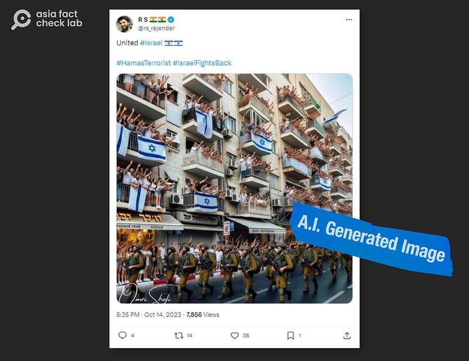
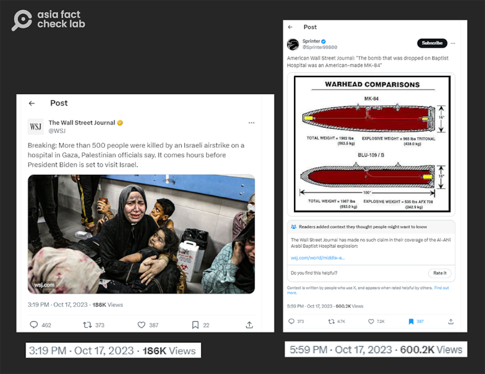
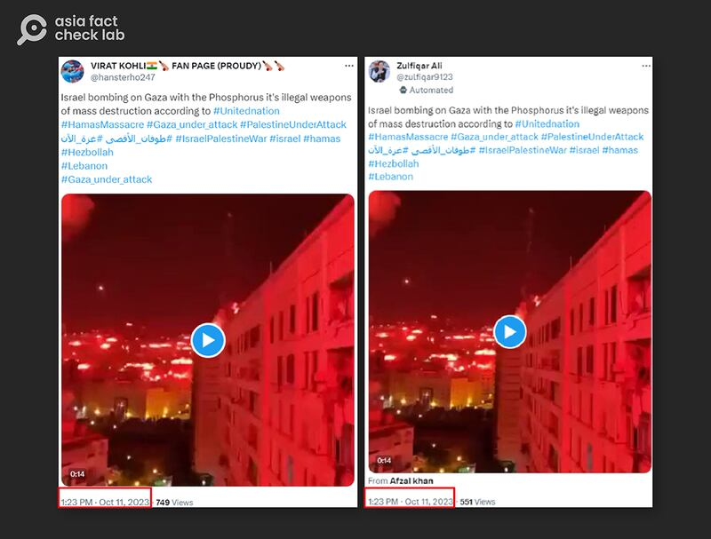
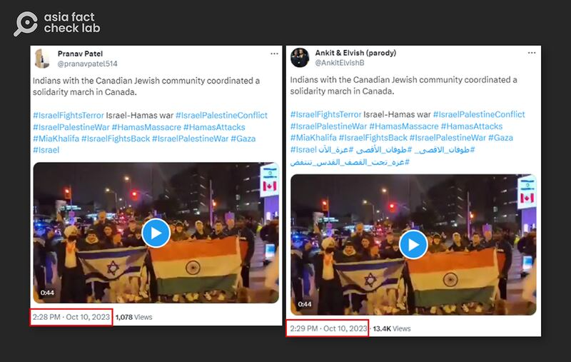

# Israel-Hamas war: How tech, social media spur misinformation

## Impartial audiences find themselves grappling with the challenge of distinguishing fact from fiction.

By Rita Cheng for Asia Fact Check Lab

2023.11.08

Washington

The adage “The first casualty when war comes is truth” remains as relevant today as it did when the U.S. Sen. Hiram Johnson first said it more than a century ago. The recent conflict between Israel and Hamas serves as a reminder of how truth can be overshadowed by falsehoods and propaganda during times of war.

In the month since violence erupted, a second invisible battle has emerged online. Both sides are involved in spreading disinformation and fake news. Old images are being passed off as new. Video game footage is [presented](https://web.archive.org/web/20231108042543/https://www.wired.com/story/x-israel-hamas-war-disinformation/) as reality. Credible news outlets like *The New York Times* have faced backlash over [flawed reporting](https://web.archive.org/web/20231108042648/https://www.nytimes.com/2023/10/18/business/media/hospital-blast-gaza-reports.html?partner=slack&smid=sl-share).

While disinformation campaigns are nothing new in war, their efficiency today is unparalleled. Advances in AI have made it cheaper and simpler to generate deceptive, but convincing fabrications. As a result, impartial audiences find themselves grappling with the challenge of distinguishing fact from fiction.

Faced with this flood of propaganda, numerous reports have examined its impact on domestic and international audiences. AFCL has reviewed several of these reports, highlighting how technology and social media enable online users and governments to take advantage of religious divides and cultural intolerance by spreading misinformation. The findings paint a troubling picture of truth obscured and tensions inflamed by the digital tools of modern war.

## AI muddles fact and fiction

The weaponization of AI is muddying the waters of truth in the Israel-Hamas conflict. As revealed by Reuters, several viral images purporting to show support for [Palestians](https://web.archive.org/web/20231108043126/https://www.reuters.com/fact-check/image-atletico-madrid-fans-holding-giant-palestinian-flag-is-fake-2023-10-24/) or [Israelis](https://web.archive.org/web/20231108043253/https://www.reuters.com/fact-check/photo-cheering-crowds-waving-israeli-flags-soldiers-is-ai-generated-2023-10-30/) were actually AI-generated fakes, for instance, and these are only a tip of the iceberg.

A widely shared image of Israeli citizens hanging flags off balconies was proven to be generated by AI. (Original image saved by Reuters Fact Check team, annotated by AFCL)

Furthermore, advanced "deepfake" technology has enabled the creation of fabricated footage, such as a video of the U.S. President Joe Biden [claiming](https://web.archive.org/web/20231108044006/https://www.reuters.com/fact-check/video-joe-biden-calling-military-draft-was-created-with-ai-2023-10-19/) he would send American troops to aid Israel.

More dangerous than the false information itself, experts warn these AI fabrications sow doubts about even verifiable facts.

As one AI researcher [told](https://web.archive.org/web/20231108044014/https://www.nytimes.com/2023/10/28/business/media/ai-muddies-israel-hamas-war-in-unexpected-way.html) *The New York Times*: "The real power of this technology is how it undermines truth and trust."

In an already polarized conflict, these insidious digital deceptions risk inflaming tensions by making truth itself seem unknowable.

## ‘Verified users’ lead in spreading misinformation

Social media platforms have become hotbeds of misinformation amid the Israel-Hamas war. Services like X, formerly known as Twitter, are rife with unsubstantiated claims and outright falsehoods disseminated by both anonymous and supposedly “verified” users. On these digital battlegrounds, propaganda and lies gain traction faster than truth.

One illustrative example comes from X user “Sprinter.” Originally blocked for spreading pro-Russian disinformation, Sprinter was reinstated under Elon Musk’s ownership and granted a blue verification checkmark.

The user then falsely [claimed](https://web.archive.org/web/20231108044940/https://twitter.com/SprinterX99880/status/1714400739760467990?s=20) the *Wall Street Journal* had reported that U.S.-made bombs were dropped on Gaza's AI-Ahli Hospital. Ironically, this false claim received nearly six times more views than the American daily's genuine tweet about the story earlier that day.

According to internet monitoring group NewsGuard, nearly three-fourths of the 250 most popular tweets containing misinformation in the first week of conflict were [posted](https://web.archive.org/web/20231108045428/https://www.newsguardtech.com/misinformation-monitor/october-2023/) by verified users.

Jack Brewster, one of the authors of the report, told AFCL that unlike past wars which involved large amounts of automated accounts, he believes “overwhelmingly real individuals” are behind the current wave of disinformation.

The X user Sprinter (right), spread misinformation that The Wall Street Journal had reported an attack on a Gaza hospital was conducted with U.S.-made artillery shells. X afterwards annotated the post to include a rebuttal of the claim by the WSJ itself. (Screenshot/Sprinter’s and official WSJ X accounts)

## Business model for monetization

In their quest to maximize revenue, social media platforms have instituted business models that reward viral lies over verifiable facts, and experts warn these profit-driven decisions fundamentally undermine platforms’ role as trusted spaces for public discourse.

NewsGuard cited X’s new business model as an example. X users who subscribe to a premium account can obtain the blue checkmark while also having their posts prioritized in other users’ feeds. The company further announced in July 2023 that premium users with at least 500 followers who received 5 million impressions on their posts within three months would be eligible for ad profit-sharing.

Mike Caulfield, a specialist in social media and disinformation at the University of Washington, told AFCL that online misinformation will become more prevalent as long as businesses can profit from it.

## Leveraging social media

Beyond the direct combatants, social media users across the world leverage platforms to advance favored narratives about the Israel-Hamas war. Their agenda-driven posts flood networks with biased misinformation.

Pro-Hamas voices spotlight Gaza hospital bombings to paint Israel as evil, a disinformation expert [told](https://web.archive.org/web/20231108054702/https://www.reuters.com/world/disinformation-surge-threatens-fuel-israel-hamas-conflict-2023-10-18/) Reuters, while pro-Israel users accuse Palestinians of faking injuries to discredit their suffering.

Even supposedly neutral parties take sides online. The Digital Forensic Research Lab, a division of the Atlantic Council, [found](https://dfrlab.org/2023/10/18/network-of-south-asian-twitter-accounts-spreading-israel-palestine-war-disinfo/?mkt_tok=NjU5LVdaWC0wNzUAAAGO6SSAhn8q4A2TKPnAsVpUDPPVJrsMFZcEIPVOuvwMLK85V3qCq-zHbOPbycLnchWeyIEoR5ApLi_k3PIxKNCL-TN8pHUfRN2ANw_uSEzdF4ml) that at least 25 X accounts claiming to be located in India coordinated posting identical tweets and videos about the conflict at nearly the same time.

Though mostly pro-Israel in content, some accounts bizarrely shared pro-Palestine messages shortly after pro-Isreal messages. By flooding platforms with contradictory claims, these users advance their own agendas, irrespective of consistency or truth.

The Digital Forensics Research Lab found multiple X accounts claiming to be based in India had released coordinated posts containing identical disinformation about the war. (Screenshots taken from The Digital Forensic Research Lab)

Despite its large Muslim population, anti-Muslim sentiment among India's Hindu majority runs high. Islamophobic rhetoric backed by the country's ruling right-wing Bharatiya Janata Party and current Prime Minister Narendra Modi is creating anti-Palestinian attitudes and a flood of misinformation during the current conflict, according to an Al Jazeera [article](https://web.archive.org/web/20231108055500/https://www.aljazeera.com/news/2023/10/16/analysis-why-is-so-much-anti-palestinian-disinformation-coming-from-india).

Meanwhile, misinformation coming out of Indonesia is heavily pro-Palestinian. As Voice of America analysis [found](https://web.archive.org/web/20231108055732/https://www.voanews.com/a/in-indonesia-fake-news-about-israel-hamas-war-triggers-concern/7310668.html), the country's Muslim majority population and widespread pro-Palestine views among Indonesian leaders shape social media narratives to favor Palestinians, regardless of the facts.

## Traditional media remains a potent tool

While social media grabs headlines, traditional media remains a potent tool for spreading misinformation. In China, state-controlled outlets continue shaping narratives despite rigid censorship, according to a recent Freedom House [report](https://web.archive.org/web/20231108061843/https://freedomhouse.org/report/china-media-bulletin/2023/antisemitism-surges-online-asian-games-censorship-hong-kong).

CCTV, for instance, aired a segment claiming Jewish-Americans control 70% of U.S. wealth and elections. Social media brims with similar dangerous lies, despite the usual swift suppression of controversial content.

Many videos disparaging Jews and promoting the theory that they control the world have been posted by internet celebrities on Chinese video sharing platforms such as Douyin. (Screenshot/Douyin)

Given the normally extremely swift and efficient censorship of politically sensitive messages in China, the article notes that the continued presence of such content on several media coverage and social media sites clearly shows a tacit acceptance by the authorities, citing China’s longtime support of the Palestinian national movement and Israel’s close partnership with the U.S as important reasons for this trend.

## *Translated by Shen Ke. Edited by Taejun Kang and Malcolm Foster.*

*Asia Fact Check Lab (AFCL) is a branch of RFA established to counter disinformation in today’s complex media environment. Our journalists publish both daily and special reports that aim to sharpen and deepen our readers’ understanding of public issues.*

[Original Source](https://www.rfa.org/english/news/afcl/fact-check-israel-hamas-misinformation-11082023172217.html)