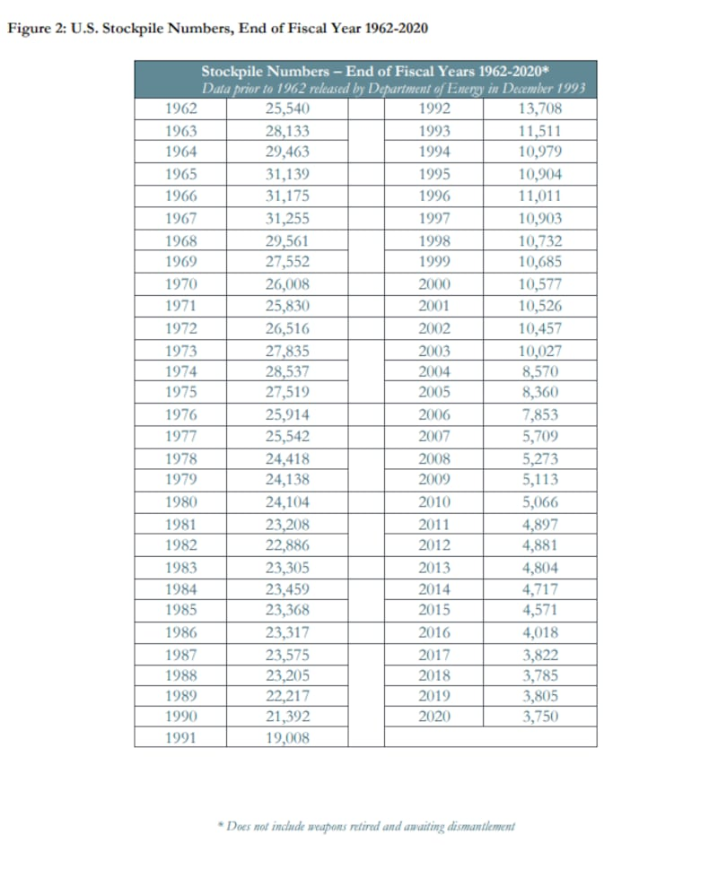
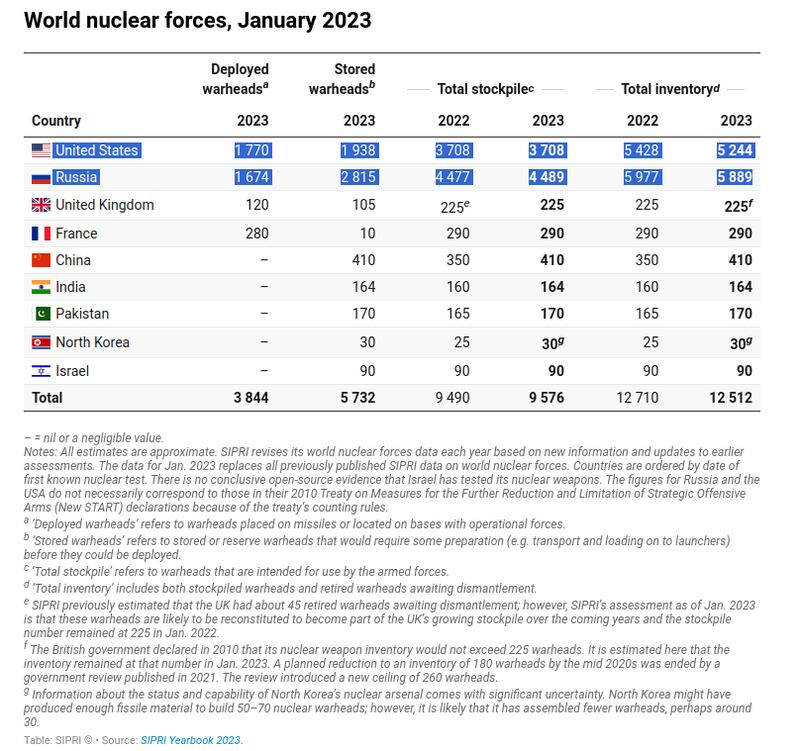

# Is the US expanding its nuclear arsenal?

## Verdict: Misleading

By Shen Ke for Asia Fact Check Lab

2023.11.13

Washington

## China’s official news outlet claimed that the United States is “expanding its stockpile of nuclear warheads” and “possesses the world’s largest nuclear arsenal.”

## But the claims are misleading. While some legislators are calling for such an expansion, the current official policy of the U.S. government does not aim to enlarge its nuclear warhead inventory to maintain nuclear deterrence. Data shows that the U.S. nuclear arsenal has been on a downward trend for the past 30 years. Russia currently possesses the world’s largest nuclear stockpile.

The claim was [published](https://web.archive.org/web/20231109040638/https://www.guancha.cn/internation/2023_10_15_712039.shtml) in a report by Guancha on Oct. 15.

“Ministry of National Defense spokesman Tan Kefei reiterated in February this year that even as the U.S. possesses the largest nuclear arsenal in the world, it still continues to heavily invest in upgrading its Trinity nuclear force, develop tactical nuclear weapons, lower the threshold for using nuclear weapons and strengthen its nuclear umbrella,” the claim reads in part.

“The repeated speculation by the U.S. on the so-called ‘Chinese nuclear threat’ is merely a pretext for expanding its own nuclear arsenal and maintaining its military hegemony,” the report further claims.

The claim came after the bipartisan Strategic Posture Committee released a [report](https://armedservices.house.gov/sites/republicans.armedservices.house.gov/files/Strategic-Posture-Committee-Report-Final.pdf) in October to evaluate current military threats to the United States.

The report stresses the necessity of being ready for the future possibility of simultaneous war with China and Russia, while emphasizing Beijing’s ongoing nuclear weapons expansion as a reason for the present augmentation of the U.S. nuclear arsenal.

China's precise quantity of warheads has remained a closely guarded state secret ever since its inaugural nuclear test in 1964. American officials have [claimed](https://web.archive.org/web/20231109042050/https://www.gisreportsonline.com/r/chinas-nuclear-weapons-buildup/) in recent years that Beijing has significantly boosted its nuclear capabilities, with a recent Pentagon [report](https://media.defense.gov/2023/Oct/19/2003323409/-1/-1/1/2023-MILITARY-AND-SECURITY-DEVELOPMENTS-INVOLVING-THE-PEOPLES-REPUBLIC-OF-CHINA.PDF) estimating that as of May 2023, China has accumulated more than 500 warheads.

## On a downward trend

The term "nuclear arsenal" is not commonly used for tallies of nuclear warheads. The often-used equivalent to the term is a nation's nuclear *stockpile*, which denotes the overall quantity of warheads held by the country for military purposes.

The U.S. nuclear stockpile experienced an almost continuous annual decrease from 1996 to 2020, according to a tally [released](https://www.state.gov/wp-content/uploads/2021/10/Fact-Sheet_Unclass_2021_final-v2-002.pdf) by the State Department in 2021. During that time, the stockpile dropped from 11,011 warheads to 3,750, with only a slight increase of 20 warheads during the 2019 calendar year being the sole exception.

Historical figures for the annual U.S. nuclear stockpile show a continued gradual decrease since the end of the Cold War. (Screenshot/U.S. Department of State)

Experts from the Chicago-based non-profit organization Bulletin of the Atomic Scientists suggest that the U.S. nuclear stockpile has further shrunk since 2020, [estimating](https://web.archive.org/web/20231109042844/https://thebulletin.org/premium/2023-01/nuclear-notebook-united-states-nuclear-weapons-2023/) a total of 3,708 warheads as of early 2023.

Beyond numbers, American officials have also declared that the United States has no intent of increasing its stockpile in the years to come. In a speech given to the Arms Control Association, or ACA, in June 2023, the National Security Advisor Jake Sullivan [explained](https://web.archive.org/web/20231109042851/https://www.whitehouse.gov/briefing-room/speeches-remarks/2023/06/02/remarks-by-national-security-advisor-jake-sullivan-for-the-arms-control-association-aca-annual-forum/) that future U.S. policy will attempt to achieve nuclear deterrence through better warheads, not more.

“The United States does not need to increase our nuclear forces to outnumber the combined total of our competitors in order to successfully deter them,” said Sullivan at that time.

## Russia, world’s largest nuclear stockpile holder

As of January 2023, Russia had both a larger nuclear stockpile and a larger nuclear inventory – the total nuclear stockpile plus retired warheads awaiting dismantlement – according to the latest estimates of distinct warheads for all countries possessing nuclear weapons [provided](https://web.archive.org/web/20231109045015/https://www.sipri.org/media/press-release/2023/states-invest-nuclear-arsenals-geopolitical-relations-deteriorate-new-sipri-yearbook-out-now) by the Stockholm International Peace Research Institute (SIPRI).

SIPRI estimates Russia holds the world's largest nuclear stockpile, while the U.S. deploys more warheads on military bases. (Screenshot/SIPRI)

The figures do show that the U.S. currently deploys the largest number of warheads on missiles or on active military bases, but this is not equivalent to the total amount of warheads a given country would be able to use in wartime.

Similar figures have been published by other third party organizations monitoring nuclear proliferation such as the [Federation of American Scientists](https://web.archive.org/web/20231109045345/https://fas.org/web/20231109045345/https://fas.org/initiative/status-world-nuclear-forces/), or FAS.

FAS estimates the total number of nuclear weapons worldwide at around 12,500 warheads, from a peak estimate of over 70,000 nuclear weapons in the 1980s.

Russia and the United States have historically possessed the lion’s share of warheads worldwide, with the two countries’ current combined stockpiles still accounting for almost 90% of the total.

Following efforts to lower nuclear stockpiles after the end of the Cold War, the FAS notes that a new trend of increasing nuclear stockpiles has emerged in recent years, with India, Pakistan, the United Kingdom, China and North Korea all attempting to increase their stockpiles.

In February, some Chinese media outlets made a similar claim that the United States increased nuclear weapons between 2017 and 2021. AFCL debunked this claim [here](2023-02-12_Asia Fact Check Lab： Has the U.S. nuclear arsenal increased since 2017?.md).

## *Edited by Taejun Kang and Malcolm Foster.*

*Asia Fact Check Lab (AFCL) is a branch of RFA established to counter disinformation in today’s complex media environment. Our journalists publish both daily and special reports that aim to sharpen and deepen our readers’ understanding of public issues.*

[Original Source](https://www.rfa.org/english/news/afcl/fact-check-nuclear-arsenal-11132023155401.html)