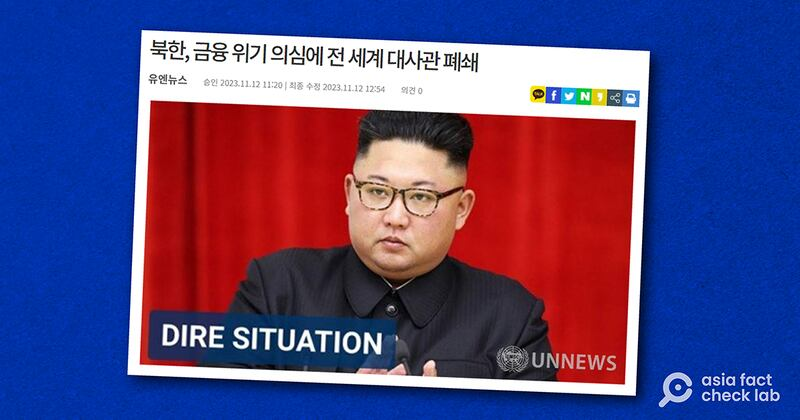

# Has North Korea shut down all diplomatic missions?

## Verdict: False

By Taejun Kang for RFA

2023.11.16

Taipei, Taiwan

## Korean-language social media posts in November circulated the claim that North Korea has closed down its diplomatic missions worldwide.

## But the claim is false. As of May, North Korea operated a total of 53 foreign missions. Since then, media reports confirmed that Pyongyang has shut down embassies and consulates in as many as a dozen locations. North Korean officials said in November that it has been in the process of "closing and opening" diplomatic missions in other countries.

The claim first appeared on Nov. 12 in a [report](https://web.archive.org/web/20231115055505/http://www.unnews.net/View.aspx?No=3006818) on UN News, a Seoul-based online media outlet that has no affiliation with the United Nations.

“North Korea shut down diplomatic missions worldwide amid the financial crisis,” its headline reads.

The UN News report contained a link to a Fox News [report](https://web.archive.org/web/20231115060310/https://www.foxnews.com/world/north-korea-closing-embassies-world-suspected-financial-crisis) published on Nov. 11, that ran with the headline "North Korea closing embassies around the world amid suspected financial crisis."

Because of how the headline was rendered in Korean, it could be construed to mean that North Korea was shutting down all of its embassies worldwide.

Both reports however indicated that Pyongyang was closing many – not all– of its embassies.

Screenshot of the UN News report, captured on Nov. 15, 2023.

The claim was widely shared on popular South Korean social media platforms including Naver Blog and Daum Cafe, as people reposted the UN News Report and the New York Post's [reposting](https://web.archive.org/web/20231116013922/https://nypost.com/2023/11/11/news/north-korea-closing-embassies-around-the-world-amid-suspected-financial-crisis/) of the Fox News report.

But the claim is false.

## Closures in a dozen locations

As of May 2023, North Korea [operated](https://web.archive.org/web/20231115060206/https://overseas.mofa.go.kr/www/wpge/m_4178/contents.do) a total of 53 foreign missions, according to South Korea's Ministry of Foreign Affairs.

Since then, media reports have confirmed the closure of North Korean embassies and consulates in as many as a dozen locations, including those in countries Pyongyang views as longtime allies.

According to these reports, during “farewell” visits to the leaders of Uganda and Angola, North Korean ambassadors declared the closure of their embassies in those nations. Additionally, the consulate of the North in Hong Kong and the embassy in Madrid have been closed.

However, keyword searches found no official or credible reports to confirm that the North closed all foreign missions.

## Dire situation

Although North Korea has achieved notable advancements in its nuclear and ballistic missile initiatives, the imposition of sanctions is impeding its ability to obtain foreign currency, a portion of which is utilized to finance its international operations.

“Tightened international sanctions on North Korea have hampered its ability to earn foreign currency, making it difficult to maintain its diplomatic missions,” an official from South Korea’s Ministry of Unification, which oversees inter-Korean relations, said in October.

The North’s diplomatic missions are supported by illicit trade and smuggling, as well as selling money laundering services, construction labor and information technology solutions, rather than direct financial support from Pyongyang.

“This is a glimpse of North Korea’s dire economic situation, where it is difficult to maintain even minimal diplomatic relations with traditional allies,” the ministry official said.

## ' Normal part of the business'

Amid the speculation over its finances, a North Korean foreign ministry spokesperson said on Nov. 3 that it is in the process of “closing and opening” diplomatic missions in other countries, and this is a normal part of the business of sovereign nations.

“We will continue to take the necessary diplomatic steps in the context of the prospective development of our external relations in line with the evolving international environment,” the spokesperson said.

## *Edited by Eugene Whong and Malcolm Foster.*

*Asia Fact Check Lab (AFCL) is a branch of RFA established to counter disinformation in today’s complex media environment. Our journalists publish both daily and special reports that aim to sharpen and deepen our readers’ understanding of public issues.*

[Original Source](https://www.rfa.org/english/news/afcl/north-korea-diplomatic-missions-11162023125806.html)