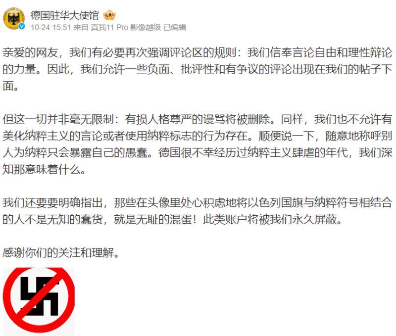
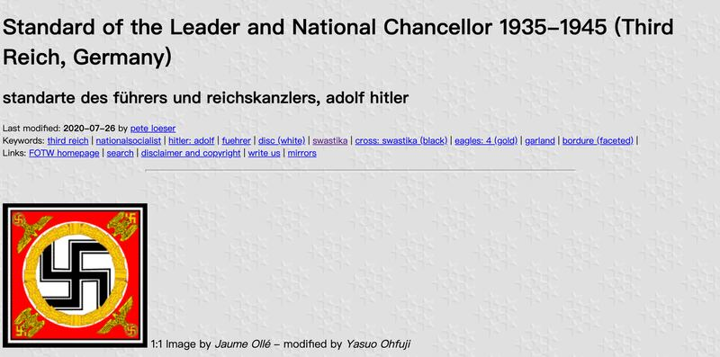

# Did the German Embassy in China ban a Buddhist religious symbol?

## Verdict: False

By Zhuang Jing for Asia Fact Check Lab

2023.11.20

Taipei, Taiwan

## A claim has been repeatedly shared among Chinese-language social media users that the German Embassy in Beijing has “insulted” Chinese citizens by “banning” the use of the Buddhist religious symbol, also known as a swastika, on one of its social media posts.

## However, the claim is false. Germany’s foreign ministry told AFCL that its post was to condemn some online users who inappropriately used the symbol to glorify the Nazi regime – which used the symbol – or combined it with the Israeli flag.

The swastika is an ancient symbol that has been used in many different cultures, not just as a symbol for Buddhism.

The claim was shared [here](https://web.archive.org/web/20231113075612/https://m.weibo.cn/detail/4960740170272428) on Weibo, China's popular social media platform, on Oct. 25.

“Germany insulted Chinese online users with its official Weibo post. It banned the manja [the swastika]. The German Embassy must apologize!” reads the claim in part.

A number of Chinese internet personalities and legal bloggers later derided the embassy's announcement as [inappropriate for using foul language](https://weibo.com/1989660417/NpnCDFBvi?type=repost) and  [mistaken in its use of the upright version of the swastika](https://m.weibo.cn/detail/4960740170272428), insisting that Buddhist uses of the symbol were always upright, while Nazi was always tilted.

German expressions of support for Israel following the outbreak of the Israel-Hamas war has caused Chinese netizens to leave disparaging comments on the German Embassy official social media accounts, including pictures of an Israeli flag combined with a swastika.

In response, the German Embassy in China [urged](https://weibo.com/2209621235/Npla4n81V) Chinese online users on Oct. 24 to avoid glorifying Nazism, posting an image of the Swastika with a red cross mark on it.

The German Embassy in Beijing posted a message on Weibo asking netizens to stop glorifying Nazism or using swastikas in their comments. (Screenshot/German Embassy in China’s official Weibo)

The identical claim was shared in other Chinese social media posts that also claimed that the photo released by the German Embassy shows an upright swastika, which solely symbolizes Buddhism, unlike the tilted swastika used by the Nazis.

Several influential users on Weibo claimed that the upright swastika posted by the German Embassy in Beijing was not used by the Nazis and exclusively employed as a Buddhist religious symbol. (Screenshot/Weibo)

However, the claim is false.

## The swastika

The [swastika](https://web.archive.org/web/20231113084651/https://encyclopedia.ushmm.org/content/en/article/history-of-the-swastika) is an ancient symbol that has been used in many different cultures going back at least 5,000 years. To this day, it is a sacred symbol in Hinduism, Buddhism, Jainism and Odinism.

The symbol took on a variety of meanings throughout history before being [chosen](https://web.archive.org/web/20231113084651/https://encyclopedia.ushmm.org/content/en/article/history-of-the-swastika) by Adolf Hitler as a symbol of National Socialism.

While this was the most infamous appropriation of the symbol, the swastika was also [used](https://web.archive.org/web/20231113084745/https://www.crwflags.com/fotw/flags/keywords.html#swastika) on the flags of many other radical far-right political parties from the early 20th century.

It is true that most Nazi flags feature tilted swastikas, but [historical photos](https://www.alamy.com/stock-photo/deutschland-erwache.html?blackwhite=1&sortBy=relevant) of others such as the personal standard of Hitler and the flag used by his personal bodyguards clearly show the symbol in an upright position.

Hitler’s personal standard featured an upright swastika. (Screenshot/CRW Flags)

Historical photos also document several Nazi flags featuring upright swastikas. (Screenshot/Alamy)

## ‘Not a ban for Chinese online users’

Keyword searches found no official statements or credible reports to show that the German Embassy banned Chinese online users from using the swastika.

Use of the swastika in Germany, regardless of its position, is [prohibited](https://web.archive.org/web/20231113085439/https://www.dw.com/en/germanys-confusing-rules-on-swastikas-and-nazi-symbols/a-45063547) by law due to its use by the Nazis and its clear anti-Semitic connotations, according to a spokesperson for Germany's Federal Foreign Office.

The spokesperson told AFCL that its Weibo post was designed to “condemn posts by some users who inappropriately used this symbol to glorify the Nazi regime or combined it with the Israeli flag.”

## *Translated by Shen Ke. Edited by Taejun Kang and Malcolm Foster.*

*Asia Fact Check Lab (AFCL) is a branch of RFA established to counter disinformation in today’s complex media environment. Our journalists publish both daily and special reports that aim to sharpen and deepen our readers’ understanding of public issues.*

[Original Source](https://www.rfa.org/english/news/afcl/fact-check-swastika-11202023153639.html)