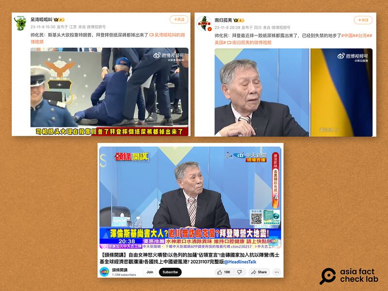

# Biden in a diaper? ‘US skepticism’ spreads in Taiwan

## Verdict: False

By Zhuang Jing for Asia Fact Check Lab

2023.11.22

Taipei, Taiwan

## A claim emerged among Chinese-speaking online users that U.S. President Joe Biden had been exposed wearing a soiled diaper after falling to the ground. They cited a video taken from a Taiwanese TV program in which one guest made the identical claim.

## But the claim is false. The photo of Biden in a diaper has been digitally altered, and no diaper can be seen in the original photo. Biden, who just turned 81, has attracted media and public scrutiny due to occasional falls and verbal missteps. These incidents have been frequently exploited by anti-U.S. and pro-China groups to challenge his credibility and that of the United States government. Taiwan has also been affected by these narratives.

The claim was made by a Taiwanese commentator Shuai Hua-ming during a program [aired](https://www.youtube.com/live/YUSwzusIvXA?feature=shared&t=2346) by CTi News on Nov. 7.

“Biden recently tripped and his pants fell down, revealing a diaper. It is very damaging that [he] is already [having] incontinence,” said Shuai, who formerly served as a legislator for the Kuomintang, or KMT, one of Taiwan’s major parties.

Shuai, once served as a lieutenant general, is considered an influential opinion leader of the KMT on issues of national defense.

The KMT supports improving relations and retaining ancestral ties with Mainland China, advocating for one China with different interpretations. In contrast, the ruling Democratic Progressive Party emphasizes Taiwan’s unique identity and autonomy, advocating for political and economic distancing from Beijing.

CTi News is a Taiwanese 24-hour online news outlet viewed as pro-KMT.

“Personally, I don’t think it’s a matter of age. It’s that he [Biden] is senile, that he seems to have dementia. In addition, his decision-making and his team are chaotic. These are his real problems,” claimed another guest of the show, Lai Yueh-chien, a Youtuber and political commentator who supports Taiwan’s Pan-Blue coalition consisting of opposition parties including the KMT.

Claims about Biden wearing a diaper and accusations of his health issues have been also widely shared in Chinese-language social media platforms, including Weibo, NetEase and Zhihu.

“Carrying out duties is not easy for an old person like Biden,” one Weibo user said.

“A sign of the decline of the old United States,” another wrote, referring to the diaper claim.

Weibo users recently posted a short video from a Taiwanese news program of former legislator Shuai Hua-ming saying that U.S. President Joe Biden recently fell down to reveal his diaper. (Screenshot / Weibo & Youtube)

The claim that Biden had been exposed wearing a diaper emerged after the president attended a graduation ceremony at the U.S Air Force Academy in Colorado on June 1, 2023.

Wearing a dark suit, the president tripped and fell down at one point during the event and was immediately helped up by three men standing nearby.

At that time, social media users shared a photo of Biden that shows part of what appears to be a diaper protruding from his pants as he falls.

However, a closer look at the [original photo](https://www.gettyimages.in/detail/news-photo/president-joe-biden-is-helped-up-after-falling-during-the-news-photo/1258358301?adppopup=true) taken by AFP and videos published by [The Washington Post](https://www.youtube.com/watch?v=_ctthyYjglw) and [The New York Times](https://www.nytimes.com/video/us/politics/100000008933574/biden-fall-air-force-commencement.html) shows that Biden's pants did not split or rip due to the fall and no diapers were exposed.

International news outlets, including [Reuters](https://www.reuters.com/article/factcheck-biden-diaper-idUSL1N38B0Q0) and [AFP](https://factcheck.afp.com/doc.afp.com.33JN9V2) reported that the photo had been digitally altered to add the diaper on the president.

An article on NetEase about Biden’s diaper being exposed was marked as a rumor by the website. (Screenshot / NetEase)

## ‘US skepticism’ narratives

Biden has attracted media and public scrutiny due to occasional falls and verbal missteps. These incidents have been frequently exploited by anti-U.S. and pro-China groups to challenge his credibility and that of Washington. Taiwan has also been affected by these narratives.

One example is a [claim](https://www.rfa.org/cantonese/news/factcheck/biden-04202023074358.html) that the AFCL debunked in April that the president apologized to an invisible man after giving a speech at the University of Northern Ireland. But in fact he was just interacting with the attending crowd.

Remarks made by Shuai and Lai during CTi News was another example.

AFCL contacted Shuai, but he declined to comment.

Taiwan has witnessed an evolving collection of “unreasonable or manipulative narratives that suggests that the island should keep a distance from or reduce its relations with the U.S.” amid its growing ties with Washington, said the Information Operations Research Group, or IORG, a Taipei-based civilian research organization.

Out of 85 such narratives investigated by IORG, more than half of them were generated by individuals from in Taiwan, specifically from social media influencers and political commentators, IORG noted in a [report](https://iorg.tw/_en/a/us-skepticism-238) updated on Nov. 8.

“US Skepticism manufactures negative images of Taiwan’s democratic allies and Taiwan’s democratic governance,” IORG said. “These unreasonable and manipulative narratives are harmful to the quality of public discourse, create unfounded mistrust towards democracy, and therefore should be rejected.”

## *Translated by Shen Ke. Edited by Taejun Kang and Malcolm Foster.*

*Asia Fact Check Lab (AFCL) is a branch of RFA established to counter disinformation in today’s complex media environment. Our journalists publish both daily and special reports that aim to sharpen and deepen our readers’ understanding of public issues.*

[Original Source](https://www.rfa.org/english/news/afcl/fact-check-biden-diaper-11222023134025.html)