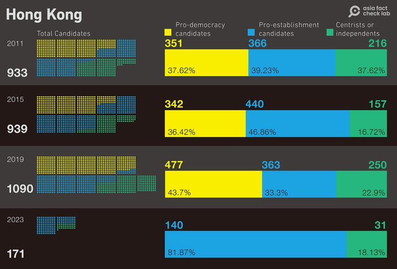
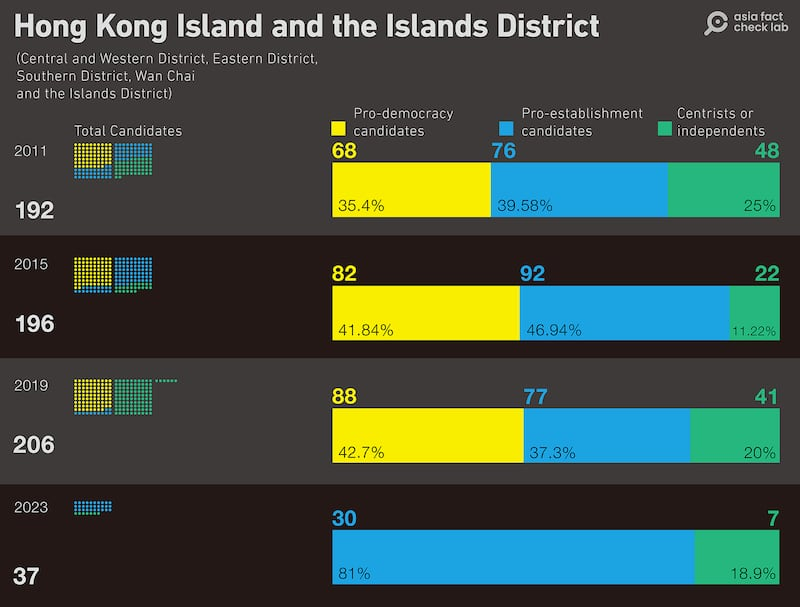
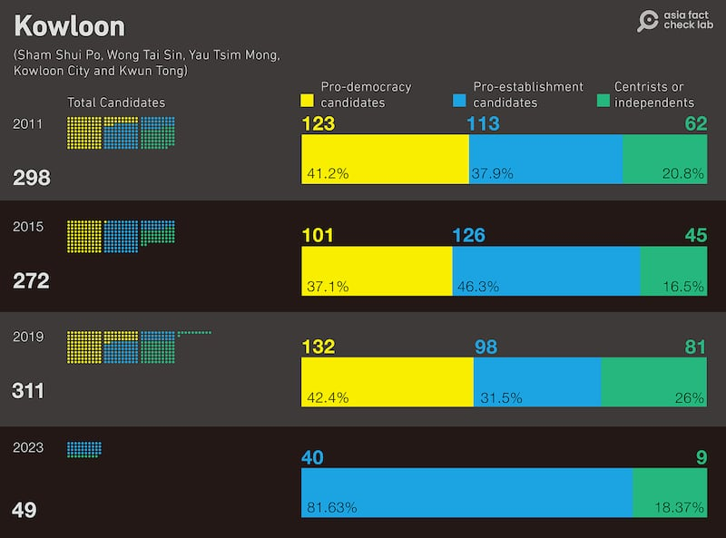
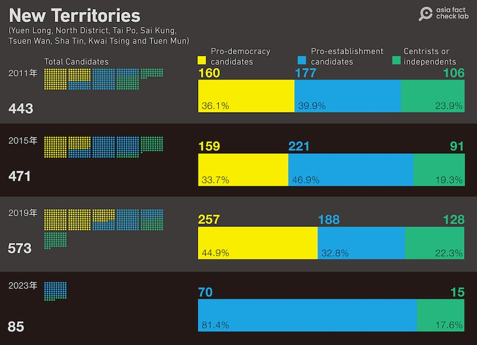

# Have Hong Kong’s electoral reforms improved diversity in 2023 elections?

## Verdict: Misleading

By Shen Ke and Li Tong for Asia Fact Check Lab

2023.11.27

Washington and Taipei

## Following the nomination period for Hong Kong’s upcoming district council elections, a claim emerged that the nominations results show electoral reforms adopted earlier this year have improved the diversity, representativeness and competitiveness of the city’s elections.

## But the claim is misleading. Statistics indicate that previous elections were significantly more politically varied and competitive compared to this year. AFCL found the city’s electoral reforms rather created an unfair playing field for certain candidates in the elections.

The claim was shared in a [report](http://report) on Oct. 31 published by the Beijing-backed Hong Kong China News Agency.

“John Lee [chief executive of Hong Kong] described the election as fiercely competitive and covering people from different backgrounds, reflecting that the improved election would be pluralistic, more three-dimensional and more in line with public interest,” the claim reads in part.

“He also pointed out the diverse backgrounds of the candidates … [and that this] reflects the universality and diversity of the new electoral system,” it reads further.

District council elections in Hong Kong, pivotal for local governance, determine the makeup of the city’s 18 council districts. Held every four years, these elections allow citizens to directly elect councilors.

While primarily advisory, district councils focus on local issues and community welfare but lack legislative power. Their responsibilities include overseeing community activities, advising on public facilities, and managing government funds for district projects.

But the influence of Beijing and recent political changes in Hong Kong continue to impact the scope and function of these councils.

In July, for instance, the city's Legislative Council [adopted](https://www.had.gov.hk/file_manager/public_services/district_administration/dar2023/legco_brief_en.pdf) changes to the electoral system of the district councils, drastically reducing the number of directly elected members to less than one-fifth.This decision follows the imposition of the National Security Law in 2020 and the overhaul of the elections' rules for the chief executive and the Legislative Council in 2021.

AFCL [counted and classified](https://www.elections.gov.hk/dc2023/eng/nomination2.html?1698953027287) all nominees from the past three district council elections in 2011, 2015 and 2019 and compared them to this year's nominations. For 2023, only candidates participating in the district council direct elections were included in the count.

Here is what AFCL found.

## Reforms created ‘unfair playing field’

While the number of directly-elected representatives in each of Hong Kong’s previous three district council elections was above 400, this number has now been reduced to 88 following electoral reforms. The remaining district council seats are appointed either by the government or by government controlled advisory committees.

In order to ensure political loyalty to the state, the reforms further require all aspiring candidates to secure nominations from three members of these committees before being eligible to run for office.

## Waning political diversity

In the 2019 Hong Kong district council elections, pro-democracy candidates, who generally oppose closer ties with Beijing, reached an unprecedented peak, outnumbering pro-establishment candidates for the first time, with leads ranging from 5 percentage points on Hong Kong Island to over 12 percentage points in the New Territories. Pro-establishment candidates are those who favor closer ties with Beijing and less political autonomy for the city.

The total number and proportion of candidates from different political camps participating in Hong Kong’s current and past three district council elections. (Photo/AFCL)

This surge coincided with Hong Kong’s largest protest series, causing many pro-establishment candidates to distance themselves from Beijing and leading to a significant reduction in uncontested “walkover” districts, where only a single pro-establishment candidate ran for office. Conversely, pro-establishment candidates, peaking in 2015, saw their lowest representation in 2019.

The number and proportion of candidates by political affiliation from the elections in Hong Kong Island and the Islands District. (Photo/AFCL)

Additionally, the proportion of centrists fluctuated, often filling the gap left by the decline of pro-establishment candidates, especially post-2019 protests. Notably, several pro-establishment candidates chose to run as centrists in the absence of legal regulations on political party affiliations in Hong Kong, according to Leung Kai Chi, a researcher of Hong Kong studies at the Academia Sinica.

In stark contrast to 2019, the 2023 elections saw no pro-democracy candidates, marking a dramatic shift from the democratization trend of previous decades. The Democratic Party’s failure to nominate any candidates and the overwhelming 81% representation of pro-establishment candidates across all districts signaled Beijing’s growing influence over Hong Kong’s political landscape.

The number and proportion of candidates for the district council elections in Kowloon (top) and New Territories (bottom). (Photo/AFCL)

Leung suggests that Beijing’s control over elections aligns with its broader agenda to suppress any potential for change within the city, effectively sidelining democrats and turning the elections into an exclusive competition between Beijing loyalists.

“The purpose of the elections has changed to finding capable people within the circle of Beijing loyalists,” said Leung. “It’s impossible for Beijing to allow the democrats any institutional platform that might give the public the chance to compare and question.”

## Disappearance of localist parties

A notable trend in Hong Kong’s previous three elections was a significant number of local parties contesting in specific districts across the city. Particularly in 2019, a surge of ordinary citizens stepped in to fill the electoral void left by the reduced number of openly pro-Beijing candidates, according to Leung.

By 2023, however, these locally-based parties, irrespective of their political leanings, had largely vanished from the scene. This included both pan-democrat-aligned local parties and a few pro-establishment groups, with the majority of registered candidates now affiliated with traditional, larger pro-establishment parties.

Leung observes that the shrinking political space has led many local parties to opt out of the current elections. Additionally, the reduction in the total number of electoral districts and the consequent increase in the average constituency size has challenged parties with only a strong local base to compete effectively.

This shift marks the end of a prominent trend where young politicians in Hong Kong focused on local issues in district election campaigns, at least in terms of openly declared political identities. It also raises questions about the authenticity of claims regarding increased representation and competition in these elections.

Leung emphasizes that the diversity of candidates is crucial for reflecting the spectrum of political views in society.

“The latest opinion polls show that more people are dissatisfied than satisfied with the current political situation, but this is not reflected in the candidates at all,” said Leung.

“While nominally there might still be elections, they can’t really be called a competition.”

## *Edited by Taejun Kang and Malcolm Foster.*

*Asia Fact Check Lab (AFCL) is a branch of RFA established to counter disinformation in today’s complex media environment. Our journalists publish both daily and special reports that aim to sharpen and deepen our readers’ understanding of public issues.*

[Original Source](https://www.rfa.org/english/news/afcl/fact-check-hong-kong-elections-11272023151305.html)