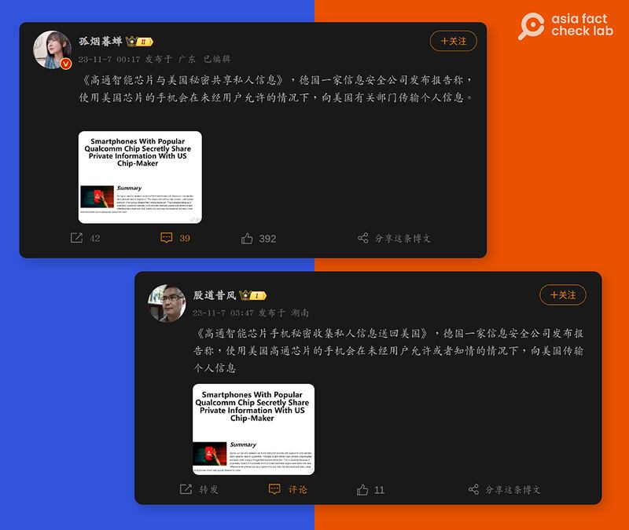
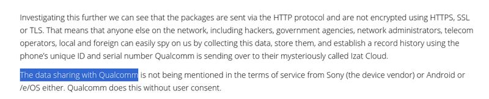
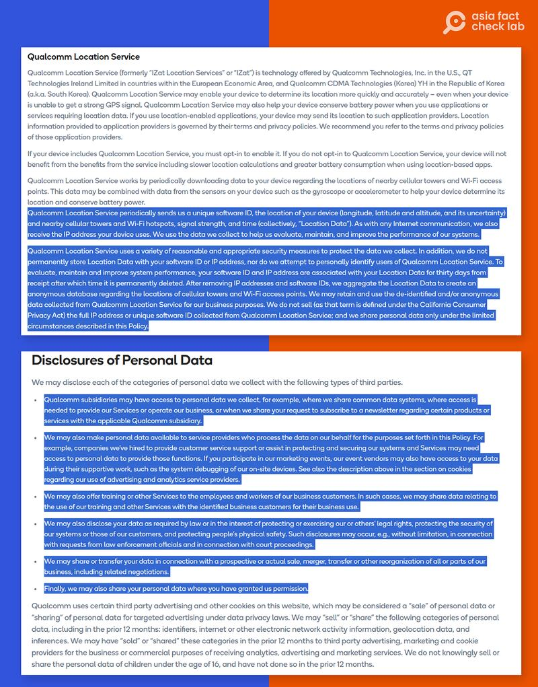
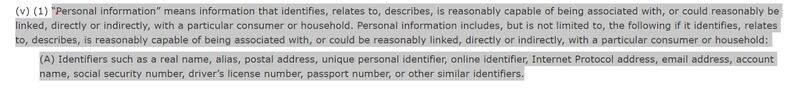

# Do Qualcomm chips pass private information to the US government?

## Verdict: Misleading

By Shen Ke for Asia Fact Check Lab

2023.11.29

Washington

## Updated Dec. 04, 2023, 10：15 p.m. ET.

## Chinese-speaking social media users claimed that phones equipped with Qualcomm chips are “secretly transmitting” users’ personal information to U.S. authorities, citing a report published in May.

## But the claim is misleading. The report, written by a German open source security hardware firm, in fact said chips made by Qualcomm can send metadata – information about personal communications – back to the company itself, not the U.S. government. Experts told AFCL that data sent to a U.S.-based server is not automatically accessible to American authorities either in a technical or legal sense.

The claim was shared [here](https://web.archive.org/web/20231127071413/https://s.weibo.com/weibo?q=%E9%AB%98%E9%80%9A%E6%99%BA%E8%83%BD%E8%8A%AF%E7%89%87%E4%B8%8E%E7%BE%8E%E5%9B%BD%E7%A7%98%E5%AF%86%E5%85%B1%E4%BA%AB%E7%A7%81%E4%BA%BA%E4%BF%A1%E6%81%AF) on Chinese popular social media platform Weibo on Nov. 7.

“A German information security firm has released a report claiming that mobile phones using Qaulcomm smart chips transmit personal information to relevant departments in the U.S. without the user’s permission,” the claim reads. The term “relevant departments” is widely used in China’s official context to refer to governmental departments.

Qualcomm is an American company known for designing and manufacturing semiconductors, wireless telecommunications products, and services, primarily known for its Snapdragon series of smartphone processors.

The claim was shared alongside a screenshot of what appears to be a news report. Its headline reads: “Smartphones With Popular Qualcomm Chips Secretly Share Private Information With the US Chip-Maker.”

A keyword search on Google found the report was [published](https://web.archive.org/web/20231127071342/https://www.nitrokey.com/news/2023/smartphones-popular-qualcomm-chip-secretly-share-private-information-us-chip-maker) by Nitrokey, a Germany-based open source security hardware firm, in May.

An influencer on Weibo claimed that phones using U.S. chips are sending data back to “U.S. authorities.” (Screenshot/Weibo)

Similar claims, citing the same Nitrokey report, were also shared by official [Chinese media](https://web.archive.org/web/20231127071249/https://new.qq.com/rain/a/20230508A06VSB00?no-redirect=1) and other influential users on popular Chinese social media platforms.

But the claim is misleading.

## Nitrokey report

A close look at the report found that it made no mention of phones equipped with Qualcomm chips secretly transmitting users’ personal information to U.S. authorities.

Instead, the report said chips made by Qualcomm can send metadata – such as the device's IP address, country code, operating system and installed software associated with its GPS service – back to the company itself, not the U.S. government. Qualcomm's [terms of service](https://web.archive.org/web/20231127073550/https://www.qualcomm.com/site/privacy/services) also openly state this.

The original article on NItrokey only stated that data was being sent back to Qualcomm. It did not suggest that the data was shared with or directly sent to U.S. authorities. (Screenshot/NitroKey)

Qualcomm’s terms of service outline both what data its location service collects and when it can share such data. (Screenshot/Qualcomm)

NitroKey told AFCL that the original article only investigated and found the sharing of metadata had taken place in a phone using a chip designed by Qualcomm, confirming that its team found no evidence of data being sent to U.S. authorities.

Data sent to a U.S. server is not automatically accessible to U.S. authorities either in a technical or legal sense and companies do not normally just route away all data they collect back to U.S. government intelligence agencies, according to William Budington, a senior staff technologist at the Electronic Frontier Foundation, a nonprofit digital liberties organization.

“It is possible, but not [that’s not] normally how the U.S. government collects information. I’m not aware of any instance where a chip manufacturer automatically siphons information directly to the intelligence community,” said Budington.

Qualcomm has not responded to AFCL inquiries concerning the claims as of this writing.

## Lack of regulations

Metadata has the potential to reveal personal information about individuals or aid governments in tracking and targeting significant figures, but there is a lack of a broad federal law that safeguards against the collection of personal identifiable information in the United States.

“It’s all too common a practice for device firmware to be sending out all sorts of data to third parties out-of-the-box,” said Budington. “There is no federal data privacy law [in the U.S.].”

In recent years, various states like California, Colorado and Connecticut have [enacted](https://web.archive.org/web/20231127071314/https://www.ncsl.org/technology-and-communication/state-laws-related-to-digital-privacy) data privacy laws. These regulations [provide](https://web.archive.org/web/20231127071322/https://leginfo.legislature.ca.gov/faces/codes_displayText.xhtml?lawCode=CIV&division=3.&title=1.81.5.&part=4.&chapter=&article=) protections for metadata comparable to those for PII, categorizing any data that can be connected or associated with a specific consumer or household, including IP addresses, as personal information.

California and other U.S. states have defined information that can be linked or associated with a given person as personal information. This includes IP addresses. (Screenshot/California Legislative Information)

## *Edited by Taejun Kang and Malcolm Foster.*

## *Updated to clarify the translation of the social media claim.*

*Asia Fact Check Lab (AFCL) is a branch of RFA established to counter disinformation in today’s complex media environment. Our journalists publish both daily and special reports that aim to sharpen and deepen our readers’ understanding of public issues.*

[Original Source](https://www.rfa.org/english/news/afcl/fact-check-qualcomm-11292023132440.html)