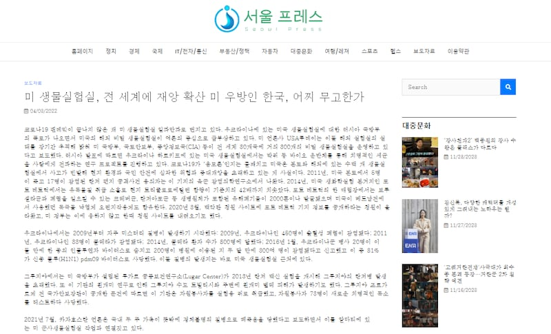
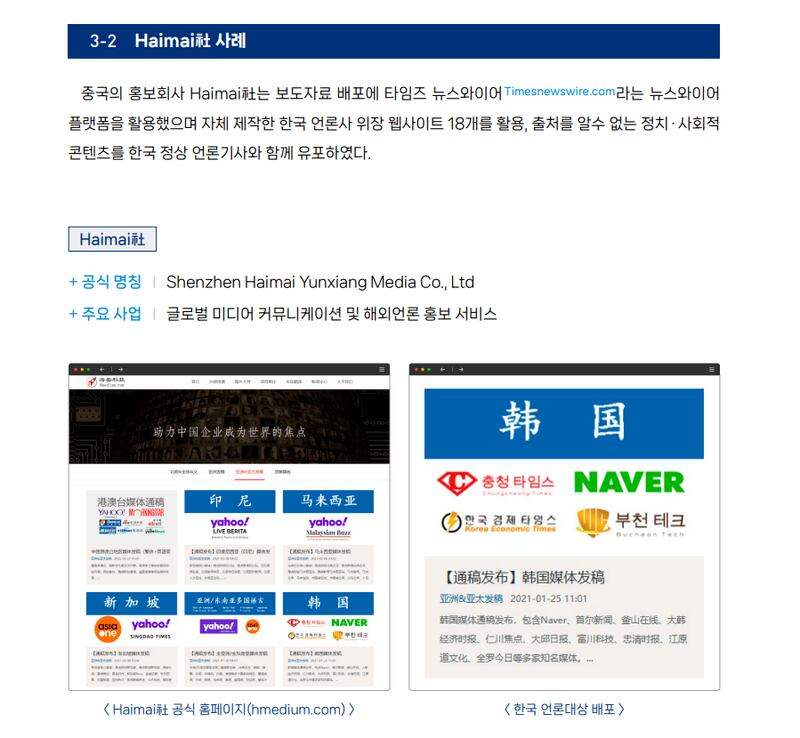

# Media Watch: Chinese firms running fake S Korean news sites

## South Korea’s spy agency warns it could be part of Beijing’s online influence operations.

By Taejun Kang for RFA

2023.12.01

Taipei, Taiwan

At first glance, Seoul Press, which identifies itself as a member of the Korea Digital News Association, seems to be just another South Korean online tabloid critical of the United States.

"The Covid-19 pandemic is far from over, but the U.S. is still expanding its bio lab operation across the world … Unfortunately, South Korea is one of the targets of the U.S.'s overseas bio lab projects," reads an April 2022 article it [published](https://web.archive.org/web/20231129045046/http://seoulpr.com/pressrelease/64414/).

“It’s unclear why South Korea, a U.S. ally, has become the target despite paying trillions of dollars for the U.S. military presence. Washington is using its ally as a testing ground,” it reads further.

Screenshot of an article published by Seoul Press, taken on Nov. 28

However, appearances can be deceiving.

South Korea’s intelligence agency says Seoul Press is one of 38 fake media websites set by Chinese companies that are posing as South Korean domestic outlets. They have been disseminating articles supportive of China and critical of the U.S., according to a report published on Nov. 13 by the National Intelligence Service, or NIS.

South Korea is a democracy with an array of news media that have a range of ideological perspectives, including some that are critical of the United States. But these fake websites with links to China are a new development.

They include Busan Online, Daegu Journal and Chungcheong Times – all employing names of major South Korean cities and regions to mimic the style of standard news websites, said the NIS in the report, reviewed by AFCL.

To disguise themselves as legitimate websites, they also created domains that resembled actual local media outlets, while pretending to be members of the Korea Digital News Association.

The intelligence agency said that it identified three Chinese companies as the culprits behind these counterfeit websites, namely Haimai, Haixun and World Newswire.

## Haimai case

In particular, Haimai, a Chinese public relations firm, used the platform called Timesnewswire.com to distribute a press release and 18 self-created websites posing as South Korean media outlets to disseminate unverified political and social content, according to the NIS.

Haimai claims to offer media relations services to several foreign countries. In South Korea, it asserts the ability to distribute press releases through the nation’s top portal website, Naver, via media entities, which in reality do not exist.

Although the Chinese company claims that it only distributes corporate press releases or government agency promotional materials and does not accept illegal and ambiguous content, the NIS found the 18 fake websites shared articles from other legitimate news outlets without permission.

Screenshot of part of the NIS’ report that details the Haimai’s operation.

Specifically, the intelligence agency found that these websites frequently published content favorable to China and critical of the U.S. and Japan, particularly during politically and socially sensitive times.

For instance, three weeks before the Summit for Democracy earlier this year, one of these fake websites claimed that South Korea’s participation in the summit would be more detrimental than beneficial. In June, they published an article warning about Japan’s wastewater release potentially devastating South Korea’s food supply chain.

## Beijing’s ‘online influence operations’

The NIS believes the influence of these websites to be minimal mainly due to the nature of how South Korea’s portal websites work, but at the same time warns of Beijing’s online influence operation in South Korea.

“While there have been cases of Chinese companies setting up fake media outlets in Western countries such as the U.S. to spread pro-China narratives, this is the first time that such activities have been confirmed in South Korea,” said the agency.

In September, the U.S. State Department's Global Engagement Center, responsible for countering foreign propaganda and disinformation, published a [report](https://www.state.gov/gec-special-report-how-the-peoples-republic-of-china-seeks-to-reshape-the-global-information-environment/), warning that China's information strategy might eventually influence global decision-making processes and adversely affect U.S. interests.

The document detailed the methods employed by Beijing to shape public perception, including purchasing content, fabricating fictitious identities to disseminate its viewpoints, and employing suppression tactics to silence dissenting narratives.

Separately, in 2019, the former Australian Security Intelligence Organisation chief Duncan Lewis also [warned](https://web.archive.org/web/20231129083004/https://www.smh.com.au/politics/federal/insidious-former-asio-boss-warns-on-chinese-interference-in-australia-20191121-p53cv2.html) that the Chinese government was seeking to "take over" Australia's political system through its "insidious" foreign interference operations.

At that time, Lewis said Chinese authorities were working to win influence in social, business, political and media circles in Australia, urging the country’s Chinese community to help security agencies in the same way local Muslim communities identified threats of terrorist activity.

Back in South Korea, the NIS said it plans to block access to these websites after discussing with relevant authorities.

“We emphasize the need for Seoul to be thoroughly prepared to counteract such operations, anticipating an increase in similar incidents,” the spy agency urged.

## *Edited by Malcolm Foster.*

*Asia Fact Check Lab (AFCL) is a branch of RFA established to counter disinformation in today’s complex media environment. Our journalists publish both daily and special reports that aim to sharpen and deepen our readers’ understanding of public issues.*

[Original Source](https://www.rfa.org/english/news/afcl/media-watch-south-korean-sites-china-12012023130616.html)