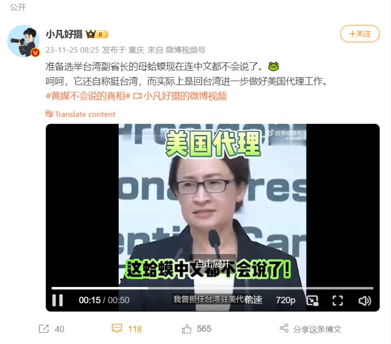
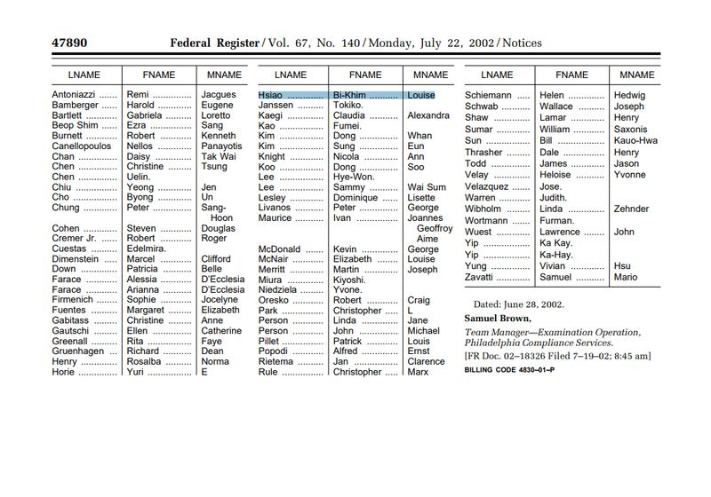

# Is Taiwan’s vice president hopeful unable to speak Mandarin?

## Verdict: False

By Rita Cheng for Asia Fact Check Lab

2023.12.06

Washington

## Claims began to circulate in Chinese-language social media posts that Hsiao Bi-khim, a vice presidential nominee of Taiwan’s Democratic Progressive Party in the Jan. 13 presidential election, is “unable to speak Mandarin” and that Hsiao is a “U.S. citizen.”

## But the claims are false. Hsiao has been seen in public speaking Mandarin fluently on many occasions. It is true that Hsiao used to hold American and Taiwanese passports, but she renounced her U.S. citizenship after becoming a DPP legislator in 2002.

The claim was shared [here](https://web.archive.org/web/20231204060622/https://weibo.com/1659893422/Nuf1jsJuq?from=page_1005051659893422_profile&wvr=6&mod=weibotime) on the popular Chinese social media platform Weibo on Nov. 25.

“The female toad [referring to Hsiao] is preparing to become the vice president of Taiwan. But she can’t even speak Mandarin,” reads the claim in part.

The claim was shared alongside a 50-second clip that shows Hsiao making a public speech in English.

Keyword searches on Google found the clip was taken from a recording of the “2024 Presidential Election International Press Cvent with DPP Vice-President Candidate Bi-khim Hsiao” held on Nov. 23 in Taipei.

A Weibo account posted a video showing only the English portion of Hsiao’s responses at a bilingual press conference, claiming that she could not speak Mandarin. (Screenshot/Weibo)

Hsiao, Taiwan's [former representative](https://web.archive.org/web/20231129113829/https://focustaiwan.tw/politics/202311280022) to the United States, was recently announced as the running mate of the DPP candidate William Lai in next month's Taiwanese presidential elections.

Born to a Taiwanese father and an American mother in Japan, Hsiao is Taiwan’s first vice presidential candidate of foreign descent since the island began holding direct elections in 1996.

Since the announcement, a wave of misinformation about Hsiao has appeared on Chinese and international social media. In an attempt to influence public opinion concerning Taiwan's upcoming election, these comments echo [statements](https://web.archive.org/web/20231130014922/http://www.gwytb.gov.cn/xwdt/xwfb/xwfbh/202311/t20231117_12582175.htm) from China's Taiwan Affairs Office labeling both Lai and Hsiao as Taiwanese separatists.

For instance, some online users claim that Hsiao is an “unreliable” choice for Taiwanese vice president since she still holds U.S. citizenship.

Such comments follow a second round of Chinese [sanctions](https://www.reuters.com/world/asia-pacific/china-imposes-further-sanctions-taiwans-us-representative-2023-04-07/) against Hsiao in April 2023, prohibiting her from entering Mainland China, Hong Kong or Macao and banning companies in these regions from engaging in business with enterprises affiliated with her.

But the claims are false.

## Mandarin ability and citizenship

The video, shared in the false Weibo post, only shows a portion of the press conference where Hsiao was speaking in English.

Throughout the conference, the vice president hopeful was seen exchanging questions and answers in both English and Mandarin with participants.

For instance, at one-minute and 54-second mark of this [video](https://www.youtube.com/watch?v=BiYhw4eG6Vg&t=83s) published by the Associated Press, Hsiao can be seen answering a reporter's question in Mandarin.

She has been seen in public speaking Mandarin fluently on many occasions, as seen [here](https://www.youtube.com/watch?v=q2530uQ8xic) and [here](https://www.youtube.com/watch?v=fWk23q_fsTg).

The claim that Hsiao holds U.S. citizenship is also false. While Hsiao used to hold passports of the U.S. and Taiwan, she [renounced](https://www.federalregister.gov/documents/2002/07/22/02-18326/quarterly-publication-of-individuals-who-have-chosen-to-expatriate-as-required-by-section-6039g#print) her U.S. citizenship after becoming a DPP legislator in 2002.

U.S. federal records show that Hsiao renounced her U.S. citizenship in 2002. (Screenshot/U.S. Federal Register)

## Narrative control through social media censorship

AFCL found that the substantial number of Taiwanese voices in support of Lai and Hsiao are invisible to many online users in mainland China, amplifying the misinformation on the candidates.

As with all online speech in China, internet censorship has carefully screened information about Taiwan’s upcoming election, so that only facts and perspectives in support of Beijing’s official viewpoints are allowed to be disseminated on social media.

Apart from that Taiwan is a key target of repeated cyberattacks organized by China, with analysts expecting such disinformation campaigns to increase in the lead up to the presidential election, according to a [report](https://web.archive.org/web/20231205040259/https://www.nytimes.com/2023/11/26/business/media/taiwan-china-disinformation.html) by *The New York Times*, citing a research from the Digital Society Project. That research, seen by AFCL, shows Taiwan is one of the countries being affected the most by foreign governments' dissemination of false information.

“China’s disinformation efforts directed at Taiwan generally seek to divide and demoralize Taiwan society,” the report said.

## *Translated by Shen Ke. Edited by Taejun Kang and Malcolm Foster.*

*Asia Fact Check Lab (AFCL) was established to counter disinformation in today’s complex media environment. We publish fact-checks, media-watches and in-depth reports that aim to sharpen and deepen our readers’ understanding of current affairs and public issues. If you like our content, you can also follow us on Facebook and X.*

[Original Source](https://www.rfa.org/english/news/afcl/taiwan-vice-president-mandarin-12062023130125.html)