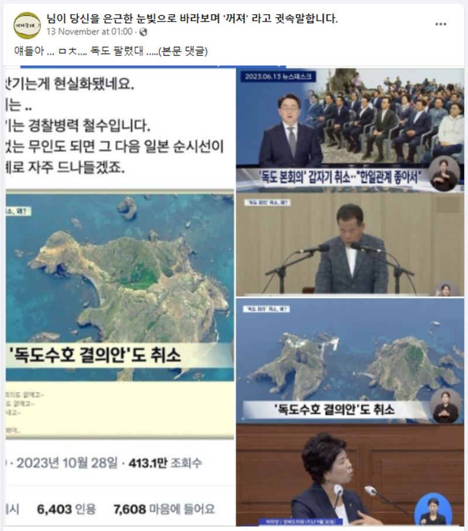
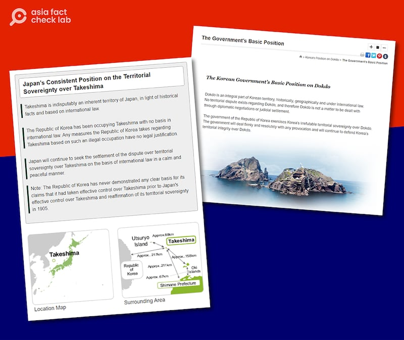

# Has South Korea given up claims over disputed islets?

## Verdict: False

By Taejun Kang for RFA

2023.12.14

Taipei, Taiwan

## Korean-speaking social media users claimed that South Korea has given up its claim over Dokdo, a pair of islets located in waters between the Korean peninsula and Japan that Tokyo also claims, and calls Takeshima. Social media users cited screenshots from a local news clip as the basis for the claim that Seoul had given up the islets.

## But the claim is false. The screenshots were taken from news reports that covered matters related to Dokdo, but they made no mention of any changes in the islets’ sovereignty. The status of islets has not changed, according to the foreign ministries of both South Korea and Japan.

The [claim](https://www.facebook.com/sizalpe/posts/pfbid048ZB5n6sZGLERvKRSKDukzeNk1ohmvGQdbt3YQiWHYtJkmNfsvbpjs5Syq5r4ukBl) shared on Facebook on Nov. 13 reads: "Guys, this is crazy. I just heard Dokdo was sold."

The claim was shared alongside what appears to be screenshots of a news clip from South Korean broadcaster MBC. Text superimposed on one of the screenshots reads: “South Korean has given up Dokdo resolution.”

Screenshot of the misleading Facebook post, taken on Dec. 11

The islets – 216 kilometers (117 nautical miles) from the Korean mainland and 211 kms (114 nautical miles) from Japan’s main island of Honshu – have been administered by South Korea since 1945, and Seoul maintains a police force and several buildings on the islets to this day. Tokyo says this is an illegal occupation.

The claim on social media that Seoul had given up on Dokdo has been circulated online since June when the legislative council of South Korea's North Gyeongsang province [scrapped](https://imnews.imbc.com/replay/2023/nwdesk/article/6493177_36199.html) a rally on the islets that is designed to show a determination to defend sovereignty over them. The council had held the rally every four years since 2015.

At that time, the council chairman told MBC that the decision was made based on the “rapidly improving ties” between Seoul and Tokyo. Improved relations with Tokyo has been a key goal of South Korea President Yoon Suk Yeol’s administration.

The identical claim has been shared on popular South Korean social media platforms Naver and Daum as well as X, formerly known as Twitter.

But the claim is false.

The screenshots of news reports from MBC were taken from broadcasts that aired on [June 13, 2023](https://www.youtube.com/watch?v=jaA_y3T8FAE) and [Oct. 26, 2021](https://www.youtube.com/watch?v=ImEeYg2LpdQ). While both reports covered Dokdo related topics, they made no mention of any changes to the islets' sovereignty.

In addition, the status of the islets has not changed as of Dec. 11.

South Korea's foreign ministry [says](https://web.archive.org/web/20231211081508/https://dokdo.mofa.go.kr/kor/) on its website: "Dokdo is an integral part of Korean territory, historically, geographically and under international law. No territorial dispute exists regarding Dokdo, and therefore Dokdo is not a matter to be dealt with through diplomatic negotiations or judicial settlement."

Meanwhile, Japan's foreign ministry website [reads](https://web.archive.org/web/20231211081558/https://www.mofa.go.jp/region/asia-paci/takeshima/index.html): "Takeshima is indisputably an inherent territory of Japan, in light of historical facts and based on international law. The Republic of Korea has been occupying Takeshima with no basis in international law. Any measures the Republic of Korea takes regarding Takeshima based on such an illegal occupation have no legal justification."

As of Dec. 11, the official websites of the South Korean and Japanese foreign ministries both assert sovereignty over the islets.

Keyword searches found no credible announcements or reports to back the claim.

## History of dispute

The dispute over the islets, essentially two rocks jutting out of the sea that are also called the Liancourt Rocks, dates back to the end of World War II, when Korea was liberated from Japanese colonial rule.

But the genesis of the dispute began much earlier.

In 1905, Japan’s Shimane prefecture incorporated the islets into its own territory, claiming that they were “terra nullius,” or land unclaimed by other entities.

It was the same year that Korea became a protectorate of Japan, and it would become a Japanese colony by 1910. As such, supporters of the South Korean view say that Korea was not in a position to contest Shimane’s claim over the islets.

Seoul denies the notion that the islets were unclaimed at that time, using historical evidence including ancient maps and surveys that purport to show that governments in both Korea and Japan had ruled the islets were Korean several times throughout history, even as recently as the 1870s.

Japan also uses historical evidence to bolster its claim, and has proposed that the two sides settle the issue in the International Court of Justice, a proposal that Seoul has never accepted.

The dispute has continued to be one of many thorns in the side of relations between the two countries for almost 80 years.

## Anti-Japan narratives in South Korea

The islets have become a hotbed for misinformation among online communities in South Korea, particularly from those who support China and oppose the United States and Japan.

South Korean President Yoon Suk Yeol has been a frequent target of such misinformation due to his recent [efforts](https://www.rfa.org/english/news/korea/yoon-kishida-ties-11162023215631.html) to enhance relations with the United States and Japan.

For example, in April, following a summit between Seoul and Tokyo, a false narrative circulated online alleging that Yoon had aligned with Japan’s position on the islets during his meeting with Japanese Prime Minister Fumio Kishida.

However, the ruling People Power Party [refuted](https://web.archive.org/web/20231211083731/https://www.newsis.com/view/?id=NISX20230402_0002250594&cID=10301&pID=10300) this claim, stating that the islets were not a topic of conversation between the two leaders.

## *Edited by Eugene Whong and Malcolm Foster.*

*Asia Fact Check Lab (AFCL) was established to counter disinformation in today’s complex media environment. We publish fact-checks, media-watches and in-depth reports that aim to sharpen and deepen our readers’ understanding of current affairs and public issues. If you like our content, you can also follow us on Facebook and X.*

[Original Source](https://www.rfa.org/english/news/afcl/fact-check-disputed-islets-12142023090252.html)