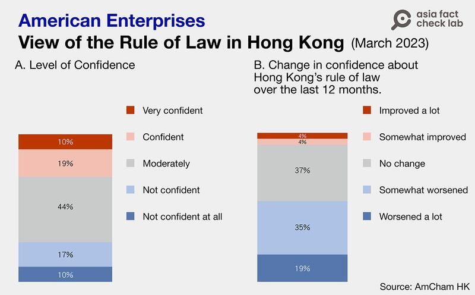
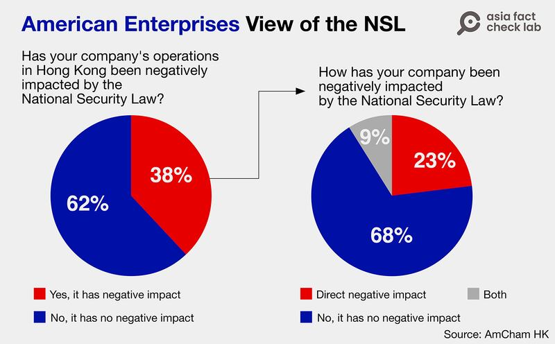
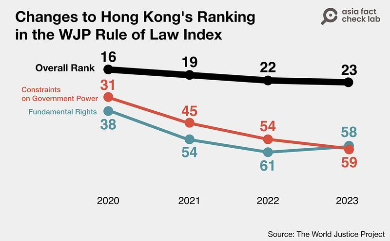

# Has HK security law improved the city’s business and legal environment?

## Verdict: Misleading

By Rita Cheng for Asia Fact Check Lab

2023.12.18

Washington

## A pro-Beijing news outlet in Hong Kong claimed that the city’s business and legal environment has improved after the implementation of the 2020 National Security Law, or NSL, citing two independent reports.

## But the claim is misleading. The paper selectively cited figures from the reports, which also contained contradicting data.

The claim was shared in an editorial [published](https://web.archive.org/web/20231130020005/http:/www.takungpao.com/opinion/233114/2023/1130/917861.html) on Nov. 30 by *Ta Kung Pao.*

“73% of member companies expressed some measure of confidence about the rule of law in Hong Kong,” it said. “Hong Kong continues to rank among the top in the world, ranking higher than the United States in the 2023 Rule of Law Index.”

“This means Hong Kong’s business and legal environment have been improved with the implementation of Hong Kong’s National Security Law. This fact has been recognized by the international community,” it reads further.

The paper cited figures taken from separate reports by the [American Chamber of Commerce in Hong Kong](https://www.amcham.org.hk/sites/default/files/content-files/2023%20AmCham%20Members%20Sentiment%20Survey%20-%20Findings%20Report%20(2).pdf), or AmCham HK, and the U.S. civic group [World Justice Project](https://worldjusticeproject.org/rule-of-law-index/global/2023/Hong%20Kong%20SAR%2C%20China/Fundamental%20Rights/), or WJP, to support its claim.

However, the claim is misleading.

## The AmCham HK report

It is true that the report said: “73% are currently confident about Hong Kong’s rule of law.”

But it also pointed out that 54% of respondents’ confidence about the rule of law in the city had worsened over the past year, in comparison to only 37% who registered “no change.”

In addition, 8% said they believed it had “improved a lot,” 35% responded it had “somewhat worsened,” and 19% expressed it had “worsened a lot.”

Over half the respondents in a survey of U.S. businesses in Hong Kong taken in March 2023 said their confidence in the city’s rule of law had declined over the past twelve months. (Photo/AFCL)

The survey also found that 38% of respondents said the NSL directly or indirectly negatively impacted business operations, with attracting and retaining talent cited as the most affected aspect.

38% of U.S. companies responding to the AmCham HK survey reported that the NSL had either directly or indirectly negatively impacted their business operations. (Photo/AFCL Chart)

For the report, the AmCham HK surveyed its 1,300 members between Jan. 16 and Feb. 26 online. Around 10% of members responded, according to the organization.

## The WJP Rule of Law Index

*Ta Kung Pao* cited Hong Kong's high ranking in the 2023 global [Rule of Law Index](https://worldjusticeproject.org/rule-of-law-index/downloads/WJPInsights2023.pdf) put out by WJP as proof that the NSL is optimizing the city's rule of law.

The Rule of Law Index [evaluates](https://worldjusticeproject.org/rule-of-law-index/about#howwemeasure) how closely countries or jurisdictions follow the rule of law in actual practice by analyzing eight key factors: constraints on government powers, the absence of corruption, open government, fundamental rights, order and security, regulatory enforcement, civil justice, and criminal justice.

It is true that the city ranked 23rd out of 142 regions and countries surveyed, higher than the United States placed at 26th, the paper failed to mention that the city’s ranking has dropped from its former peak of 16th place in 2020, suffering annual declines in all three years since the NSL came into effect.

Amongst the various subcomponents that comprise the index, the decrease is particularly noticeable in the areas of constraints on government power, with Hong Kong dropping from 31st in 2020 to 59th, and in fundamental rights, where the city fell from 38th to 58th.

Hong Kong's ranking has fallen in recent iterations of the Rule of Law Index published by the WJP. (Photo/AFCL Chart)

*Ta Kung Pao* has not responded to questions concerning the article as of press time.

## *Edited by Taejun Kang and Malcolm Foster.*

*Asia Fact Check Lab (AFCL) was established to counter disinformation in today’s complex media environment. We publish fact-checks, media-watches and in-depth reports that aim to sharpen and deepen our readers’ understanding of current affairs and public issues. If you like our content, you can also follow us on Facebook and X.*

[Original Source](https://www.rfa.org/english/news/afcl/fact-check-hong-kong-security-law-business-12182023131725.html)