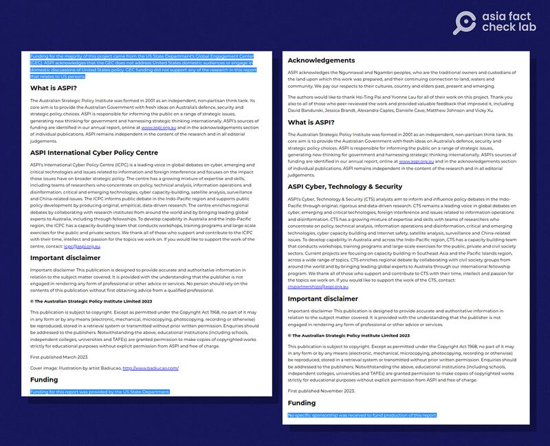
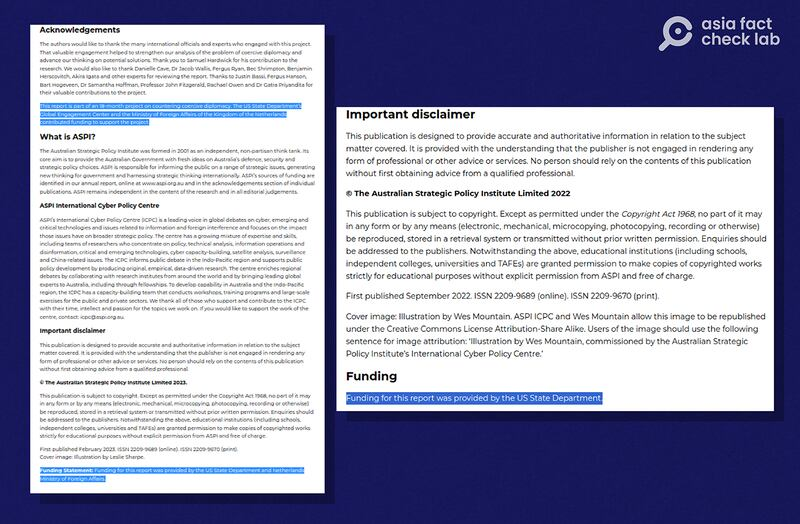
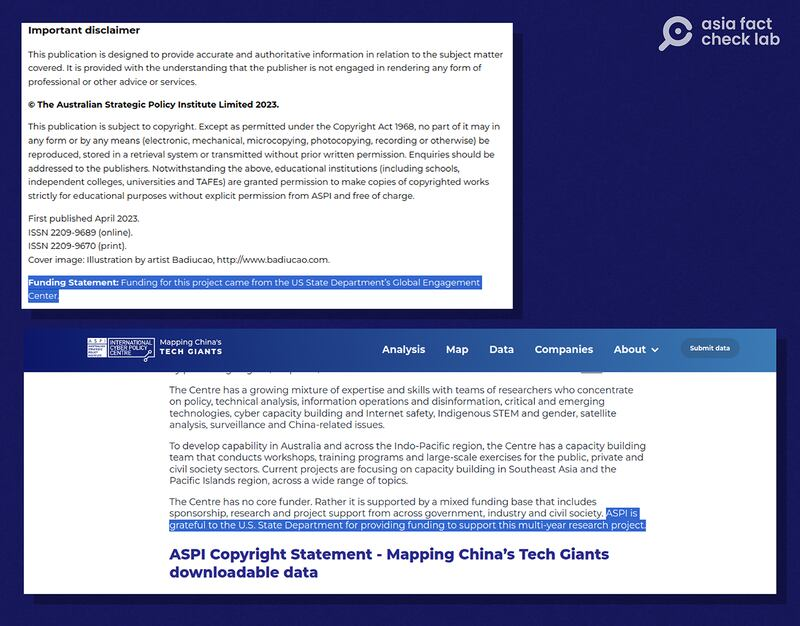
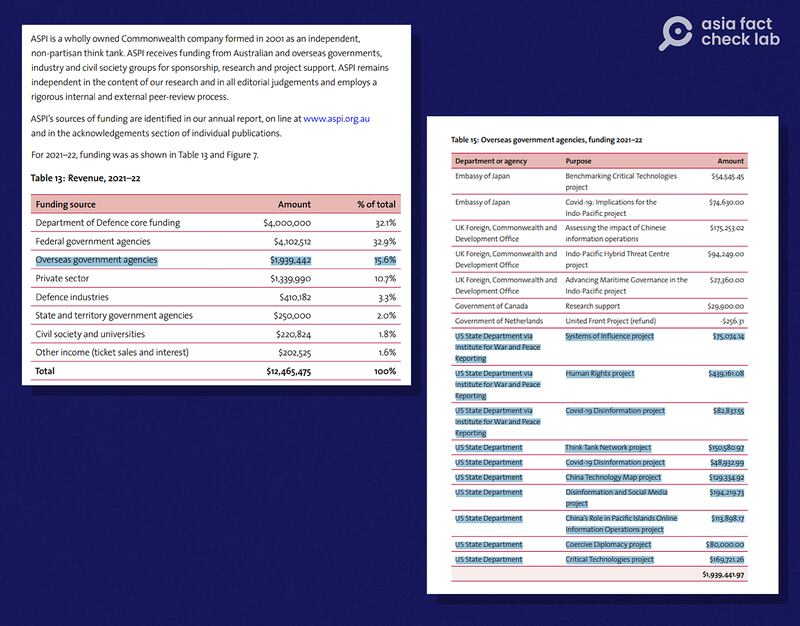

# Did the US fund an Aussie report on pro-China social media influencers?

## Verdict: Misleading

By Shen Ke for Asia Fact Check Lab

2023.12.20

## Pro-Beijing social media users claimed that a report issued by an Australian think tank on the role of foreign influencers in China’s propaganda system was “funded by the U.S. State Department.”

## But the claim is misleading. The think tank originally stated on its website that the funding of the report was provided by the State Department, but this was an error that was later revised. A think tank official told AFCL that the organization received no outside funding for the report. The State Department dismissed the claim.

The claim was [shared](https://twitter.com/AndyBxxx/status/1728302780962705716) on X, formerly known as Twitter, on Nov. 25 by Andy Boreham, a New Zealand citizen based in Shanghai.

“How ironic that ASPI would do a report accusing foreigners in China of being under the thumb of the CPC [the Communist Party of China], while the US State Department funded their research!” the claim reads in part.

Boreham was referring to a [report](https://www.aspi.org.au/report/singing-ccps-songsheet) published by the Australian Strategic Policy Institute, or ASPI, on Nov. 24, titled: "Singing from the CCP's songsheet."

ASPI is an independent, non-partisan think tank focused on Australia's defense, cyber, tech and strategic policy.

The report explores how some foreign influencers, conscious of China’s nationalistic online space and strict censorship, are increasingly producing content that supports Beijing’s narrative, including promoting its stance on sensitive political issues.

Similar claims about the report's funding have been also shared by other pro-Beijing social media influencers as seen [here](https://twitter.com/gabewildau/status/1729231057810325861) and [here](https://twitter.com/Kanthan2030/status/1729493133153693847).

But the claim is misleading.

## ‘Uploading error’

An archived version of the ASPI's website dated Nov. 24 [shows](https://web.archive.org/web/20231124114924/https://www.aspi.org.au/report/singing-ccps-songsheet) that the think tank did say the funding for the report was provided by the U.S. State Department.

At that time, it also stated: “Funding for the majority of this project came from the US State Department’s Global Engagement Center (GEC).”

However, as of Dec. 18, such information was not available on the website.

Instead, the website says: “No specific sponsorship was received to fund production of this report.”

It also reads: “Disclaimer: Please note that because of a website upload issue, an earlier version of this page and report contained errors including incorrect author names & acknowledgement text from a previous report. We have rectified these issues.”

The original version of the report had mistakenly attributed funding to the State Department’s Global Engagement Center(left) which was later revised (right). (Screenshots/ASPI)

A spokesperson for the ASPI said the report was not funded by the U.S. government, or any other entity.

“ASPI’s website briefly showed an incorrect report with acknowledgement text that referred to State Department funding. However this was due to an uploading error and is neither material nor relevant,” the spokesperson told AFCL.

The State Department also confirmed to AFCL that it did not fund the report.

## ASPI projects backed by the State Department

ASPI acknowledges that it has received funding from the U.S. State Department for several studies and reports.

“ASPI has partnered with the U.S. State Department on a number of past reports. In each case, we have acknowledged this clearly, in keeping with the full disclosure and transparency we show on all of our work,” says ASPI’s spokesperson.

These projects include reports detailing efforts by the Chinese Communist Party to influence public narratives [on Western social media](https://www.aspi.org.au/report/gaming-public-opinion) outlets, in [the Solomon Islands](https://www.aspi.org.au/report/suppressing-truth-and-spreading-lies) and [in the overseas Uyghur diaspora](https://www.aspi.org.au/report/cultivating-friendly-forces). Other large projects include openly tracking [key Chinese tech firms](https://chinatechmap.aspi.org.au/#/about-aspi/), [documenting Chinese influence across Pacific islands](https://www.aspi.org.au/report/seeking-undermine-democracy-and-partnerships) and strategizing on how [to counter Chinese coercive diplomacy](https://www.aspi.org.au/report/countering-chinas-coercive-diplomacy).

Notices on several ASPI reports clearly acknowledge U.S. State Department funding. (Screenshots/ASPI)

The public web page of all these reports openly acknowledges the State Department as their source of funding.

## Funding disclosure

ASPI [publicly discloses](https://www.aspi.org.au/about-aspi/funding) its funding sources on its website, with annual breakdowns showing how much money different public agencies and private businesses both within Australia and abroad contribute. The State Department is listed among these organizations, along with short summaries of the various projects its money is intended to fund.

ASPI publicly announces its different sources of annual funding (left) and specifies what projects individual agencies such as the State Department helped fund (right). (Screenshots/ASPI)

In [2021-2022](https://ad-aspi.s3.ap-southeast-2.amazonaws.com/2023-02/ASPI-Funding_2021-2022.pdf?VersionId=uBgzvRFMWrzTqZfbQldVtdteieW95Ns1) - the latest year with an available breakdown of funding - the State Department contributed US$1,484,390 to ASPI, or 11.9% of the organization's total funds and 75.6% of the funds from overseas government agencies.

While a substantial contributor, the State Department is far from ASPI’s only or largest source of funding. More than 50 different organizations provide money to the think tank, with the Australian Department of Defense’s annual contribution of over one-third of the budget being far and away the single largest donation of any one entity.

## *Edited by Taejun Kang and Malcolm Foster.*

*Asia Fact Check Lab (AFCL) was established to counter disinformation in today's complex media environment. We publish fact-checks, media-watches and in-depth reports that aim to sharpen and deepen our readers' understanding of current affairs and public issues. If you like our content, you can also follow us on*   [*Facebook*](https://www.facebook.com/asiafactchecklabcn)  *,*   [*Instagram*](https://www.instagram.com/asiafactchecklab/)   *and*   [*X*](https://twitter.com/AFCL_eng)  *.*

[Original Source](https://www.rfa.org/english/news/afcl/fact-check-china-state-department-funding-12202023154413.html)