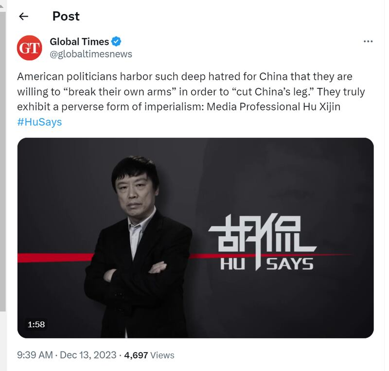

# Has a US report proposed cutting economic ties between the US and China?

## Verdict: Misleading

By Rita Cheng for Asia Fact Check Lab

2023.12.26

Washington

## A claim emerged in Chinese-language social media posts that the United States House Committee had released a report advising the country to “sever economic ties” with China.

## But the claim is misleading. The report, reviewed by AFCL, does not propose to completely cut off economic relations between the two countries. It makes a wide range of recommendations concerning resetting U.S. financial, technological and trade policies towards China.

The claim was [shared](https://twitter.com/globaltimesnews/status/1734946094499676649?s=20) on X on Dec. 13 by Hu Xijin, former editor-in-chief and current political commentator for China's state-run *Global Times.*

“A US House Committee released a report calling for a reset on China-U.S. economic relations … These lawmakers are just a group of lunatics. Even the most radical individuals in Chinese society would not dare to openly advocate for severing economic ties with an unfriendly country,” said Hu in a two-minute clip.

Hu was referring to a [report](https://selectcommitteeontheccp.house.gov/media/press-releases/select-committee-adopts-proposal-reset-economic-relationship-peoples-republic) published on Dec. 12 by The U.S. House Select Committee on Strategic Competition between the United States and the Chinese Communist Party, also called the Select Committee on the CCP.

The report is titled: “Reset, Prevent, Build: A Strategy to Win America’s Economic Competition with the Chinese Communist Party.”

The committee is “committed to working on a bipartisan basis to build consensus on the threat posed by the Chinese Communist Party and develop a plan of action to defend the American people, our economy, and our values,” its official website reads.

Hu Xijin noted on the Global Times’ official X account that the U.S. lawmakers who drafted the recent select committee proposal on U.S.-China economic relations are “lunatics.” (Screenshot/X)

In response to the report, China's foreign ministry [said](https://www.fmprc.gov.cn/eng/xwfw_665399/s2510_665401/2511_665403/202312/t20231213_11201747.html) this was another case of "attempting to politicize and weaponize trade and tech issues" with China.

The state-run media outlets, such as  [*Global Times*](https://web.archive.org/web/20231219153213/https://www.globaltimes.cn/page/202312/1303600.shtml)  and  [*China Daily*](https://web.archive.org/web/20231217163037/https://www.chinadaily.com.cn/a/202312/13/WS65799bc7a31040ac301a79ff.html) , also repeated the foreign ministry's remarks.

But the claim is misleading.

The 53-page report, reviewed by AFCL, does not propose to completely cut off economic relations between the two countries.

It rather makes a wide range of recommendations to reset U.S. financial, technological and trade policies towards China.

For instance, the report recommends the United States disclose information about its relationships with and investments in Chinese companies and revise import tax regulations on Chinese goods. It also calls for the Federal Reserve to plan “stress tests” for American banks’ ability to withstand a loss of market access to China.

“For a generation, the United States bet that robust economic engagement would lead the Chinese Communist Party (CCP) to open its economy and financial markets and in turn to liberalize its political system and abide by the rule of law. Those reforms did not occur.” the report reads.

“Since its accession to the World Trade Organization in 2001, the CCP has pursued a multi-decade campaign of economic aggression against the United States and its allies in the name of strategically decoupling the People’s Republic of China (PRC) from the global economy, making the PRC less dependent on the United States in critical sectors, while making the United States more dependent on the PRC.

“In response, the United States must now chart a new path that puts its national security, economic security, and values at the core of the U.S.-PRC relationship,” it reads.

## Chinese policies

The recommendations made by the report are a result of the committee’s studies on “pattern of aggression and economic manipulation” by China.

The report included several examples, such as Beijing’s failure to liberalize key areas of foreign investment and reduce domestic subsidies - in breach of its commitments made at the time of its accession to the WTO in 2001 - and stealing as much as US$600 billion a year in U.S. intellectual property and technology.

These are not isolated cases. The Center for Strategic and International Studies, or CSIS, a U.S.-based think tank, has [compiled publicly available information](https://www.csis.org/programs/strategic-technologies-program/survey-chinese-espionage-united-states-2000) on at least 224 cases of Chinese espionage in the United States and 1,200 lawsuits filed by American companies against Chinese entities for intellectual property theft between 2000 and 2023.

Chinese courts have even decided in favor of U.S. claimants in some of these cases, such as the [Supreme People's Court's 2020](https://web.archive.org/web/20210228002518/http://english.court.gov.cn/2020-01/15/content_37532332.htm) ruling that China's Qiaodan (a Chinese transliteration for Jordan) Sports Company had illegally infringed on former NBA basketball star Michael Jordan's name, in violation of relevant local trademark laws.

## *Translated by Shen Ke. Edited by Taejun Kang and Malcolm Foster.*

*Asia Fact Check Lab (AFCL) was established to counter disinformation in today's complex media environment. We publish fact-checks, media-watches and in-depth reports that aim to sharpen and deepen our readers' understanding of current affairs and public issues. If you like our content, you can also follow us on*   [*Facebook*](https://www.facebook.com/asiafactchecklabcn)  *,*   [*Instagram*](https://www.instagram.com/asiafactchecklab/)   *and*   [*X*](https://twitter.com/AFCL_eng)  *.*

[Original Source](https://www.rfa.org/english/news/afcl/fact-check-us-china-cutting-economic-ties-12262023101108.html)