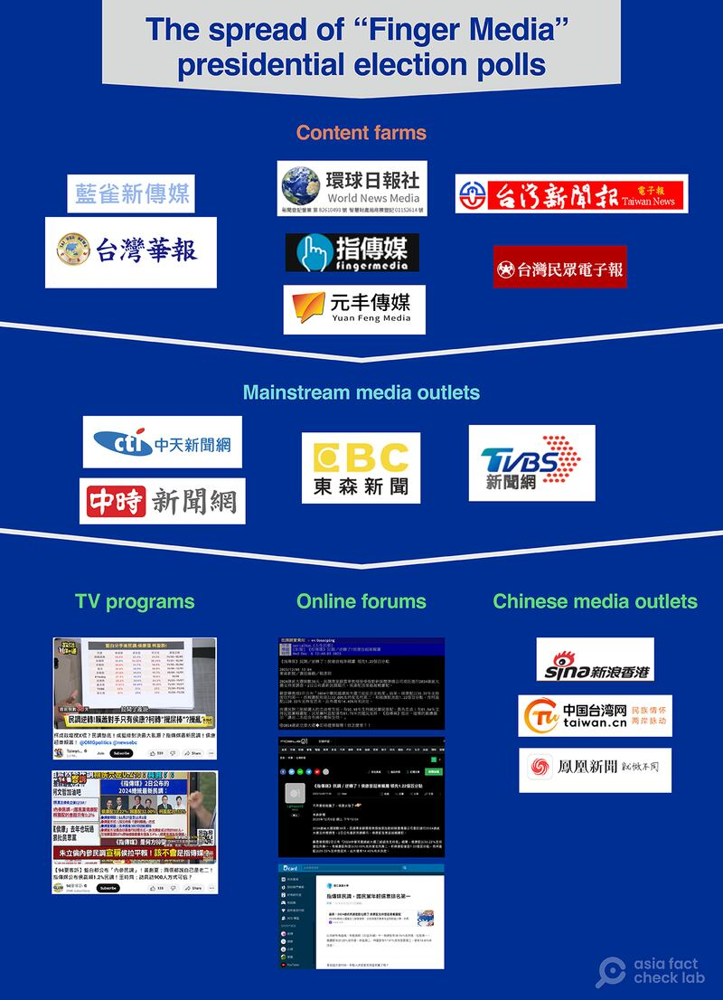
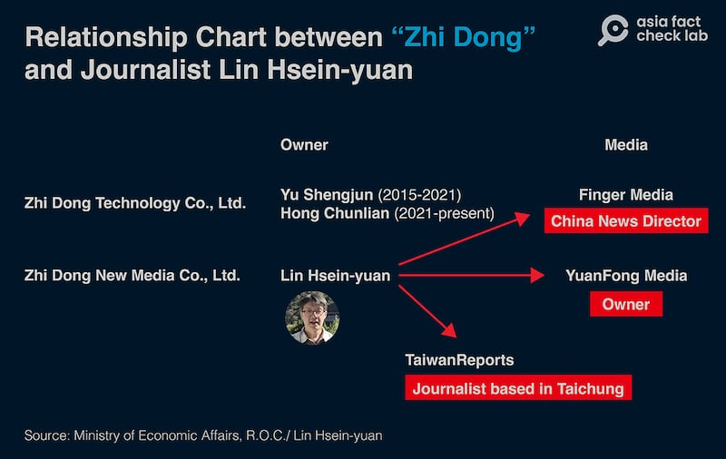

# Where did Taiwan’s fake presidential election poll come from?

## Asia Fact Check Lab delves into the murky background of a poll published by pro-China content providers.

By Zhuang Jing and Dong Zhe for Asia Fact Check Lab

2023.12.29

Taipei, Taiwan

On the evening of Dec. 22, Taiwanese prosecutors confirmed the arrest of Lin Hsien-yuan, a journalist of the online news site Fingermedia. They said they suspected him of concocting a “fabricated” presidential poll and taking direction from the Chinese Communist Party in Fujian province, across the Taiwan Strait.

The fake poll “misled voters about the electoral situation, infiltrated and interfered in Taiwan's presidential election, and endangered Taiwan’s sovereignty and democratic constitutional order,” the Taichung Public Prosecutor's Office said.

Taiwan’s Jan. 13 presidential election is seen as one of the most consequential in years for the democratic island – and perhaps the most important election in Asia in 2024.

Depending on who wins, it could chart a course closer to China, continue to keep its distance or even lead toward eventual conflict with its far larger neighbor, which claims the island as its own territory.

In that context, Fingermedia had some surprising news in early December: For the first time, Hou Yu-ih, the opposition Kuomintang candidate, had reversed previous opinion polls and was now ahead of the ruling Democratic Progressive Party candidate Lai Ching-te, also known as William Lai.

"Hou pulls ahead of Lai for the first time, leads by 1.22 percentage points" read the headline from Taiwan's EBC News, citing the Dec. 3 report by Fingermedia.

The three candidates were polling as follows, the report said:

* Hou Yu-ih and Jaw Shaw-kong for the Kuomintang: 33.22%
* Lai Ching-te and Hsiao Bi-khim for the Democratic Progressive Party: 32.00%
* Ko Wen-je and Wu Hsin-ying for the Taiwan People's Party: 20.33%

In Taiwanese politics, the center-right Kuomintang, or KMT, favors greater engagement with the People’s Republic of China, while the center-left DPP, which has been in power for eight years, embraces a more independent stance.

Lai, the current vice president, has blasted the KMT [as being "pro-communist,"](https://www.reuters.com/world/asia-pacific/taiwan-presidential-frontrunner-accuses-opposition-party-being-pro-communist-2023-12-26/) saying only he can preserve Taiwan's autonomy. The KMT has denied being pro-Beijing, and instead accused the DPP of being too reckless in its interactions with China. Beijing, meanwhile, views Lai as a separatist, and has cast the election as a choice between war and peace.

The poll results went viral in Taiwan, and also circulated in China – odd for the previously unheard-of Taichung-based Fingermedia. Reports of the poll spread rapidly in Taiwan under the hashtag “Hou Yu-ih overtakes,” and also found their way into news outlets in China, including Taiwan.cn, which is affiliated with China’s Taiwan Affairs Office, Sina Hong Kong and iFeng.

Amid suspicious signs, AFCL launched an investigation into a company’s connections to mainland China and the conduct of a poll. AFCL journalists consulted several individuals, including Lin Hsien-yuan and Taichung-based Providence University’s retired professor Su Yuan-hwa.

Before Lin’s arrest, AFCL uncovered numerous issues with the poll, highlighting Lin’s strong mainland ties, which cast doubt on the poll’s credibility. Prosecutors allege that the supposed pollsters fabricated results without conducting actual opinion polls.

Here is what AFCL found.

## The poll

Su, a self-described polling expert, was commissioned by Zhi Dong New Media Co. Ltd. to conduct the poll. It claimed to have been conducted between Nov. 27 and Dec. 1, based on “randomly” selected participants at train stations in three parts of the country – northern, central and southern Taiwan, reports said.

Some 300 interviews with eligible voters over the age of 20 were conducted in each location for a total of 900 interviews. The sampling error was given as ± 4%.

Su said he did the poll for no charge, as a favor to Lin: “He is my student. I did the poll for him, for free.”

When contacted by AFCL, Su declined to provide full details of his research, but confirmed that he had used four simple questions: the respondent’s age, which candidates they supported, whether they were likely to change their minds before the election and who the respondents’ family and friends supported.

## Problematic methods

Su’s methods drew sharp criticism from polling experts.

Opinion polls should rely on as broad a sample as possible, but the Fingermedia poll did the opposite, said Hsiao Yi-ching, a researcher at the Center for Electoral Studies at Taiwan’s Chengchi University.

“Those stations are in metropolitan areas, so are you ignoring the opinions of the people in non-metropolitan areas?” Hsiao said. “Who are the interviewers looking for, and what are their criteria? You can challenge all of that.”

He also said Su’s poll failed to define “north,” “central” and “south” for the purposes of the poll and questioned the numbers interviewed at each location.

The survey only mentioned “interviews” as a methodology, without specifying whether they were in person, online, by cell phone or landline, and the sampling error should be ± 3.26%, not ± 4.00%, Hsiao said.

Taiwan pollster Dai Li-an questioned whether the interviews were truly conducted at random, and said they could be subject to bias among those gathering opinions.

## Mainland ties

Furthermore, AFCL found that Fingermedia, along with a number of its partner websites, had been mentioned in connection with two cases of Chinese Communist Party media influence campaigns in 2019, and that executives from these websites had taken part in a higher-than-average number of cross-strait exchanges in China.

Experts agreed that this alone would have made the poll unusable to any Taiwanese media organization.

Dai Li-an said the island’s media shouldn't be using Fingermedia’s polls at all. “They shouldn’t be cited at all,” he said. “Frankly, It’s a bit irresponsible of them.”

An online search for Fingermedia pulled up a number of results linking it to “red media” organizations backed by the Chinese Communist Party.

In July 2019, Taiwan's *Liberty Times* and other media reported that 23 Taiwanese online media simultaneously reposted articles from China's state media criticizing Taiwan President Tsai Ing-wen. The incident was designated part of a "red information war" by Taiwan's presidential palace, the National Security Council and other agencies.

Of the 23 websites named, 15 were run by Fingermedia’s parent company, Zhi Dong Technology Co., Ltd.

Fingermedia made another appearance in news reports in November 2019, after China launched its 26-point blueprint for relations with Taiwan.

## ‘A close-run thing’

Fu Wen-cheng, head of journalism at Taiwan’s National Defense University’s Fu Hsing Kang military academy, said Fingermedia appears to have switched tactics.

“They fought the usual infowar but didn't win, so they started playing around with sensationalist polls as clickbait, trying to get onto all of the front pages,” Fu told AFCL.

Now that the Taiwanese public is increasingly resistant to disinformation, pro-China operations like Fingermedia need to take a multi-platform approach to maximize their impact, hoping to leapfrog across multiple platforms and onto the pages of the mainstream media, he said.

Before his arrest, Lin told AFCL that he had gotten into opinion polls because “this year’s election is more of a close-run thing.”

“This year’s presidential election is particularly important in deciding the fate of the Republic of China and affects the future direction of cross-strait relations,” he said, adding that he had asked for help from Su, his former professor at Providence University. Su confirmed this account.

The poll that got Lin into trouble with prosecutors in Taichung wasn’t the first, either.

Between Oct. 13 and Dec. 11, Fingermedia published no less than seven polls on public support for presidential election candidates, some of which were picked up by the media. But none of them set off quite such a heated debate as the one claiming KMT’s Hou had overtaken DPP’s Lai.

Lin, who has been identified by his government as a known participant in the Chinese Communist Party’s United Front event, the Cross-Straits Forum, openly admits to being on friendly terms with Chinese officials, including those from the Taiwan Affairs Office.

“There’s no [special] relationship, just a sense of brotherhood,” he said.

He rejected the “pro-China” label, however.

“It’s normal for individuals to have a point of view. I can be in the Blue camp, I can be in the Green. But where in the media do I say that I am a full-on supporter of mainland China?” he said. “Have I ever written such a thing?”

Nonetheless, Lin still references Beijing’s claim that the people of Taiwan are “brothers” or “relatives,” of those in China, which it uses to underpin its territorial claim on the island, which has never been ruled by the Chinese Communist Party, nor formed part of the People’s Republic.

He said he simply believes that Taiwan should be on good terms with its neighbor. To that end, Lin founded Yuan Fong Media to target the Chinese market and promote cross-strait exchanges.

## ‘Too lazy’

Tai Yu-hui, an associate professor in the Department of Communication and Technology at Taiwan’s National Yang Ming Chiao Tung University, said the shift to public opinion surveys is new.

The lack of regulation around the use of content from China-linked content farms means that editors would have little guidance, according to Tai. But they still should have checked the provenance of the information before using it, she said.

“The problem is that they are too lazy nowadays,” Tai said. “Maybe they figured they would pick it up for the time being, then take it down if there was an issue with it.”

AFCL repeatedly contacted the Ministry of Justice Investigation Bureau, but only received a curt refusal of comment, because the case “involves matters of national security.”

By taking advantage of weaknesses in the national media’s editorial decision-making processes, Lin’s unorthodox and eye-catching poll managed to get mainstream media attention – a victory for the guerilla infowars waged by Taiwanese media organizations known for their close ties to China.

And according to the Taichung Public Prosecutor's Officers, that “guerrilla warfare on public opinion” was directed by the Chinese Communist Party.

## *Translated by Luisetta Mudie. Edited by Malcolm Foster and Taejun Kang.*

*Asia Fact Check Lab (AFCL) was established to counter disinformation in today's complex media environment. We publish fact-checks, media-watches and in-depth reports that aim to sharpen and deepen our readers' understanding of current affairs and public issues. If you like our content, you can also follow us on*   [*Facebook*](https://www.facebook.com/asiafactchecklabcn)  *,*   [*Instagram*](https://www.instagram.com/asiafactchecklab/)   *and*   [*X*](https://twitter.com/AFCL_eng)  *.*

[Original Source](https://www.rfa.org/english/news/afcl/taiwan-fake-poll-12292023000620.html)