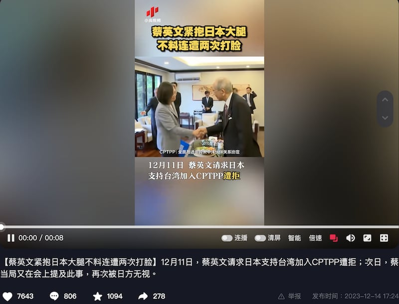

# Did Japan refuse to support Taiwan’s CPTPP access?

## Verdict: Misleading

By Zhuang Jing for Asia Fact Check Lab

2024.01.02

Taipei, Taiwan

## A video circulated in Chinese-language posts alongside a claim that Japan had refused to support Taiwan’s access to the 11-member CPTPP free trade agreement in the latest meeting between Taiwanese President Tsai Ing-wen and Chairman of Japan-Taiwan Exchange Association Mitsuo Ohashi in December.

## But the claim is misleading. After the meeting, Ohashi was cited by the Taiwanese presidential office’s statement as saying that Japan has always supported Taiwan’s accession to the CPTPP and he hopes the island will have the opportunity to join the agreement in the near future. A source close to the matter also told AFCL that no conversation about Japan refusing Taiwan’s access took place during the meeting.

An eight-second clip showing scenes of a [meeting](https://web.archive.org/web/20231227044244/https://english.president.gov.tw/NEWS/6659) between Tsai and Ohashi on Dec. 11 was [shared](https://www.douyin.com/video/7312378757539532068) on Dec. 14 on Chinese state-run CCTV's official Douyin channel.

“On December 11, Tsai Ing-wen’s request for Japan’s support for Taiwan’s access to the CPTPP was rejected; on the following day, Tsai’s authorities mentioned the matter at a meeting, which was once again ignored by the Japanese side,” reads the title of the clip.

Screenshot of CCTV’s official Douyin channel of one of its programs

The Comprehensive and Progressive Agreement for Trans-Pacific Partnership, or CPTPP, is a trade agreement between 11 nations: Australia, Brunei, Canada, Chile, Japan, Malaysia, Mexico, New Zealand, Peru, Singapore and Vietnam.

Initially called the Trans-Pacific Partnership, or TPP, and comprising 12 negotiating members, including the United States, the agreement underwent a change after the former U.S. President Donald Trump withdrew from it in 2017. The remaining members agreed to rename it as CPTPP, and it became effective in 2018.

Since 2021, various economies including the United Kingdom, China, Taiwan, and Ecuador have applied to join the agreement. However, admission is contingent on a unanimous consensus decision. So far, only the U.K. has been allowed entry, while the other applications are still under consideration.

The claim about Japan’s rejecting Taiwan’s request for support on CPTPP access has been also shared by other state-run Chinese media outlets.

But the claim is misleading.

After the meeting, Taiwan’s presidential office released a statement to confirm the remarks made by Ohashi on Japan’s support for the island’s CPTPP access.

“Japan has always supported Taiwan’s accession to the CPTPP, but that membership is approved by consensus, which may require some more time, adding that he hopes Taiwan will have the opportunity to join the CPTPP in the near future,” said Ohashi, as cited by the Taiwanese presidential office’s statement.

Separately, sources close to the matter told AFCL that the dialogue between Tsai and Mitsuo Ohashi at the meeting was as written in the Taiwan Presidential Office’s statement, and that the content of the CCTV video shared on Douyin was inaccurate.

The Japan-Taiwan Exchange Association, or JTEA, has not responded to AFCL’s request for comment.

## Tokyo’s support for Taiwan’s CPTPP access

Japanese officials have repeatedly stated that they welcome Taiwan’s application to join CPTPP.

For instance, Kazuyuki Katayama, JTEA's new chief representative in the Taipei office, [said](https://web.archive.org/web/20231227063253/https://www.koryu.or.jp/tw/about/taipei/chief-representative/katayama/activity-report/20231214/) at his inaugural tea party on Dec. 14: "Taiwan is an extremely important economic partner for Japan. The Japanese government welcomes Taiwan's application to join the CPTPP, and we need to continue our cooperation in this regard."

After Taiwan formally applied to join the CPTPP on Sep. 22, 2021, Japan’s then-Foreign Minister Toshimasa Mochizuki also expressed his welcome.

## *Translated by RFA Staff. Edited by Taejun Kang and Malcolm Foster.*

*Asia Fact Check Lab (AFCL) was established to counter disinformation in today's complex media environment. We publish fact-checks, media-watches and in-depth reports that aim to sharpen and deepen our readers' understanding of current affairs and public issues. If you like our content, you can also follow us on*   [*Facebook*](https://www.facebook.com/asiafactchecklabcn)  *,*   [*Instagram*](https://www.instagram.com/asiafactchecklab/)   *and*   [*X*](https://twitter.com/AFCL_eng)  *.*

[Original Source](https://www.rfa.org/english/news/afcl/fact-check-taiwan-japan-free-trade-01022024171118.html)