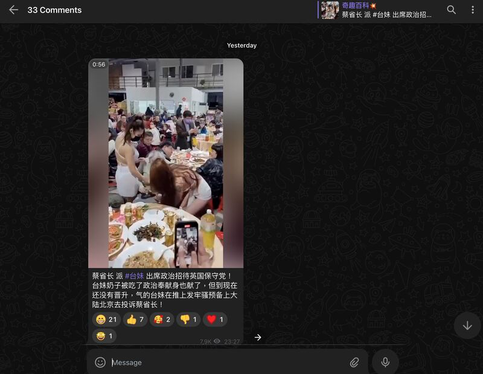
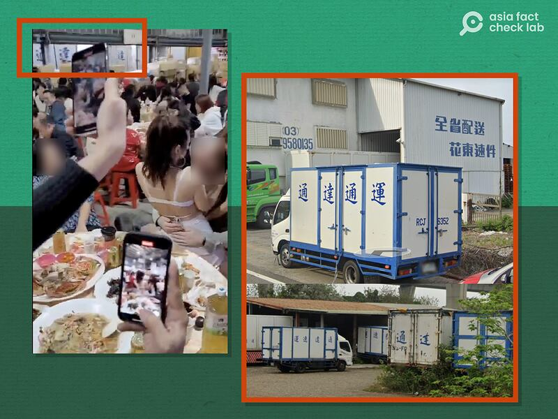

# Did Taiwan’s president send women to entertain British officials?

## Verdict: False

By Dong Zhe for Asia Fact Check Lab

2024.01.09

Taipei, Taiwan

## A video of two scantily-clad women dancing around a man has been shared in Chinese-language posts with a claim that they were sent by Taiwan’s President Tsai Ing-wen to entertain members of the British Conservative Party during their visit to Taiwan.

## The claim is false. The video shows a Taiwanese company party around the beginning of the 2023 Chinese New Year. A review of all official British dignitaries to Taiwan over the past two years also did not reveal any person who matched the man in the video.

The video was [shared](https://archive.ph/ub27o#selection-459.0-459.68) on X, formerly known as Twitter, on Jan. 3.

“President Tsai sent a Taiwanese girl to the political reception of the British Conservative Party! The girl tried her best to provide service with a dedicated mind, but she has not been able to get a promotion yet. So she got angry and complained on X. She is also ready to go to Beijing to complain about Tasi,” reads the claim.

The one-minute and 14-second clip shows two women dancing around a man at what appears to be a banquet.

The identical video with similar claims has also been shared on Telegram.

A video posted on X purportedly showed scantily clad Taiwanese girls dancing at a reception for members of the British Conservative Party. (Screenshot/X)

But the claim is false.

## Courier’s New Year’s party

A reverse image search on Google found the footage first appeared in a [post](https://archive.ph/wE24z) by the X account "CEO Briefing" on Jan. 9, 2023.

“I never thought Chinese girls could be so bold! A shipping company’s end of the year dinner party. There’ll also be a get together after Chinese New Year,” the caption reads.

At around the 40-second point in the video, the traditional Chinese characters for “Tongda” are visible on a wall, a style predominantly used in Taiwan. Additionally, a careful examination of the clip shows that the people are speaking Mandarin with a Taiwanese accent, suggesting that the event occurred in Taiwan.

Keyword searches found a Taiwanese company called Tongda Express.

An image from Google Map shows the company’s brand name printed across the body of one of its vehicles. Both the font and color of the word Tongda on the vehicle appear to match the same characters on the wall in the video.

The Taiwanese media outlet MinTV News also [reported](https://archive.ph/uahEi) on the video, saying that the event took place at a Chinese New Year's party.

The Chinese characters “Tongda” on the wall in the background of the video (left) and on one of Tongda Express’ company trucks. (Screenshot /X and Google Map)

## Tsai’s meetings with British officials

A review of press releases of President Tsai’s meetings with U.K. officials over the past two years shows that none of them match the man shown in the video of the dancing girls.

They include meetings with Minister of State for Trade Policy [Greg Hands](https://english.president.gov.tw/NEWS/6384) in November 2022, members of the [British-Taiwanese All-Party Parliamentary Group](https://english.president.gov.tw/NEWS/6459) in March 2023 and Deputy Speaker of the House of Lords and U.K. Trade Envoy to Taiwan [Lord Faulkner of Worcester](https://english.president.gov.tw/NEWS/6607) in September 2023.

Tongda Express has not responded to questions about the video as of press time.

## *Translated by Shen Ke. Edited by Taejun Kang and Malcolm Foster.*

*Asia Fact Check Lab (AFCL) was established to counter disinformation in today's complex media environment. We publish fact-checks, media-watches and in-depth reports that aim to sharpen and deepen our readers' understanding of current affairs and public issues. If you like our content, you can also follow us on*   [*Facebook*](https://www.facebook.com/asiafactchecklabcn)  *,*   [*Instagram*](https://www.instagram.com/asiafactchecklab/)   *and*   [*X*](https://twitter.com/AFCL_eng)  *.*

[Original Source](https://www.rfa.org/english/news/afcl/fact-check-women-taiwan-uk-01092024152739.html)