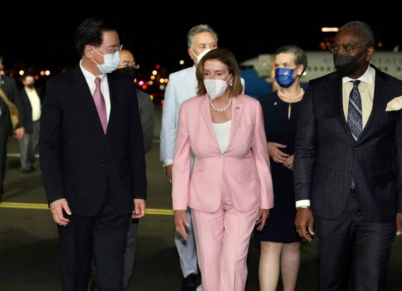
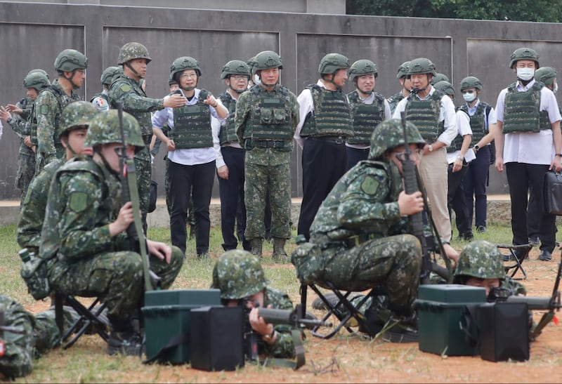

# Media Watch: How is Taiwan fighting China’s disinformation campaign?

## Taiwan has beefed up defenses, but Beijing has become more experienced.

By Zhuang Jing for Asia Fact Check Lab

2024.01.10

Taipei, Taiwan

The year leading up to Saturday’s presidential election in Taiwan has been fraught with disinformation from China.

"It's been a very challenging year for fact-checkers, researchers and the media alike. [China] is fully aware of the vulnerabilities in Taiwan's media space and has become quite adept at striking its weak points," [Summer Chen](https://tfc-taiwan.org.tw/node/670), chief editor of the non-profit Taiwan FactCheck Center, or TFC, told Asia Fact Check Lab.

This viewpoint is echoed internationally. The University of Gothenburg in Sweden, for instance, has identified Taiwan as the society most impacted by disinformation originating from beyond its borders.

Taiwan has not been passive. It has steadily enhanced its capabilities to counter and challenge the Chinese Communist Party’s efforts to disseminate its political narratives within Taiwan. However, during this time, the CCP has also gained considerable experience.

Below is AFCL’s analysis on the evolution of China’s disinformation strategies in the run-up to the imminent elections and responses from the democratic island to these tactics.

## Doubts about the U.S.

Interviews with experts and fact-checkers revealed a key theme: China now prefers subtler methods of influence over its previous direct tactics in Taiwan’s elections.

And arousing skepticism towards the relationship between the United States and Taiwan is one of the most potent tools in the CCP’s toolbox.

[Jaw-Nian Huang](https://gids.nccu.edu.tw/PageStaffing/Detail?fid=3429&id=4343), an assistant professor at Taiwan's National Chengchi University, believes that promoting this skepticism serves China's propaganda goals by associating closer ties with the U.S. as steering Taiwan on a course toward war with China.

Closer ties with mainland China, meanwhile, means peace – as long as Taiwan doesn’t declare independence, he said. Beijing professes to prefer achieving reunification with the island through peaceful means.

Such rhetoric allows the CCP to both covertly attack Taiwanese political factions that favor closer ties to the United States and support those that favor warmer relations with China.

A [recent report](https://iorg.tw/_en/a/us-skepticism-238) by the civil society organization Taiwan Information and Environment Research Center, or IORG, categorized 84 narratives from Taiwanese political discourse between 2021 and June 2023 into eight major groups.

IORG categorizes narratives pushing skepticism of the U.S. into eight categories. (Screenshot/IORG website)

While the report notes that the Chinese Communist Party is the largest foreign actor fanning this skepticism, they also point out that actors working for the party tend to spur existing narratives rather than create new ones, with 44 of the 84 cases found to have originated from Taiwan itself.

In the past two years, narratives emphasizing skepticism of the U.S. have gained popularity in Taiwan and become the focus of political arguments, particularly following significant events such as then-Speaker of the House Nancy Pelosi’s visit to Taiwan in Aug. 2022. (Taiwan Ministry of Foreign Affairs)

## Fear of war

Another tactic favored by Beijing is using the threat of violence to intimidate Taiwanese, according to an [article](https://www.atlanticcouncil.org/blogs/new-atlanticist/what-to-know-about-chinas-meddling-in-taiwans-upcoming-election/) on China's role in the lead-up to the elections by the Atlantic Council.

A recent example unfolded when Taiwanese President Tsai Ing-wen met with then-House Speaker Kevin McCarthy in the U.S. during a stopover en route to Latin America in April 2023.

This event led to China initiating a three-day military exercise around Taiwan. During this time, the Taiwanese internet was [inundated](2023-04-18_Did the Chinese military launch missiles into Taiwan’s airspace?.md) with disinformation apparently designed to escalate fears about the military maneuvers.

But the use of such fear has its limits, said TFC’s Chen.

Chen noted that following a phase of intense propaganda and disinformation coinciding with military demonstrations, Beijing often tones down such rhetoric. Instead, it shifts to either increasing skepticism about the U.S. or portraying Taiwan’s leaders as ineffectual.

Particularly notable is the tactic to erode trust in the Taiwanese government. After the military exercises mentioned above, Chinese internet users falsely claimed in July 2023 that Taiwan's military was [practicing](https://tfc-taiwan.org.tw/articles/9370) evacuation drills for Tsai in anticipation of a future crisis.

Chen believes the reason for this switch in tactics is simple: China recognizes that maintaining a constant, credible military threat throughout the year leading up to Taiwan’s elections is not feasible.

The relationship between President Tsai and the military is often subject to misinformation. Pictured here is a visit paid by the President to Taiwan’s military in May 2023. (AP)

Liu Wenbin, a research member of Taiwan’s Ministry of Justice Investigation Bureau, is among others with different explanations.

Liu believes that while fanning skepticism of the U.S. is beneficial to Beijing’s interests, overplaying the threat of military aggression may be counterproductive.

He points out that it isn’t clear as to whether the CCP or one of Taiwan’s political parties first used the threat of violence in an attempt to influence the situation in Taiwan.

However, some data show that Beijing is producing more such narratives, whatever the risks may be.

A [discourse analysis](https://www.cna.com.tw/news/aipl/202312200126.aspx) of Chinese official media conducted by the private research organization Taiwan AI Labs from October to December 2023 found that the biggest narratives pushed by Chinese outlets centered around Taiwan being forced into war, followed by U.S. disregard over the potential Taiwanese deaths.

Chinese authorities have consistently alleged that Taiwan’s ruling Democratic Progressive Party, DPP, is nudging the nation toward war.

For instance, in response to Tsai's final New Year's address of her term, delivered just under two weeks before the impending elections, China's Taiwan Affairs Office [claimed](http://www.gwytb.gov.cn/xwdt/xwfb/wyly/202401/t20240101_12591023.htm) that her stance is pushing Taiwan to the verge of conflict.

## Reviving rumors on social issues

Beyond fears related to a potential conflict in the Taiwan Straits, issues regarding Taiwanese voters’ livelihoods have also served as a hotbed for rumors.

According to reports by local fact-checking organizations, TFC, IORG and MyGoPen, some of the more prevalent topics include lack of critical goods such as eggs, electricity, and toilet paper, as well as various crises related to food safety, transportation or public security.

All outlets also found that many old rumors about such issues started to circulate again before the election.

TFC's Chen points to the recent reappearance of a rumor originally circulated before the 2020 election concerning a [purported reform](https://tfc-taiwan.org.tw/articles/761) of Taiwan's currency that would cost NT$50 billion (US$1.6 billion) as an attempt to deepen public dissatisfaction and distrust by playing up the image of the current government as a spindrift.

The confidence of Taiwanese voters in the integrity of their elections and democratic institutions has been shaken by a barrage of disinformation. This includes various alleged election fraud tactics, such as the [removal](https://tfc-taiwan.org.tw/articles/10054) of polling station monitors, [tampering](https://tfc-taiwan.org.tw/articles/10049) with voting boxes, and ballots supposedly marked with invisible ink.

## AI technology

Advancements in artificial intelligence also have expanded the CCP’s toolkit for spreading rumors.

A notable example is the alleged leaked audio from August 2023, where the Taiwan People’s Party presidential candidate Ko Wen-je supposedly criticized vice president and DPP candidate Lai Ching-te for his U.S. visit earlier that month.

Although Taiwan's Ministry of Justice Investigation Bureau later concluded that the audio was likely fake, this did not prevent the emergence of several [other](https://www.mjib.gov.tw/news/Details/1/953) doctored [videos](https://www.mjib.gov.tw/news/Details/1/939) and [audio](https://www.mjib.gov.tw/news/Details/29/957) recordings of Lai in the following months.

Screenshot of DPP presidential candidate Lai suspected to have been forged with deepfake technology. (Screenshot/TFC)

Charles Yang, the chief editor of the Taiwan-based fact-checking organization MyGoPen, noted that while AI-generated videos and audios were initially easy for fact-checkers to identify and debunk, higher-quality content emerged closer to election day, posing greater challenges for debunking.

TFC’s Chen agrees. Chen said that technology capable of reliably detecting deep fake content is yet to catch up with recent AI advancements.

Consequently, experts recommend that fact-checkers depend on their media literacy skills to evaluate and determine the authenticity of potential deep fake material.

## New channels

Along with advancements in technology, the increasing popularity of Chinese-owned social media platforms like TikTok in Taiwan has created new avenues for China to directly convey its political narrative to Taiwanese citizens.

While Yang noted that the go-to social media platforms for most Taiwanese remain Facebook and LINE, the growing popularity of short videos as a format has led many users to turn to TikTok.

“There are a lot more tactics and more channels now. TikTok wasn’t this popular before, but now it’s used for everything,” he said.

Separately, Chen pointed out that the expansion of these channels now enables purveyors of disinformation to modify and repurpose previously debunked false information, circulating it across various platforms.

Another common tactic to sway public opinion involves “baiting” users on popular Taiwanese online forums like PTT and Mobile01, according to Chen. This is done by initiating contentious debates on topics that are difficult for fact-checkers to conclusively debunk.

These controversies are occasionally picked up by Taiwanese media, this media attention often ends up “whitewashing” the true facts of an incident, said Chen.

Chen believes this pattern is one of Taiwan’s “vulnerabilities” that the CCP is adept at exploiting.

## Made in Taiwan

IORG's co-host [Chih-Hao Yu](https://www.igf.org.tw/?page_id=9312) told AFCL that CCP propaganda no longer originates exclusively from China.

National Chengchi University’s Huang also cites official Chinese media, local Taiwanese media with a clear pro-China editorial slant, and individual Taiwanese actors as main players in spreading Beijing’s preferred narratives.

And the CCP now prefers to use such local grassroots actors to indirectly affect the elections instead of directly attacking Taiwan’s ruling party through pro-Beijing media, according to Huang, who noted that this change in strategy made misinformation harder to detect or check.

Yu stressed that raising media literacy and critical thinking skills would offer the most fundamental defense against the covert influence of China.

Meanwhile, the Ministry of Justice’s Liu advised Taiwanese citizens to be cautious of messages designed to sow division among specific groups by exploiting their fears.

He also warned Taiwanese media against creating a “CNN effect” – oversimplifying complex issues into brief narratives for continuous broadcast.

“The time crunch around elections leaves no way to really grasp the situation, affecting your understanding and judgments,” said Liu, who still remained concerned. “That’s very scary.”

## *Translated by Shen Ke. Edited by Taejun Kang and Malcolm Foster.*

*Asia Fact Check Lab (AFCL) was established to counter disinformation in today's complex media environment. We publish fact-checks, media-watches and in-depth reports that aim to sharpen and deepen our readers' understanding of current affairs and public issues. If you like our content, you can also follow us on*   [*Facebook*](https://www.facebook.com/asiafactchecklabcn)  *,*   [*Instagram*](https://www.instagram.com/asiafactchecklab/)   *and*   [*X*](https://twitter.com/AFCL_eng)  *.*

[Original Source](https://www.rfa.org/english/news/afcl/taiwan-china-disinformation-01102024224335.html)