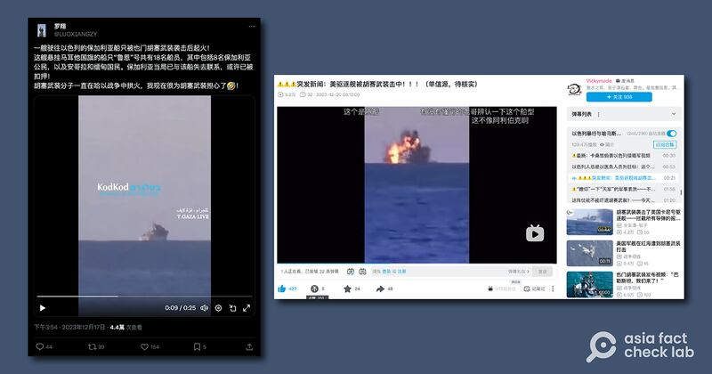
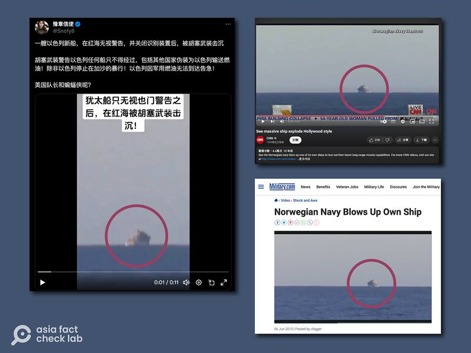
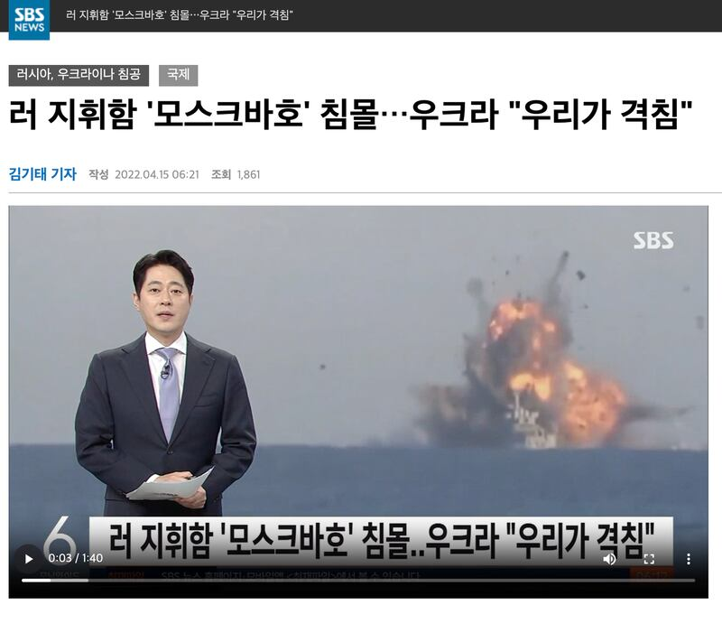

# Does video show Yemeni rebels destroying an Israeli vessel?

## Verdict: False

By Dong Zhe for Asia Fact Check Lab

2024.01.17

Taipei, Taiwan

## A video has been circulating on Chinese-language posts that claim it shows an Israeli ship in the Red Sea being sunk by a Yemeni rebel group after ignoring warnings.

## But the claim is false. The clip was in fact taken from a 2013 Norwegian navy video that shows a then-new anti-ship missile being tested on a decommissioned warship.

The video was [shared](https://archive.ph/QsCEf#selection-429.0-429.110) on X, formerly known as Twitter, on Dec. 24, 2023, alongside a caption that reads: "A new Israeli ship, sunk by the Houthis in the Red Sea after ignoring warnings and switching off identification devices."

The 11-second clip shows an explosion of a ship following an apparent attack.

The [Houthis](https://web.archive.org/web/20240113174255/https://www.brookings.edu/articles/who-are-the-houthis-and-why-are-we-at-war-with-them/) are a Zaidi Shia Muslim minority group based in Yemen, known primarily for leading a rebellion against the Yemeni government in a civil war there.

The group has recently carried out dozens of attacks on commercial vessels that they claim are linked to Israel, and that were passing through the 30 km (20 miles) wide Bab-el-Mandeb Strait. They are demanding that Israel halt its attacks on Gaza and permit the entry of humanitarian aid.

In response, a coalition led by the United States is attempting to thwart the Houthis by deploying destroyers and various military assets in the Red Sea, as well as intercepting the missiles and drones launched by the Yemeni group.

The identical video alongside similar claims have been shared on Chinese social media platforms such as [Weibo](https://archive.ph/YNUJN) and Bilibili.

Several Chinese social media accounts claimed an Israeli ship was sunk by Houthi insurgents in the Red Sea. (Screenshot / X and Bilibili)

But the claim is false. The footage is taken from a 2013 Norwegian navy video showing a then-new anti-ship missile being tested on a decommissioned warship.

## Norwegian test in 2013

A reverse image search on Google found the identical clip [published](https://www.military.com/video/guided-missiles/sea-launched/norwegian-navy-blows-up-own-ship/2439789446001) in a report on June 6, 2013, by Military.com, a website that provides news and information about the U.S. military.

“The Norwegian navy tests its new four-metre long, 880lb Naval Strike Missile by firing on one of its own ships, the KNM Trondheim, with spectacular results,” the report reads in part.

“Footage filmed from on board the KNM Trondheim shows the moment the subsonic missile smashed into the side of the ship exploding in a massive fireball,” it reads further.

The corresponding scene can be seen at the 36-second mark of the video.

Other global media outlets, including [CNN](https://www.youtube.com/watch?v=Pz5Jb8EGqPg&ab_channel=CNN), reported on the Norwegian test also using the same footage.

The purported video of an Israeli ship being sunk on Weibo and X (left) matches video footage reports from CNN and Military.com of a Norwegian missile test in 2013 (right). (Screenshots/ Weibo, CNN and Military.com)

## Misuse of the clip

AFCL has discovered that the footage has been frequently misappropriated by media outlets covering war-related topics.

For example, in April 2022, SBS, a South Korean broadcaster, [used](https://archive.ph/kDoPx) the clip while reporting on the Russo-Ukrainian war, alleging that it showed the sinking of the Russian cruiser Moskva.

A Delhi-based daily *India Times*  [pointed out](https://www.indiatoday.in/fact-check/story/moskva-explosion-video-claims-false-1937965-2022-04-15) in April, 2022, that pro-Kiev social media accounts had also misappropriated footage of the test as footage of the Moskva's sinking.

South Korea’s SBS also mistakenly accompanied a report on the sinking of the Russian cruiser Moskva in 2022 with footage of the Norwegian missile test. (Screenshot/SBS)

## *Translated by Shen Ke. Edited by Taejun Kang and Malcolm Foster.*

*Asia Fact Check Lab (AFCL) was established to counter disinformation in today's complex media environment. We publish fact-checks, media-watches and in-depth reports that aim to sharpen and deepen our readers' understanding of current affairs and public issues. If you like our content, you can also follow us on*   [*Facebook*](https://www.facebook.com/asiafactchecklabcn)  *,*   [*Instagram*](https://www.instagram.com/asiafactchecklab/)   *and*   [*X*](https://twitter.com/AFCL_eng)  *.*

[Original Source](https://www.rfa.org/english/news/afcl/fact-check-yemen-israeli-ship-01172024141200.html)