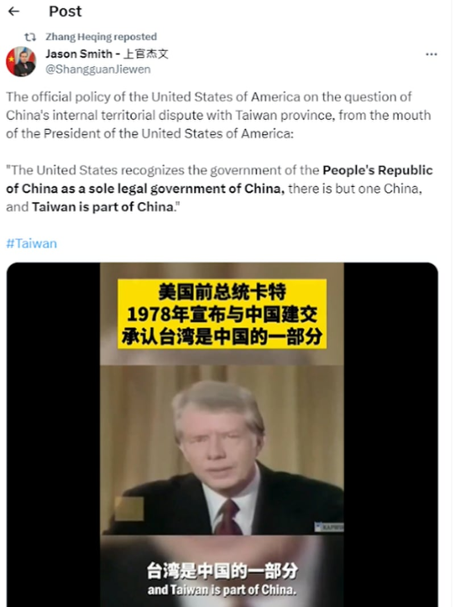

# Did Jimmy Carter admit that Taiwan is part of China in his 1978 speech?

## Verdict: Missing context

By Rita Cheng for Asia Fact Check Lab

2024.01.23

Washington

## A video of the former U.S. President Jimmy Carter’s 1978 speech has been repeatedly shared in Chinese-language posts alongside a claim that it shows Carter “admitting” that Taiwan was part of China.

## But the video has been digitally edited to omit important context. A review of the original video shows that Carter made no mention of directly admitting that Taiwan was part of China. The U.S. does not agree with China’s One China principle, instead adhering to its distinct “One China policy” that takes no position on sovereignty over Taiwan.

The video was [shared](https://x.com/ShangguanJiewen/status/1743939492807872770?s=20) on X, formerly known as Twitter, on Jan. 7.

“The official policy of the United States of America on the question of China’s internal territorial dispute with Taiwan province, from the mouth of the President of the United States of America,” reads the claim.

The claim was shared alongside a 13-second video that shows what appears to be former U.S. President Jimmy Carter’s speech.

In the video, Carter says: “The United States recognizes the government of the People’s Republic of China as a sole legal government of China, there is but one China, and Taiwan is part of China.”

Zhang Heqing retweeted an edited video of former president Jimmy Carter which seemingly shows the U.S. acknowledging China’s sovereignty over Taiwan. The video was originally posted on X by Jason Smith, an American in China. (Screenshot/X)

The claim was also shared by Chinese diplomat Zhang Heqing.

But the video has been digitally edited to omit important context.

## The video

A keyword search on Google found that the video shared on X was part of Carter’s speech in 1978 when the U.S. established diplomatic relations with China.

A review of a [full version](https://millercenter.org/the-presidency/presidential-speeches/december-15-1978-speech-establishing-diplomatic-relations) of the video and its transcript shows that the video circulated in a misleading X post was digitally edited to merge a couple of remarks made by Carter.

They are: “The United States of America recognizes the Government of the People’s Republic of China as the sole legal Government of China” and “The Government of the United States of America acknowledges the Chinese position that there is but one China and Taiwan is part of China.”

The edited version of the video noticeably excludes the sentence, “The Government of the United States of America acknowledges the Chinese position that,” from the original quote.

During his speech, Carter made no mention of directly admitting that Taiwan was part of China.

## The U.S position

The U.S. does not agree with China’s One China principle, instead adhering to its distinct “One China policy” that takes no position on sovereignty over Taiwan.

In other words, Washington acknowledges Beijing’s position, but does not take a stance on its validity.

The U.S.'s "one China policy" is substantially different from China's "one China principle," as AFCL has shown [in the past](https://www.rfa.org/mandarin/shishi-hecha/hc-02102023102235.html).

A U.S. State Department spokesman told AFCL in October last year: “The U.S. has long abided by our one-China policy. This is distinct from Beijing’s ‘One China principle’ under which the Chinese Communist Party asserts sovereignty over Taiwan. The United States takes no position on sovereignty over Taiwan,”

The spokesman noted at that time that Washington will continue to support a peaceful resolution of cross-straits issues in a manner consistent with the wishes and best interests of the Taiwanese people.

## *Translated by Shen Ke. Edited by Taejun Kang and Malcolm Foster.*

*Asia Fact Check Lab (AFCL) was established to counter disinformation in today's complex media environment. We publish fact-checks, media-watches and in-depth reports that aim to sharpen and deepen our readers' understanding of current affairs and public issues. If you like our content, you can also follow us on*   [*Facebook*](https://www.facebook.com/asiafactchecklabcn)  *,*   [*Instagram*](https://www.instagram.com/asiafactchecklab/)   *and*   [*X*](https://twitter.com/AFCL_eng)  *.*

[Original Source](https://www.rfa.org/english/news/afcl/jimmy-carter-taiwan-01232024144217.html)