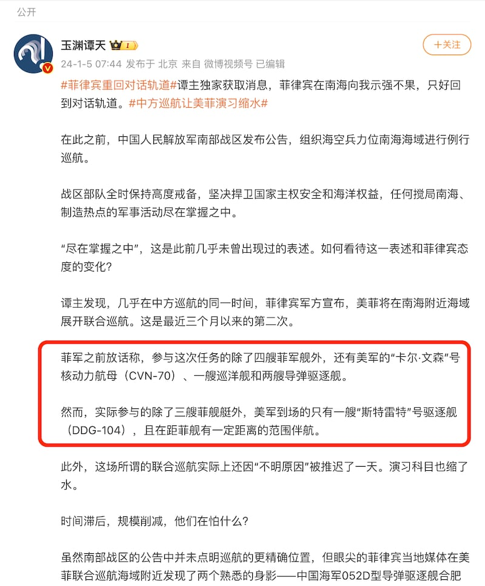
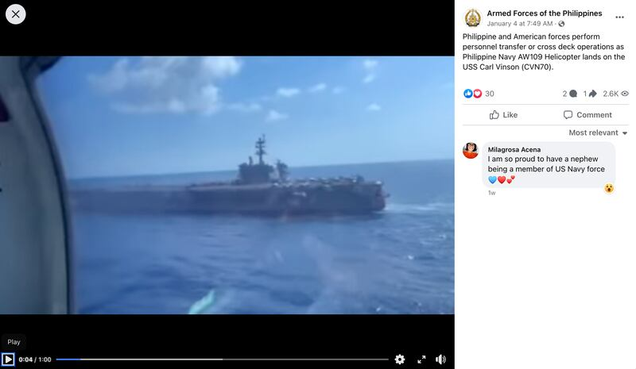
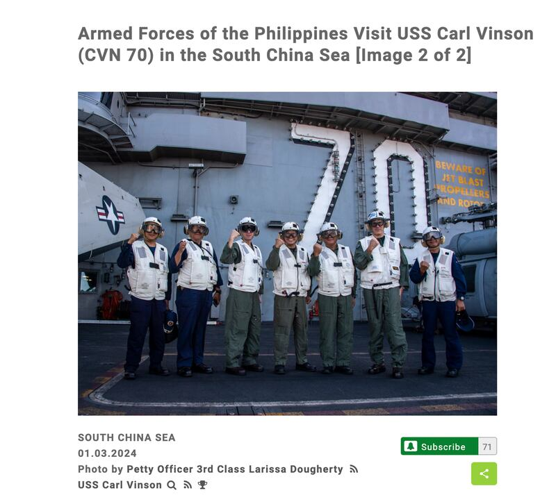

# Did the US send only one ship for joint naval drills with Manila?

## Verdict: Lack of evidence

By Shen Ke for Asia Fact Check Lab

2024.01.25

Washington

## Claims on Chinese-speaking social media suggested that the United States deployed only one ship for the joint patrols with the Philippines in the South China Sea in January, and that the USS Carl Vinson supercarrier wasn’t part of the drills.

## However, the claims lack evidence. Official statements confirm that four American vessels were involved in the exercises, and visual evidence shows the participation of the USS Carl Vinson in the joint operations.

The claim was [shared](https://web.archive.org/web/20240123163346/https://weibo.com/7040797671/NAthfaaHI) on the popular Chinese social media site Weibo on Jan. 5 by the state-affiliated social media user Yuyuan Tantian.

“The Philippine military announced that the U.S. and the Philippines would launch a joint cruise in the waters off the South China Sea,” reads the claim in part.

“The Philippine military had previously announced that in addition to four Philippine warships, the US nuclear-powered aircraft carrier USS Carl Vinson (CVN-70), a cruiser and two guided-missile destroyers would be involved in the mission.

“However, in addition to the three Philippine ships, only one destroyer, the USS Sterrett (DDG-104), actually participated in the cruise and accompanied the Philippine ships at a certain distance.”

Yuyuan Tantian cited a CNN Philippines’ report to back the claim.

A pro-Beijing social media influencer claimed that only one U.S. ship accompanied Philippine naval craft in patrols conducted on January 3 and 4. (Screenshot/Weibo)

The claim began to circulate after the Philippines and the U.S. embarked a two-day joint patrol in the South China Sea on Jan. 3.

The two treaty allies saw a significant increase in security collaboration last year amidst rising tensions in the South China Sea, a point of contention, with the Philippines and China each trading blame for a series of confrontations.

In response, the Philippines and the U.S. initiated joint patrols in November, conducting three-day military exercises in waters near Taiwan and in the West Philippine Sea, the name Manila uses for the South China Sea areas within its exclusive economic zone.

Beijing said it would not turn a blind eye to repeated “provocations and harassment” by the Philippines, while Chinese state media have also accused Manila of relying on U.S. support to continually antagonize China.

## American ships

A day before the January exercises, the U.S. Indo Pacific Command [said](https://www.pacom.mil/Media/News/News-Article-View/Article/3630769/philippines-us-partner-in-maritime-cooperative-activity-in-south-china-sea/') in a statement that a total of four warships were scheduled to take part from the American side, namely the USS Carl Vinson (CVN-70), USS Kidd (DDG-100), USS Sterett (DDG-104) and USS Princeton (CG-59).

It added that the Philippines would send three vessels.

One of several videos of the drills [released](https://www.facebook.com/armedforcesofthephilippines/posts/pfbid0eXx5i8T7P1WJ5D6MtMxyy5we3ofNy7KdNvKngrgy5rw5LXdAm7VGhqnZwKWSVsiQl) by the Philippines Armed Forces on Facebook also shows a Philippine helicopter landing on the USS Carl Vinson, identifiable by its hull number 70 located on the right side of the screen.

Video footage released by the Philippines Armed Forces shows a helicopter in the drills landing on the USS Carl Vinson. (Screenshot/Official Facebook of the Armed Forces of the Philippines)

A public affairs officer for the U.S. Pacific Fleet later referred AFCL to several pictures of U.S. and Philippine military personnel [taken aboard](https://www.dvidshub.net/image/8189670/armed-forces-philippines-visit-uss-carl-vinson-cvn-70-south-china-sea) the USS Carl Vinson and posted on the military's official Defense Visual Information Distribution Service website.

The U.S. military outlet Defense News also released [footage](https://www.youtube.com/watch?v=SS20d5iOr-w) of the drills taken both on board vessels participating in the drills and in the air surrounding them.

AFCL has not been able to independently verify the exact location of these images.

## CNN Philippines report

A keyword search on Google found a report [published](https://www.cnnphilippines.com/news/2024/1/3/ph-us-challenges-2nd-maritime-cooperative-activity.html) by CNN Philippines on Jan. 3, which only listed the USS Sterett as a participating vessel in the joint exercises.

Leaders from the Philippine and U.S. Navy take a picture aboard the USS Carl Vinson during the joint patrols. (Screenshot/Defense Visual Information Distribution Service)

However, the report also stated that the exercises would be conducted on the following day and that the U.S. still planned to send out four vessels, including the USS Carl Vinson.

Four days after the conclusion of the exercises, CNN Philippines [published](https://www.youtube.com/watch?v=JD0tOBaDd50&t=187s) a separate report on the drills, including footage of the USS Carl Vinson.

## *Edited by Taejun Kang and Paul Eckert.*

*Asia Fact Check Lab (AFCL) was established to counter disinformation in today's complex media environment. We publish fact-checks, media-watches and in-depth reports that aim to sharpen and deepen our readers' understanding of current affairs and public issues. If you like our content, you can also follow us on*   [*Facebook*](https://www.facebook.com/asiafactchecklabcn)  *,*   [*Instagram*](https://www.instagram.com/asiafactchecklab/)   *and*   [*X*](https://twitter.com/AFCL_eng)  *.*

[Original Source](https://www.rfa.org/english/news/afcl/afcl-us-philippines-01252024160828.html)