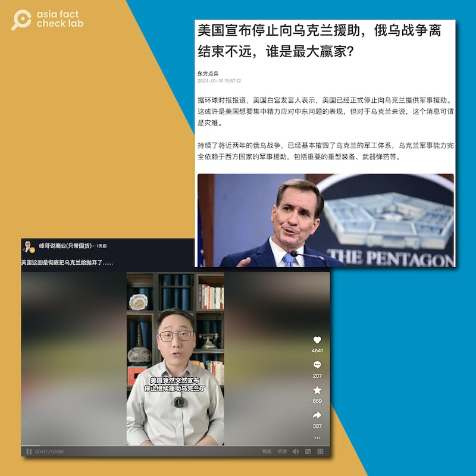

# Has the US announced a complete cutoff of aid to Ukraine?

## Verdict: Misleading

By Zhuang Jing for Asia Fact Check Lab

2024.01.31

Taipei, Taiwan

## Chinese media outlets claimed that the United States has announced cutting off all aid to Ukraine, citing a report from the state-run   *Global Times.*

## But the claim is misleading. A White House official in fact said that aid has been suspended. The official described this as temporary  due to the ongoing Congressional debate over the federal budget for the upcoming fiscal year.

The claim was shared in a [report](https://new.qq.com/rain/a/20240116A05QL500) published by China's state-backed media outlet Tencent on Jan. 16.

"According to the *Global Times*, a White House spokesman said that the United States has officially stopped providing military assistance to Ukraine. This may be a sign that the U.S. wants to focus on the Middle East, but for Ukraine, the news could be a disaster," reads the claim in part.

The Tencent report didn't clarify which *Global Times* article it referenced.

The identical claim has been shared on other Chinese media outlets, including [Sohu](https://www.sohu.com/a/752198434_121473033?scm=1102.xchannel:325:100002.0.6.0&spm=smpc.channel_248.block3_308_NDdFbm_1_fd.1.1705903412261ULnj4Xq_324#google_vignette), as well as on social media platforms, such as [Douyin](https://www.douyin.com/user/MS4wLjABAAAAYFM2gLxlH2-BOK_AvaQkN8MkZkdkr58p-iqd5QBM13POOks8bVXiBsRcRHUuehLW?modal_id=7326128915028774159) and [Xigua Video](https://www.ixigua.com/7326130412680708662?logTag=551cbcca8d32ea439d8b).

Chinese netizens and social media influencers recently released videos and articles claiming that the U.S. has announced a complete cessation of military assistance to Ukraine. (Screenshot/ Douyin and Tencent)

But the claim is misleading.

Keyword searches found a *Global Times* report published on Jan. 13, citing remarks made by John Kirby, the current coordinator for strategic communications at the National Security Council.

During a press conference on Jan. 11, Kirby [said](https://www.whitehouse.gov/briefing-room/press-briefings/2024/01/11/press-briefing-by-press-secretary-karine-jean-pierre-nsc-coordinator-for-strategic-communications-john-kirby-and-national-economic-council-director-lael-brainard/) the U.S. government had issued the last aid package to Ukraine from the allocated funds.

While noting that aid had stopped, Kirby expressed the White House’s continued support for Ukraine by calling on Congress to expedite the approval of a previous request for additional wartime assistance.

“We have issued the last drawdown package that — that we had funding to support. And that’s why it’s — it’s critical that — that Congress move on that national security supplemental request and we get more funding,” he said.

The Biden administration [proposed](https://www.reuters.com/world/us/whats-bidens-106-billion-supplemental-funding-request-2023-10-20/) a US$106 billion supplemental budget for foreign aid in Oct. 2023, of which more than US$60 billion was slotted for aid to Ukraine.

The administration has since continually urged Congress to pass the bill, with Biden emphasizing Ukraine's security needs at a [meeting](https://www.whitehouse.gov/briefing-room/statements-releases/2024/01/17/readout-of-president-bidens-meeting-with-congressional-leaders-on-ukraine-and-his-national-security-supplemental/) with congressional leaders on Jan. 17.

The United States has been the main source of military aid for Ukraine since the Russian invasion in February 2022.

While Biden has support from his Democratic Party for continuing aid, he faces stiff resistance in a U.S. election year from the Republican Party, which is demanding tougher action by the administration to secure the U.S. southern border with Mexico against illegal immigration. That has led to a political stalemate.

Keyword searches found no credible reports or statements that say the U.S. has decided to completely stop its aid to Ukraine.

## *Translated by Shen Ke. Edited by Taejun Kang, Malcolm Foster and Mat Pennington.*

*Asia Fact Check Lab (AFCL) was established to counter disinformation in today's complex media environment. We publish fact-checks, media-watches and in-depth reports that aim to sharpen and deepen our readers' understanding of current affairs and public issues. If you like our content, you can also follow us on*   [*Facebook*](https://www.facebook.com/asiafactchecklabcn)  *,*   [*Instagram*](https://www.instagram.com/asiafactchecklab/)   *and*   [*X*](https://twitter.com/AFCL_eng)  *.*

[Original Source](https://www.rfa.org/english/news/afcl/fact-check-us-ukraine-aid-01312024143214.html)