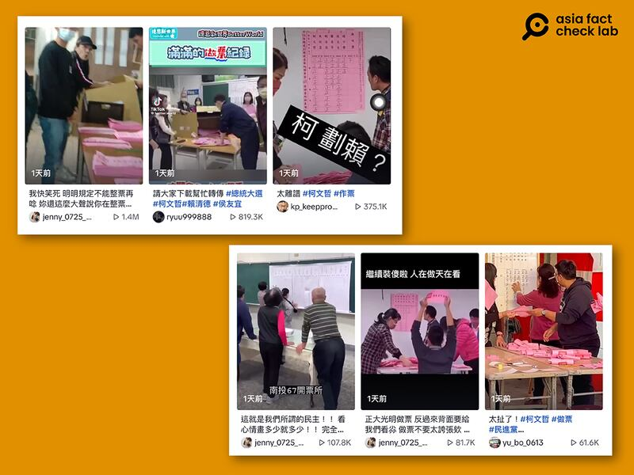
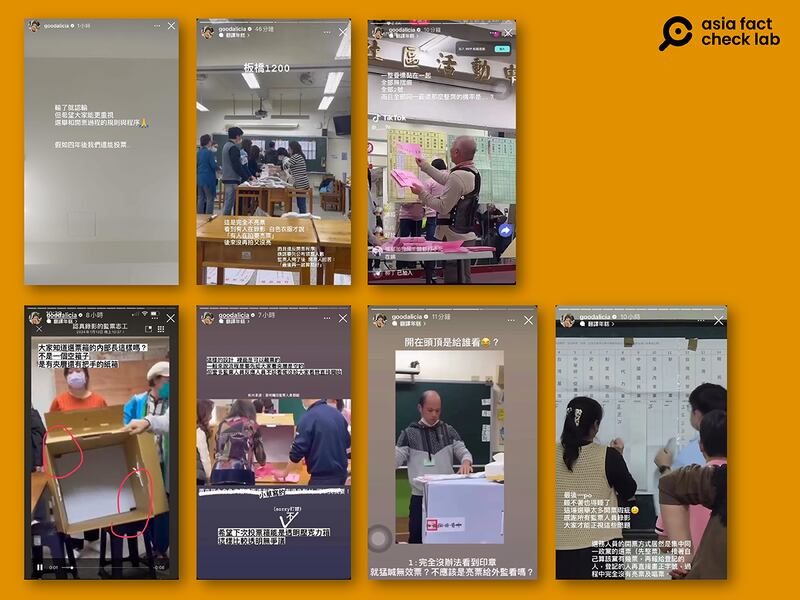
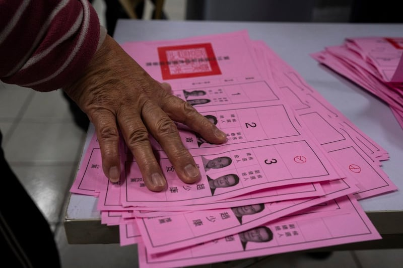
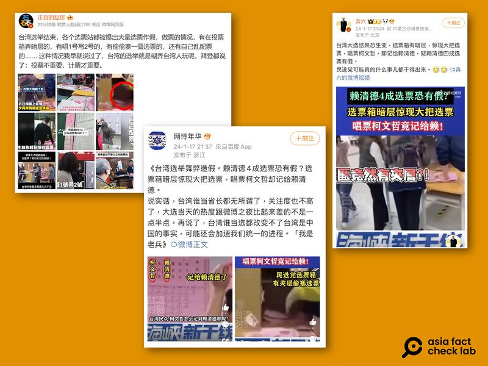
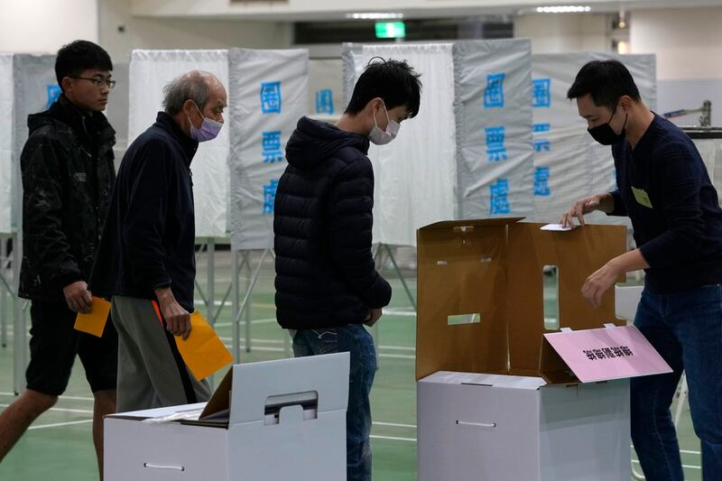

# Media Watch: Taiwan faces post-election ballot fraud conspiracies

## Historical influences, the voting system and the impact of mainland Chinese media are key contributing factors.

By Dong Zhe for Asia Fact Check Lab

2024.02.01

Taipei, Taiwan

Following Taiwan’s Jan. 13 presidential election, numerous false claims of fraud have circulated on social media, many of which have been easily debunked. Yet a large portion of the public still seem to believe them.

Some of the most prevalent rumors include allegations of officials intentionally [miscounting](https://tfc-taiwan.org.tw/articles/10196) votes and ballot box [stuffing](https://tfc-taiwan.org.tw/articles/10194), specifically with votes for the now president-elect Lai Ching-te from Taiwan's ruling Democratic Progressive Party, or DPP.

On the day immediately following Taiwan’s presidential election, a large number of video clips purportedly showing voter fraud by election officials appeared on TikTok. (Screenshot/TikTok)

Even with local groups working to [debunk](https://tfc-taiwan.org.tw/articles/10159) them, numerous rumors persisted, partly due to the influence of popular Taiwanese internet figures. YouTuber [Bit King](https://www.youtube.com/watch?v=Re_ja5guXnM) and Instagrammer [Alisasa](https://www.instagram.com/goodalicia/), for instance, continued to accuse the DPP of election rigging and propagated similar voter fraud claims.

Taiwanese internet celebrity Alisasa posted a series of time-limited Instagram video posts showing purported episodes of voter fraud during the election and accusing DPP leader’s negligence as affecting its result. (Screenshots/ Instagram)

What are the contributing factors and the background that drive such claims of election fraud? Below is what AFCL found.

## Out of context

Summer Chen, chief editor of the Taiwan FactCheck Center, or TFC, told AFCL that most so-called “voter fraud” incidents were actually genuine errors made by officials.

These mistakes were promptly identified and corrected by ballot watchers present at site, but videos capturing these incidents often cut off before the correction of errors, leading to an exaggerated perception of the issue and misrepresenting isolated mistakes as part of a broader conspiracy, according to Chen.

A notable case was when the TFC investigated [claims](https://tfc-taiwan.org.tw/articles/10175) of vote stuffing at a counting station in Hsinchu. They discovered that officials did erroneously add an extra 100 votes to two presidential candidates. But the rumors left out that ballot watchers immediately corrected this mistake and that the final counts for this station matched the official results from Taiwan's Central Election Commission.

“Mistakes such as these can be reviewed rationally, but filming and circulating these events out of context really damages the credibility and independence of elections,” Chen explained.

## Historical factors

Despite over 30 years of democratization in Taiwan, rumors about election fraud are still a regular feature after almost every election.

[Shiow-Duan Hawang](https://web-en.scu.edu.tw/politicial/teacher_resume/816), a professor of political science at Soochow University, believes current distrust among Taiwanese voters stems from historical factors.

Prior to the lifting of its nearly 40-year martial law in 1987, Taiwan was under the long-standing rule of the Kuomintang, or KMT, party. Elections during this period were widely regarded as rigged, which eroded trust in the election process among both the public and opposition parties.

“Voters’ distrust continues to exist,” said Hawang, adding that previous high-profile incidents in Taiwanese presidential elections have also fueled suspicions of underhanded tactics, such as close race in 2000 and the assassination attempt against incumbent President Chen Shui-bian on the eve of the 2004 election.

## Voting system

These lingering concerns continue to drive criticisms from many Taiwanese citizens about elements of the country’s voting system that they believe could potentially enable election fraud. A particularly frequent point of contention is the ongoing use of paper ballots.

Thirty years into Taiwan's democratization, the country still uses paper ballots in presidential elections. (AP)

“Conspiracies have been simmering since 2020, but as the Taiwan local elections [in November 2022] approached, political parties often mobilize by suggesting there might be voter fraud,” said Chen from the TFC.

“Consequently, people are urged to monitor the voting process, leading to whispers or impressions among the public.”

Chen expressed concern that such rumors might become a regular tactic for parties or politicians in future elections to gain influence and rally support.

This concern seems validated by post-election developments, with Taiwan People’s Party, or TPP, nominee Ko Wen-je alleging voter fraud.

On Jan. 16, Ko [posted](https://archive.ph/cAOJy) on Facebook, claiming his party had videos from election day showing ballot box tampering and vote theft.

However, Ko [softened](https://youtu.be/b1UZvwoaGsY?si=ykBzrHVcKA0NjVzm&t=53) his stance the next day, acknowledging Taiwan's mature democracy and doubting the feasibility of widespread voter fraud.

## Role of mainland Chinese media

Following Taiwan’s election, videos fueling fraud rumors subtly made their way onto Chinese social media platforms.

Chinese online media and influencers have been repurposing these isolated rumors, reinforcing a narrative among Chinese netizens — who often lack access to alternative information sources — that Taiwan’s election results are unreliable.

Rumors of voting fraud in the election that originated in Taiwan have already spread to popular Chinese social media platforms such as Weibo. (Screenshot / Weibo)

## Robust safeguards

Despite persistent concerns, the actual risk of voter fraud is low due to robust safeguards in place.

Taiwanese voting regulations differ from many democracies. Citizens [must vote](https://web.cec.gov.tw/english/cms/ctw) in person at their registered location on election day, preventing any doubts about absentee voting's legitimacy. This rule, while contentious, ensures the authenticity of each vote.

Furthermore, Taiwan enforces strict [anti-tampering laws](https://law.moj.gov.tw/ENG/LawClass/LawParaDeatil.aspx?pcode=C0000001&bp=22) for elections. Ballot boxes undergo public verification before voting starts, and political parties have the right to appoint independent monitors at all polling stations.

These measures significantly reduce the likelihood of mass vote fraud, as it would be challenging for poll station workers, even if biased, to orchestrate and execute such fraud without being detected.

Taiwanese ballot counting officials solicit public checks to ensure the paper ballot boxes used in elections are empty before voting begins. (AP)

All Taiwanese polling stations are converted into counting stations after the allotted voting period on election day ends, reducing the risk of votes being lost or tampered with in transit.

Votes are then [manually counted out loud](https://focustaiwan.tw/society/202401140022) onsite in front of the public, with any person free to supervise and record all proceedings.

Hawang from Soochow University noted that influencing an election outcome would require tampering with hundreds of thousands, if not millions, of votes across a majority of polling stations.

Yet as of Jan. 17, only 25 instances of possible voter fraud have been forwarded by the election committee to Taiwan’s judiciary for further investigation.

## *Edited by Taejun Kang and Malcolm Foster.*

*Asia Fact Check Lab (AFCL) was established to counter disinformation in today's complex media environment. We publish fact-checks, media-watches and in-depth reports that aim to sharpen and deepen our readers' understanding of current affairs and public issues. If you like our content, you can also follow us on*   [*Facebook*](https://www.facebook.com/asiafactchecklabcn)  *,*   [*Instagram*](https://www.instagram.com/asiafactchecklab/)   *and*   [*X*](https://twitter.com/AFCL_eng)  *.*

[Original Source](https://www.rfa.org/english/news/afcl/fact-check-taiwan-election-conspiracies-02012024132455.html)