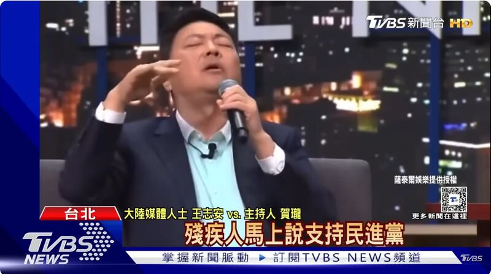

# Will Taiwan shut down a talk show over a discriminatory comment?

## Verdict: False

By Zhuang Jing for Asia Fact Check Lab

2024.02.05

Taipei, Taiwan

## Following Taiwan’s entry ban on a former Chinese journalist who made a discriminatory comment against people with disabilities on a Taiwanese talk show, a claim emerged among Chinese online users that the show will be shut down by the Taiwanse government. This led some to argue that Taiwan’s democracy is “backward” and “no different from mainland China’s.”

## But the claim is false. The show concluded its first season on Jan. 27, a finale date set back in September, and is currently considering its second season. Taiwan’s communication authorities told AFCL that online content falls outside broadcasting laws and regulations.

The claim was [shared](https://weibo.com/5564927603/NDit766yb) on a popular Chinese social media platform Weibo on Jan. 24.

“Wang’s comment angered the DPP government [the ruling Democratic Progressive Party], not only the spokesperson of DPP condemned Wang’s comment, also the producer of the talk show soon apologized, edited the clip...and the show will shut down for three months,” the claim reads in part.

The claim began to circulate online after Taiwan imposed a five-year entry ban on Wang Zhian, a former journalist with the state-run China Central Television, over a derogatory comment he made about people with disabilities during a Taiwanese talk show “He Long’s Night Show” on Jan. 22.

Wang Zhian, a former Chinese state media journalist, sparked outrage by imitating and mocking a disabled DPP lawmaker on a talk show in Taiwan. (source: screenshots of TVBS news YouTube channel)

Wang’s comments ignited an uproar online, prompting an apology from both him and the show.

Following the outcry, Taiwan’s National Immigration Agency banned Wang, noting his tourist entry status violated regulations by appearing on the show.

The claim that the talk show will be shut down by the Taiwanese government also circulated on Weibo and X.

This led some to argue that Taiwan’s democracy is “backward” and “no different from mainland China’s.”

But the claim is false.

Tendollars Liao, a staff member at STR Network, which produced the show, told AFCL that the program merely concluded its first season.

“We had originally scheduled the final episode of the first season to be taped on Jan. 27, and this information was already announced in September last year when we started to sell tickets for the show,” said Liao.

“We will make a separate announcement as to whether or not there are any plans for a new season.”

Separately, an official at Taiwan’s National Communications Commission also dismissed that claim and noted that the online content is not regulated by broadcasting laws and regulations.

## Entry ban on Wang

Taiwan’s immigration agency told AFCL that it launched an investigation against Wang in October following reports of a possible similar violation.

“After Wang appeared in a political TV show in October 2023 [under a tourist status] and it was reported to the agency, the agency launched the investigation. During the investigation, Wang left and re-entered Taiwan and appeared on a show again,” said an official at the agency who asked not to be identified. “Therefore, the agency canceled his tourist visa and imposed the entry ban.”

Regulations require mainland Chinese visiting Taiwan to obtain specific permission based on their visit's purpose and prohibit engaging in activities not aligned with this purpose.

Under Article 16 of the Regulations on Permission for People from Mainland China to Engage in Sightseeing Activities in Taiwan, the agency can revoke permits for such violations and bar individuals from applying for sightseeing permits in Taiwan for five years after their departure.

## *Translated by RFA Staff. Edited by Taejun Kang and Malcolm Foster.*

*Asia Fact Check Lab (AFCL) was established to counter disinformation in today's complex media environment. We publish fact-checks, media-watches and in-depth reports that aim to sharpen and deepen our readers' understanding of current affairs and public issues. If you like our content, you can also follow us on*   [*Facebook*](https://www.facebook.com/asiafactchecklabcn)  *,*   [*Instagram*](https://www.instagram.com/asiafactchecklab/)   *and*   [*X*](https://twitter.com/AFCL_eng)  *.*

[Original Source](https://www.rfa.org/english/news/afcl/fact-check-taiwan-call-show-02052024152053.html)