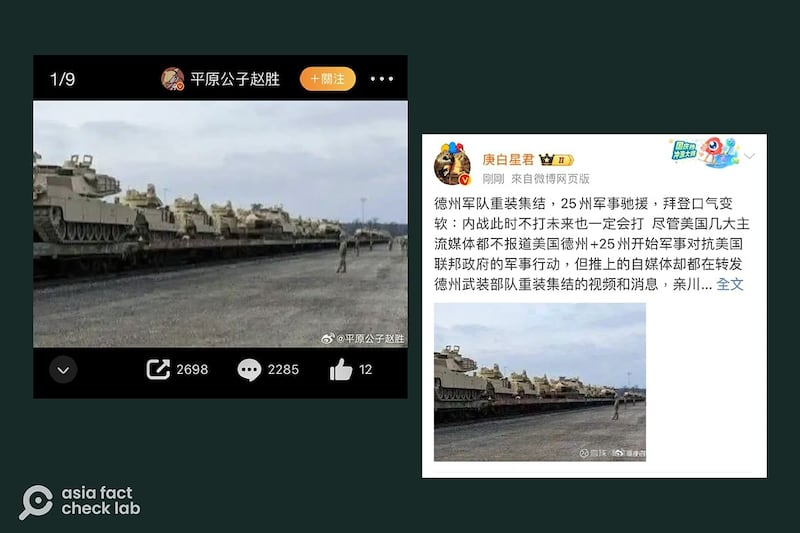
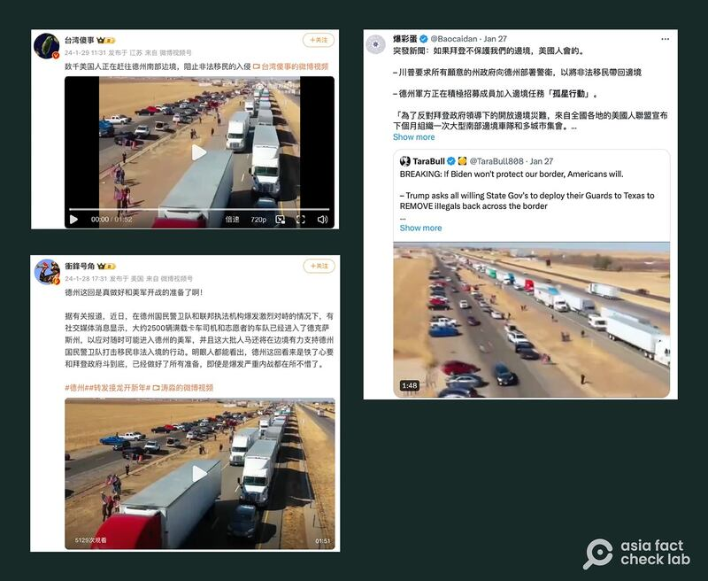

# Is Texas on the brink of war with the US?

## Verdict: False

By Dong Zhe and Zhuang Jing for Asia Fact Check Lab

2024.02.07

Taipei, Taiwan

## Social media users in China claimed that the United States was on the brink of civil war following a recent standoff between the federal government and the state of Texas over border policy, sharing photos and videos as evidence.

## But the claim is false. The photos and videos are unrelated to that ongoing dispute. There are no reports in the U.S. media of a brewing conflict between Texas and the American military – which would be huge news. Keyword searches found no credible reports and statements to back the claim.

The claim was [shared](https://web.archive.org/web/20240207004913/https://weibo.com/6399245004/NE5X1AbuV?from=page_1005056399245004_profile&wvr=6&mod=weibotime) on the popular Chinese social media site Weibo on Jan. 29.

“Huge numbers of tanks, artillery headed for Texas! The day before yesterday, the state of Texas issued a draft order for a large number of National Guard troops to move to the border,” the claim reads in part.

The post was shared alongside four images that showed soldiers shipping and working on tanks.

Netizens on Weibo claimed that images of tanks in transport were evidence that arms were being shipped towards the “frontlines” in Texas. (Screenshot/Weibo)

Tensions [escalated](https://www.reuters.com/world/us/us-supreme-court-lets-border-patrol-remove-texas-razor-wire-fencing-now-2024-01-22/) following a U.S. Supreme Court decision on Jan. 22 permitting federal agents to temporarily remove razor wire along the Mexican border. In a defiant response, Texas Gov. Greg Abbott subsequently [vowed](https://www.bloomberg.com/news/articles/2024-01-25/texas-abbott-pledges-more-razor-wire-at-border-to-stop-migrants) to add more wire along the border.

Other photos and videos have been also shared on [Weibo](https://weibo.com/tv/show/1034:4995481474891779?from=old_pc_videoshow), [Facebook](https://archive.org/details/01292024-truckconvoy_202401) and [X](https://twitter.com/Jacob43817149/status/1751504624970822000), formerly known as Twitter, trumpeting an "impending civil war."

But the claim is false.

## Photos of soldiers and tanks

A keyword search on Google found the identical photos [published](https://archive.ph/ztbV1#selection-429.19-429.105) by the Kansas National Guard's official X account on Jan. 26.

“TRENDING THIS WEEK:Soldiers ship Abrams tanks and Bradley Fighting Vehicles via rail to Fort Bliss, Texas,” reads the caption of the photos.

The Kansas Adjutant General's Department said in a statement on the same day that the equipment would only be used for training exercises in Texas before being shipped overseas in support of a U.S. military initiative in Southwest Asia known as [Operation Spartan Shield](https://web.archive.org/web/20240113133604/https://www.usarcent.army.mil/About/Units/Task-Force-Spartan/).

The state of Texas has not responded to AFCL’s inquiries as of press time.

## A video of trucks

A video showing a large number of trucks has been also shared in several social media posts alongside a claim that it shows “volunteers rushing to the border to reinforce efforts to prevent an invasion of illegal immigrants.”

Several netizens claimed that a convoy of volunteers arrived in Texas to reinforce local armed forces against a potential invasion by the national army. (Screenshot/ Weibo & X)

But the video is unrelated to the ongoing border dispute in Texas and in fact shows a [news clip](https://www.businessinsider.com/trucker-convoy-heading-from-california-to-washington-dc-2022-3) of a protest over COVID restrictions organized by American truck drivers in 2022.

While a trucker convoy heading to Texas named " [Take Our Border Back](https://web.archive.org/web/20240206093636/https://takeourborderback.com/)" was actually organized from Jan. 29 to Feb. 3 in response to the ongoing border dispute, the move predates those false social media posts.

As of Feb. 7, AFCL found no credible media reports or official statements that back the claim about imminent civil war in Texas.

## *Translated by Shen Ke. Edited by Taejun Kang and Malcolm Foster.*

*Asia Fact Check Lab (AFCL) was established to counter disinformation in today's complex media environment. We publish fact-checks, media-watches and in-depth reports that aim to sharpen and deepen our readers' understanding of current affairs and public issues. If you like our content, you can also follow us on*   [*Facebook*](https://www.facebook.com/asiafactchecklabcn)  *,*   [*Instagram*](https://www.instagram.com/asiafactchecklab/)   *and*   [*X*](https://twitter.com/AFCL_eng)  *.*

[Original Source](https://www.rfa.org/english/news/afcl/fact-check-texas-02072024164301.html)