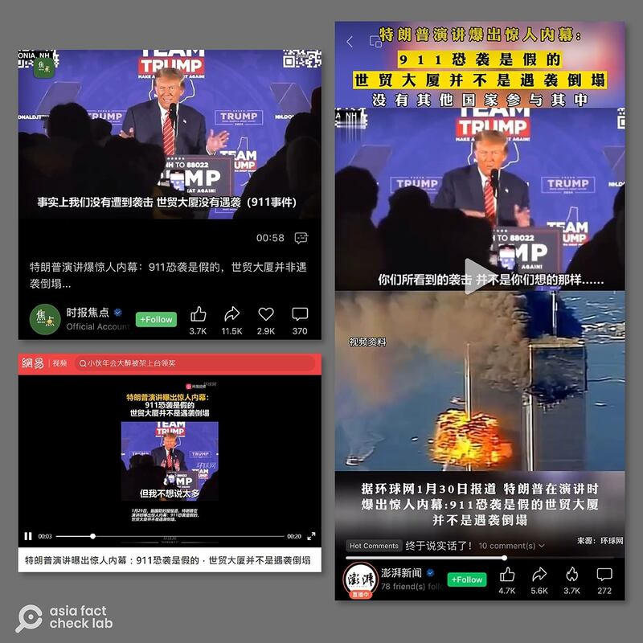
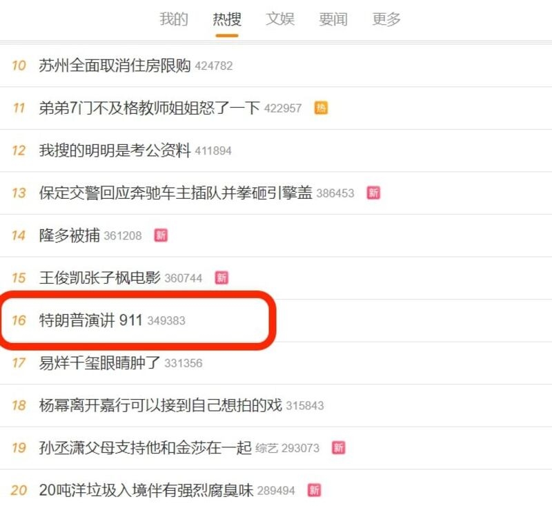

# Did Trump claim the 9/11 attacks never happened?

## Verdict: False

By Zhuang Jing for Asia Fact Check Lab

2024.02.08

Taipei, Taiwan

## A video of former U.S. President Donald Trump has been shared on Chinese-language social media claiming that Trump asserted that both the 9/11 attacks and the collapse of the World Trade Center never happened.

## But the video has been digitally edited to misrepresent Trump’s remarks. The former president, in fact, said there was “no terrorism” and “no attacks” during his four-year term in office, not that there were no attacks back in 2001.

The claim was [shared](https://weibo.com/2343014623/4995652534667377) on a popular Chinese social media platform Weibo on Jan. 29.

“Trump’s speech explodes with shocking inside story: The 9/11 terror attacks were fake, and the World Trade Towers didn’t collapse in an attack,” reads the claim.

The claim was shared alongside a one-minute and 12-second video clip that appears to show Trump’s Jan. 22 speech.

“Now I talk about it all the time. We had no attacks. We didn’t have a World Trade Center. We didn’t have attacks like you’ve seen,” he says in the video.

The identical video with similar claims has been also published by several state-backed Chinese media outlets such as *The Paper* and *Defense Times.*

The same claim also has been circulated in different languages, including [English](https://archive.ph/fBS3W) and [Italian](https://archive.ph/QXGI5).

Several official Chinese media outlets and pro-Beijing social media influencers reposted a short video of Trump purportedly saying that the 9/11 terrorist attacks never happened. (Screenshot/Weibo, WeChat, Douyin & X)

But the video has been digitally edited to misrepresent Trump’s remarks.

## Trump’s actual remarks

A combination of keyword and image searches found that the video circulated in social media posts was part of Trump's Jan. 22 [speech](https://www.c-span.org/video/?533086-1/donald-trump-campaigns-laconia-hampshire) in Laconia, New Hampshire.

A close look at the full speech shows Trump, in fact, noted there was “no terrorism” and “no attacks” during his four years in office, attributing a large part of the achievement to the “terror ban” he enacted through a series of executive actions beginning in 2017.

“When I was there, for years, I wanted to talk so much; we had no terrorism, we had no attacks, we had nothing,” he said at the video’s 23-minute and 30-second mark.

He went on to say: “We had no attacks. We didn’t have a World Trade Center. We didn’t have the attacks like you’ve seen.”

Trump’s tenure as president ran from Jan. 20, 2017 until Jan. 20, 2021, while 9/11 attacks on New York and Washington happened on Sept. 11, 2001.

The claim about Trump's remarks has also been debunked by other fact-checking organizations, including [Snopes](https://www.snopes.com/fact-check/trump-911-inside-job/).

Additionally, Reference News, alongside other China's state-controlled media outlets, [confirmed](https://m.weibo.cn/status/4995878939264049) that Trump's remarks had been misinterpreted.

## *Translated by Shen Ke. Edited by Taejun Kang and Malcolm Foster.*

*Asia Fact Check Lab (AFCL) was established to counter disinformation in today's complex media environment. We publish fact-checks, media-watches and in-depth reports that aim to sharpen and deepen our readers' understanding of current affairs and public issues. If you like our content, you can also follow us on*   [*Facebook*](https://www.facebook.com/asiafactchecklabcn)  *,*   [*Instagram*](https://www.instagram.com/asiafactchecklab/)   *and*   [*X*](https://twitter.com/AFCL_eng)  *.*

[Original Source](https://www.rfa.org/english/news/afcl/trump-terror-attacks-02082024225710.html)