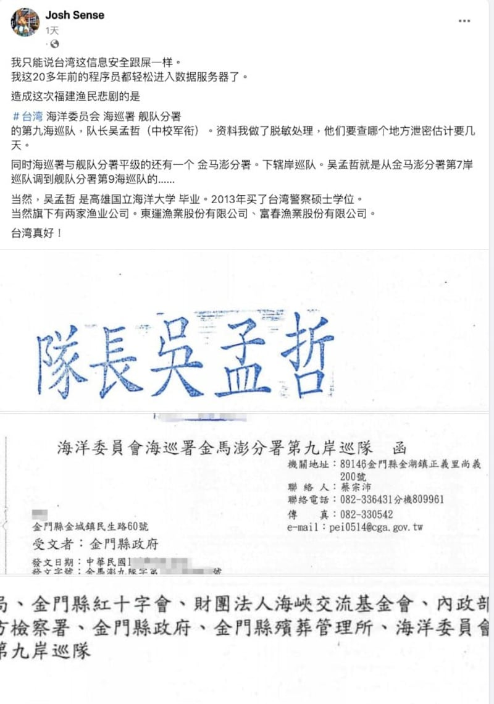
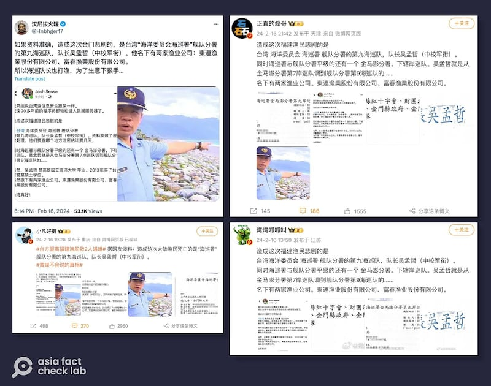
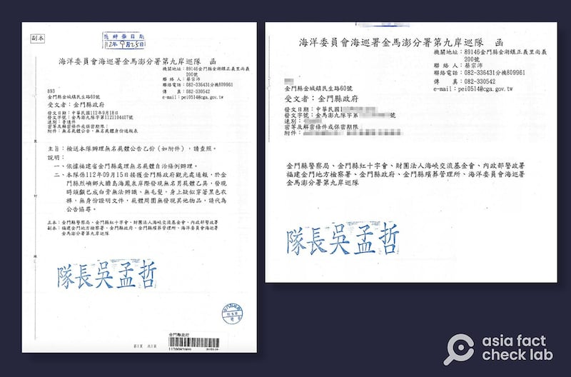

# Did a Taiwan coast guard captain cause the Kinmen incident?

## Verdict: Lack of evidence

By Zhuang Jing for Asia Fact Check Lab

2024.02.22

Taipei, Taiwan

## A claim emerged in Chinese-language social media posts that a Taiwanese coast guard captain caused two Chinese fishermen to die near Kinmen island – controlled by Taiwan but just 10 kilometers (6 miles) from mainland China – because he had interests in two fishing businesses.

## But alleged details about the post’s caption are false, and the images shared by social media users to back their claim are apparently taken from an unrelated 2023 document.

The claim was [shared](https://archive.ph/Yhqh3) on Facebook on Feb. 17.

“What caused this incident [near Kinmen] is a captain of the Taiwanese coast guard’s 9th maritime patrol unit named Wu Meng-chieh … [It’s] due to business interests relating to two fishery companies he owns,” reads the post, which included three images of what appeared to be an official document from Taiwan.

In the Feb. 14 incident, four Chinese fishermen from Fujian province in a speedboat fell into the ocean after being chased by Taiwanese coast guard ships after crossing into restricted waters around Kinmen island.

All four were recovered from the water and taken to a nearby hospital for treatment. Two returned to stable condition, but two others who had lost consciousness after falling into the sea were later pronounced [dead](https://archive.ph/AUjKZ).

China's Taiwan Affairs Office [condemned](https://archive.ph/qnfJD) the coast guard's handling of the incident.

But Taiwan's Mainland Affairs Council [stated](https://archive.ph/P0z8Z) that the relevant personnel "performed their duties in accordance with the law without any misconduct."

A Facebook user claimed that a Taiwanese coast guard official caused the deaths of two Chinese fishermen near Kinmen. (Screenshot/Facebook)

The claim and images in question – that the coast guard captain caused the accident because he owned fishing businesses – were shared by a number of widely followed [pro-Beijing](https://archive.ph/BQwRg) [influencers](https://archive.ph/o1REA) on popular social media platforms such as X and Weibo, with some additionally attaching a purported photo of Wu, the captain.

A number of netizens on Weibo and X retweeted the rumor. (Screenshot/Weibo & X)

## The document

The partial document included in the social media post made it appear that there was some classified document that linked Wu to the accident. But crucial details like dates and serial numbers were removed or blurred.

Keyword searches on Google [found](https://www.miaoli.gov.tw/social_affairs/News_Content.aspx?n=5649&s=693800) the original document issued in Sept. 2023 – concerning the disposal of an unidentified body – and had no relation to the February incident.

Below is a screenshot comparison between the original document (left) and the document shared by social media users (right).

The header, recipients list and official seal of a message sent to Kinmen County police in September 2023 (left) is identical to the images circulated by Chinese netizens as evidence of a Taiwanese coast guard officer’s role in causing the deaths (right). (Screenshot/Facebook & Taiwan’s Miaoli County Government)

## Wu’s identity

Also, Taiwanese coast guard officials told AFCL that the Facebook post was false, noting that while there was an official surnamed Wu, he served on the shore patrol team, and was not a maritime patrol captain.

Also, a [review](https://data.gcis.nat.gov.tw/od/detail?oid=4302E583-A7B5-4BE2-A3D6-9707B1AACE1C#moreBtn) of Taiwan's Ministry of Economic Affairs' public company register revealed that the two fishery companies allegedly prompting Wu to target Chinese fishermen were approved for dissolution in Dec. 2017 and Nov. 2019, respectively.

## *Translated by Shen Ke. Edited by Taejun Kang and Malcolm Foster.*

*Asia Fact Check Lab (AFCL) was established to counter disinformation in today's complex media environment. We publish fact-checks, media-watches and in-depth reports that aim to sharpen and deepen our readers' understanding of current affairs and public issues. If you like our content, you can also follow us on*   [*Facebook*](https://www.facebook.com/asiafactchecklabcn)  *,*   [*Instagram*](https://www.instagram.com/asiafactchecklab/)   *and*   [*X*](https://twitter.com/AFCL_eng)  *.*

[Original Source](https://www.rfa.org/english/news/afcl/fact-check-kinmen-fishing-incident-02222024154339.html)