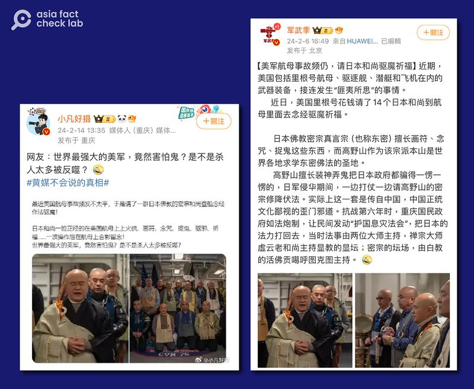
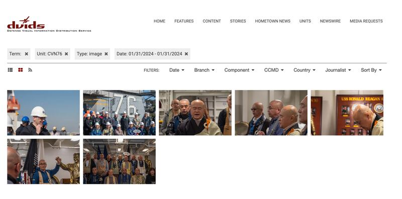
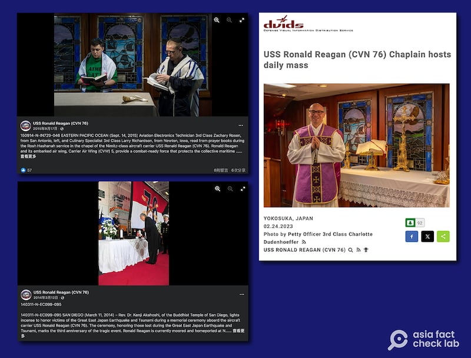

# Did a US carrier pay Japanese Buddhist monks to drive away evil spirits?

## Verdict: False

By Dong Zhe for Asia Fact Check Lab

2024.03.04

Taipei, Taiwan

## Chinese-speaking online users claimed that Japanese Buddhist monks were recently paid to board the USS Ronald Reagan aircraft carrier to “drive away evil spirits” from the vessel through an exorcism.

## But the claim is false. Although the monks did visit the ship, they were not compensated for their time there and the ritual was not an exorcism but rather a prayer for the crew’s good fortune, according to an official from the vessel and Buddhism experts.

The claim was shared on Weibo on Feb. 6.

“Recently, the USS Ronald Reagan paid 14 Japanese monks to go inside the aircraft carrier to chant to exorcise the Devil out of the vessel,” reads the claim in part.

The post also claimed that the monks were part of the “Tantra Buddhism” sector, portrayed as smaller and more secretive than Chinese Buddhism, or Han Buddhism, which has a significant following in China.

The claim was shared alongside a total of four images showing a group of people who appear to be Buddhistmonks conducting a ritual in an enclosed area.

The identical photos with similar claims have also been shared on popular Chinese social media platforms, such as [Weibo](https://archive.ph/9zFfw), [Netease](https://c.m.163.com/news/v/VNPJ179IN.html) and [Xigua Video](https://www.ixigua.com/7336144622961364287?wid_try=1).

Several influencers on Weibo claimed that a U.S. aircraft carrier paid Japanese monks to drive away evil spirits aboard the ship. (Screenshot/ Weibo)

But the claim is false.

## Voluntary invitation

A reverse image search on Google found the corresponding photos [published](https://www.dvidshub.net/image/8221367/uss-ronald-reagan-cvn-76-hosts-tour-buddhist-monks) on the Defense Visual Information Distribution Service, or DVIDS, an official archive for media relating to U.S. armed forces, on Jan. 31.

“Buddhist monks pray on the ceremonial quarterdeck during a tour of the U.S. Navy’s only forward-deployed aircraft carrier, USS Ronald Reagan (CVN 76), while in-port Commander, Fleet Activities Yokosuka, Jan. 31,” reads the caption of the photos.

The U.S. armed forces released images of the monks visiting the USS Reagan on January 31. (Screenshot/DVIDS)

The USS Reagan Lt. Commander Phil Chitty said the visit of the monks was voluntary and free of charge, adding that it was part of the U.S. efforts to engage with local religious leaders.

“Their visit to the ship was part of a larger trip where they visited several historical monuments,” Chitty told AFCL.

The Yokosuka naval base's official X account [posted](https://twitter.com/FLEACT_Yokosuka/status/1755503772296675758) a 12-second clip on Feb. 8 showing the monks chanting in front of a bronze statue of former President Reagan while aboard the ship.

“Monks prayed for safe voyages on the USS Ronald Reagan aircraft carrier,” reads the caption of the clip.

The carrier has formerly hosted several other religious ceremonies as seen [here](https://www.facebook.com/photo/?fbid=10151962024557021&set=a.10151936128062021), [here](https://www.facebook.com/photo/?fbid=10153061394092021&set=a.10153061392167021) and [here](https://www.dvidshub.net/image/7650408/uss-ronald-reagan-cvn-76-chaplain-hosts-daily-mass).

Figures from different religions have visited and performed various rites aboard the Reagan. (Screenshot/DVIDS & Facebook)

## Blessing of peace

The monks who visited the U.S. vessel appear to be chanting the " [Great Compassion Mantra](https://buddhaweekly.com/great-compassion-mantra-purification-healing-protection-maha-karuna-dharani-sutra-benefiting-beings/)," a well-known chant mainly used for blessings of peace or spiritual comfort, said Lin Chien-te, director of Taiwan's Institute of Religion and Humanities at Tzu Chi University, who reviewed a video of their ritual.

Weijen Teng, head of the Department of Buddhist Studies at Dharma Drum Institute of Liberal Arts, shares a similar view.

Teng told AFCL that the monks appear to be merely praying for blessing, although he believed they recited a separate [sutra](https://sunnyvale.ctzen.org/wiki/misfortune-dispelling-and-blessings-mantra/) for the defense of one's country.

“It is not an exorcism,” said Teng.

Separately, the USS Reagan’s public affairs office told AFCL that the monks were from a temple associated with Muso Kokushi, a famous Zen master who lived and taught in Yokosuka during the 13th to 14th centuries.

While Kokushi in his early years did practice [Shingon](https://www.britannica.com/topic/Shingon) and [Tendai](https://www.tendai.org/tendai/what-is-tendai/) - two influential Buddhist sects classified as tantric in Japan - he later converted to the non-tantric Zen sect in his later years and maintained this to his death, according to Teng.

## *Translated by Shen Ke. Edited by Taejun Kang and Malcolm Foster.*

*Asia Fact Check Lab (AFCL) was established to counter disinformation in today's complex media environment. We publish fact-checks, media-watches and in-depth reports that aim to sharpen and deepen our readers' understanding of current affairs and public issues. If you like our content, you can also follow us on*   [*Facebook*](https://www.facebook.com/asiafactchecklabcn)  *,*   [*Instagram*](https://www.instagram.com/asiafactchecklab/)   *and*   [*X*](https://twitter.com/AFCL_eng)  *.*

[Original Source](https://www.rfa.org/english/news/afcl/fact-check-monk-ussronaldreagan-03042024115053.html)