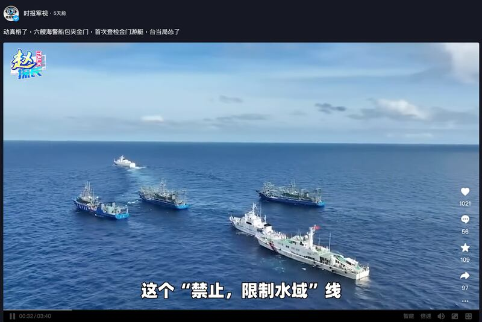
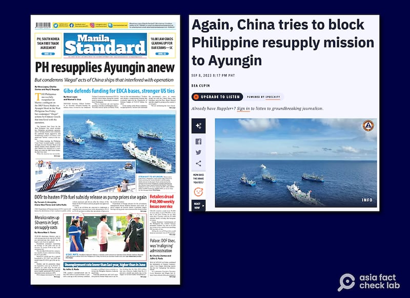

# Did Chinese guards cross into restricted waters around Taiwan’s Kinmen?

## Verdict: Misleading

By Zhuang Jing for Asia Fact Check Lab

2024.03.05

Taipei, Taiwan

## Chinese-language posts claimed that Chinese coast guard vessels crossed into waters near Taiwan-controlled Kinmen island on Feb. 19, citing a video clip and a media report as evidence.

## But the claim is misleading. The footage was taken from an irrelevant event. The media reports in question cited a real-time tracker of Chinese ships but did not provide visual evidence.

The claim was [shared](https://www.youtube.com/watch?v=-I0vr0Xtg1I) in a YouTube video on Feb. 24.

“Six Chinese coast guard vessels in two groups crossed into the restricted waters around Kinmen on Feb. 19,” said the narrator of the video.

The YouTube video featured several clips that show white and blue ships at sea, with the narrator pointing out the white ones as Chinese coast guard vessels. He also referenced a real-time tracker of Chinese ship locations to support his claim.

A recent current events show claiming that six Chinese coast guard vessels entered restricted waters around Kinmen was quoted by a subsidiary of the official Chinese media National Defense Times. (Screenshot/Douyin)

Tensions between Taiwan and China have escalated in the weeks following the death of [two Chinese fishermen](2024-02-22_Did a Taiwan coast guard captain cause the Kinmen incident?.md) who crossed into the restricted waters and subsequently attempted to evade inspection by Taiwan's Coast Guard on Feb. 14.

After the Taiwan Affairs Office [denied](http://www.gwytb.gov.cn/xwdt/xwfb/wyly/202402/t20240217_12600298.htm) Taiwan's restricted maritime zone around Kinmen on Feb. 17, the China Coast Guard, or CSG, [announced](http://www.news.cn/legal/20240218/4efd0eac0fac49e78b6c4f8379497878/c.html) the next day its intent to patrol waters near the island.

On Feb. 19, the CSG forcefully [boarded and searched](https://www.aljazeera.com/news/2024/2/20/chinese-coast-guard-boards-taiwan-tourist-boat-triggers-panic) a Taiwanese tour boat near Kinmen. Subsequently, on Feb. 25, they [released](https://www.ccg.gov.cn//2024/hjyw_0225/2424.html) footage showcasing naval drills in the vicinity.

The claim was later [reposted](https://v.douyin.com/iNGA9vDm/) by a subsidiary of China's state-owned outlet [National Defense Times](https://www.gfxww.com/WebPage/introduction.htm).

## Old, irrelevant footage

But a reverse image search on Google found the identical video published in a report by a Filipino online news website Rappler on Sep. 8, 2023.

“Video from the Philippine Coast Guard shows Chinese ships sailing dangerously close to Philippine vessels,” the report reads in part.

“Chinese vessels on Friday, September 8, tried to block Philippine boats en route to Ayungin Shoal to bring supplies for Filipino Marines stationed onboard the BRP Sierra Madre,” it reads further.

Photos and videos showing the same vessels were also published by other Filipino media outlets, including the [Manila Standard](https://manilastandard.net/?p=314368613) and [Marine Link](https://www.marinelink.com/news/philippines-condemns-chinese-harassment-507888).

The clips used in the Inspector Zhao Talk episode appeared in reports by Philippine outlets covering the September 2023 confrontation between Philippine and Chinese vessels in the South China Sea. (Screenshots/Manila Standard and Rappler)

## Lack of visual evidence

While some media outlets, including Taiwan's [United Daily News](https://udn.com/news/story/9213/7778117) and [UP Media](https://www.upmedia.mg/news_info.php?Type=24&SerialNo=195150), referenced the China Ports Network, which offers a real-time tracking of Chinese ships, claiming that six CGC vessels neared Kinmen island on Feb. 19, they failed to present any visual confirmation.

Keyword searches also did not find any reliable reports or visual proof of these vessels approaching the island’s vicinity on that specific day.

## *Translated by Shen Ke. Edited by Taejun Kang and Malcolm Foster.*

*Asia Fact Check Lab (AFCL) was established to counter disinformation in today's complex media environment. We publish fact-checks, media-watches and in-depth reports that aim to sharpen and deepen our readers' understanding of current affairs and public issues. If you like our content, you can also follow us on*   [*Facebook*](https://www.facebook.com/asiafactchecklabcn)  *,*   [*Instagram*](https://www.instagram.com/asiafactchecklab/)   *and*   [*X*](https://twitter.com/AFCL_eng)  *.*

[Original Source](https://www.rfa.org/english/news/afcl/fact-check-kinmen-03052024165300.html)