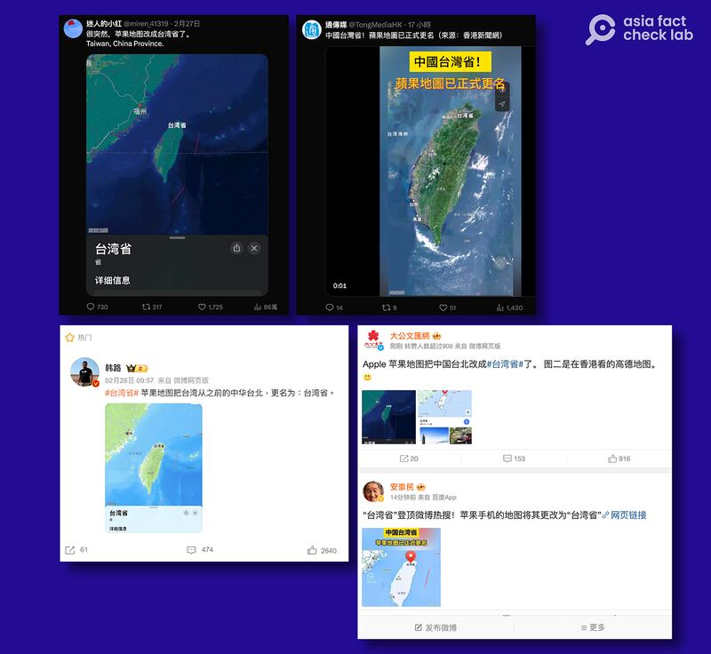
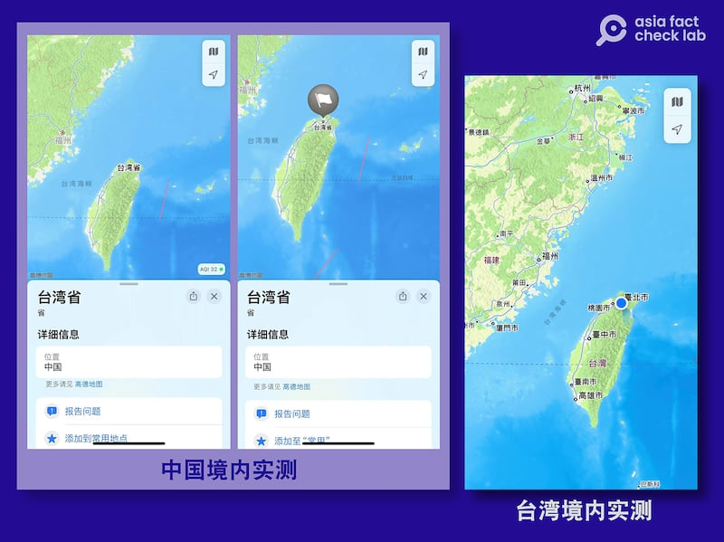
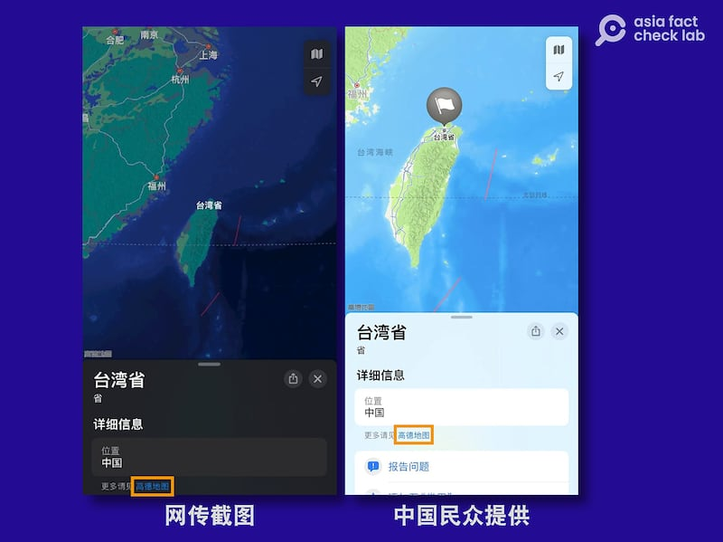

# Does Apple Maps label Taiwan as a province of China?

## Verdict: Partly correct

By Dong Zhe for Asia Fact Check Lab

2024.03.07

## Chinese-language social media posts claimed that Apple has changed Taiwan’s geographic label in its Maps app from “Taiwan” to “Taiwan Province” – a term which aligns with Beijing’s ideological commitment to “One China.”

## While now labeled as “Taiwan Province” in the Chinese version of the app, Taiwan is still called “Taiwan” on the app in other countries. Apple Maps’ Chinese app version uses domestic data in China, differing from global search results.

The claim was [shared](https://twitter.com/TongMediaHK/status/1762777347781173434) on X, formerly known as Twitter, by the Pro-China Hong Kong media outlet Tong Media on Feb. 28

“Taiwan Province of China! Apple Maps has officially changed its name,” the claim reads in part.

The claim was shared alongside a nine-second clip that shows what appears to be the Apple Maps app with the Chinese text “Taiwan Province” appearing on the main island of Taiwan.

Apple Maps changed Taiwan’s name from “Chinese Taipei” to “Taiwan Province” on Chinese registered Iphones. (Screenshot/Weibo&X)

China [considers](https://www.cfr.org/backgrounder/china-taiwan-relations-tension-us-policy-biden) Taiwan a breakaway province of its sovereign territory, even though the island has been governed independently since 1949.

Beijing refuses to establish diplomatic relations with countries that recognize Taiwan sovereignty. While only 12 governments still [maintain](https://en.mofa.gov.tw/AlliesIndex.aspx?n=1294&sms=1007) official diplomatic ties with Taipei, its government nevertheless maintains strong unofficial relations with many countries.

China's refusal to acknowledge Taiwanese sovereignty extends to events that include state participation and companies that do business internationally. For instance, China [boycotted](https://www.cbc.ca/sports/china-boycotts-world-games-opening-in-taiwan-1.822422) the World Games held in Taipei in 2009 and [pressured](https://learningenglish.voanews.com/a/us-airline-companies-agree-to-name-change-for-taiwan/4501046.html) American airline companies to change their identification of Taiwan to "Taipei" in 2018.

Internationally, “Taipei” or “Chinese Taipei” are terms used to diplomatically navigate the sensitivities of both Taipei and Beijing. However, in mainland China, terms that clearly identify Taiwan as a province or region under Chinese sovereignty are frequently adopted in official settings.

The claim has been also shared on the popular Chinese social media platforms Weibo [here](https://weibo.com/1912418597/O2vJjvFI2?refer_flag=1001030103_) and [here](https://weibo.com/1192966660/O2EFc1KE3?refer_flag=1001030103_).

But it is only partly true.

## Different country, different results

AFCL searched for “Taiwan” on Apple Maps in various countries with different IP addresses and found that “Taiwan Province,” or 臺灣省, was only used in China.

In contrast, searches from other nations, such as the United States and Thailand, consistently displayed “Taiwan.”

Apple Maps labels Taiwan as “Taiwan Province” in mainland China (left & middle) but only as “Taiwan” in Taiwan itself (right). (Screenshot/Apple Maps)

## Sources of data

Since its [introduction](https://www.google.com/search?q=WWDC+2012&oq=WWDC+2012&gs_lcrp=EgZjaHJvbWUyBggAEEUYOTIGCAEQABgeMggIAhAAGAUYHjIGCAMQRRg80gEIMjIzOGowajSoAgCwAgA&sourceid=chrome&ie=UTF-8#fpstate=ive&vld=cid:76007b94,vid:64ek5Z4NWiY,st:5922) at the 2012 developer conference, Apple Maps has [sourced](https://www.apple.com/tw/legal/privacy/data/zh-tw/apple-maps/) its navigation data for the Chinese version from Beijing's [AutoNavi](https://mobile.amap.com/), while TomTom, a Dutch company, [supplies](https://www.theguardian.com/technology/2012/jun/12/tomtom-apple-phone-satnav-program) this data for the app in most other nations.

As of March 6, the logo of AutoNavi can be seen in the bottom left corner of the Chinese version of Apple Maps app.

AutoNavi’s logo appears in the bottom left corner of Apple Map’s Chinese version. (Screenshot/Apple Maps)

For the Taiwanese version of the Maps app, Apple [utilizes](https://gspe21-ssl.ls.apple.com/html/attribution-275.html) navigation data from various providers, including TomTom, but AutoNavi is not one of the sources.

Apple has not responded to requests for comments as of this writing.

## *Translated by Shen Ke. Edited by Taejun Kang and Malcolm Foster.*

*Asia Fact Check Lab (AFCL) was established to counter disinformation in today's complex media environment. We publish fact-checks, media-watches and in-depth reports that aim to sharpen and deepen our readers' understanding of current affairs and public issues. If you like our content, you can also follow us on*   [*Facebook*](https://www.facebook.com/asiafactchecklabcn)  *,*   [*Instagram*](https://www.instagram.com/asiafactchecklab/)   *and*   [*X*](https://twitter.com/AFCL_eng)  *.*

[Original Source](https://www.rfa.org/english/news/afcl/fact-check-apple-maps-taiwan-03072024174451.html)