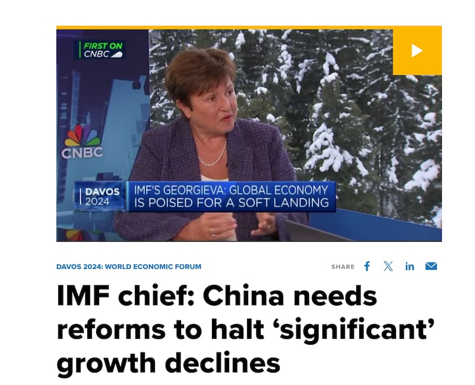
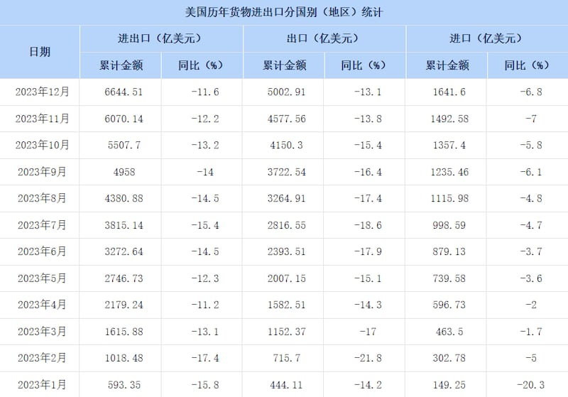

# Did the IMF chief say the Chinese economy performed well in 2023?

## Verdict: Misleading

By Shen Ke for Asia Fact Check Lab

2024.03.12

## China’s state-run Xinhua News Agency claimed in its Chinese version of report that International Monetary Fund Managing Director Kristalina Georgieva told the media on Feb. 1 that the Chinese economy “performed well” in 2023.

## But Xinhua didn’t accurately translate Georgieva’s remarks. In Xinhua’s original English copy, the IMF chief was quoted as saying the Chinese economy “performed slightly above expectations” last year.

The claim was [shared](https://web.archive.org/web/20240301203824/http://www.news.cn/fortune/20240202/63c52a60c3b646dfbb9386186a8af0aa/c.html) in a Chinese version of the report by Xinhua on Feb. 1.

“Talking about China’s economy, Georgieva told Xinhua that the country’s economy performed well in 2023,” the report reads in part.

China continues to attempt to jumpstart its economy following several sluggish years under stringent anti-epidemic measures after the outbreak of COVID-19 in 2020.

Local officials assert that the [5.2% GDP growth](https://www.gov.cn/yaowen/liebiao/202401/content_6926714.htm) in 2023 indicates the economy is "recovering and improving," although this growth still [falls short](https://data.worldbank.org/indicator/NY.GDP.MKTP.KD.ZG?locations=CN) of the usual pre-COVID rates of 6% to 7%.

But the claim is misleading. In Xinhua's original [English copy](https://web.archive.org/web/20240301203849/https://english.news.cn/northamerica/20240203/ce3e2d5bac104302b5d07eeaf8165726/c.html), the IMF chief was in fact cited as saying the Chinese economy "performed slightly above expectations."

Georgieva's remarks are in line with what she said in January during an [interview](https://www.cnbc.com/video/2024/01/15/imf-chief-china-needs-reforms-to-halt-significant-growth-declines.html) with American broadcaster CNBC.

At that time, she said China’s economy faces “really difficult short-term and long-term challenges,” citing the high level of local government debt and needs for “structural reforms” among others.

Georgieva stated in an interview with CNBC on January 15 that China needs “structural reforms” to prevent “a significant decline” in GDP growth. (Screenshot/CNBC)

The IMF executive board made [similar appraisals](https://www.imf.org/en/News/Articles/2024/02/01/pr2433-china-imf-executive-board-concludes-2023-article-iv-consultation) about China's economic outlook on Feb. 2.

Keyword searches found no credible reports or statements to show that Georgieva said the Chinese economy performed well in 2023.

## Portraying optimistic outlook

While it’s uncertain whether Xinhua deliberately mistranslated the IMF chief’s remarks, this incident aligns with a recent trend in China where its state-controlled media consistently portray an optimistic view of the nation’s economic prospects.

In December 2023, for instance, a *Global Times* journalist [interviewed](https://archive.ph/Zvl3t) international financial consultant Jim Rogers. During the interview, the reporter questioned if U.S. efforts to economically decouple from China would be successful, citing an increase in Sino-U.S. trade throughout 2023 as evidence that these attempts were ineffective. However, this claim about U.S.-China trade in 2023 was incorrect.

[Statistics](https://web.archive.org/web/20240212155901/http://data.mofcom.gov.cn/hwmy/imexCountry_detail.shtml?key=%E7%BE%8E%E5%9B%BD) published by the Chinese Ministry of Commerce show that China's total trade with the United States fell 11.6% to US$664.4 billion last year from US$759.4 billion in 2022.

Both China’s total imports to and exports from the United States suffered a continuous decline through every month of 2023, with average monthly trade falling more than 10 percent year-on-year.

Both China’s total imports to the U.S. and exports from the United States dropped every month of 2023. (Screenshot/China Ministry of Commerce)

Although the report was published more than a week before the end of the year, the Ministry of Commerce updated the publicly available statistics every month throughout 2023.

## *Edited by Taejun Kang and Malcolm Foster.*

*Asia Fact Check Lab (AFCL) was established to counter disinformation in today's complex media environment. We publish fact-checks, media-watches and in-depth reports that aim to sharpen and deepen our readers' understanding of current affairs and public issues. If you like our content, you can also follow us on*   [*Facebook*](https://www.facebook.com/asiafactchecklabcn)  *,*   [*Instagram*](https://www.instagram.com/asiafactchecklab/)   *and*   [*X*](https://twitter.com/AFCL_eng)  *.*

[Original Source](https://www.rfa.org/english/news/afcl/china-economy-imf-03122024124918.html)