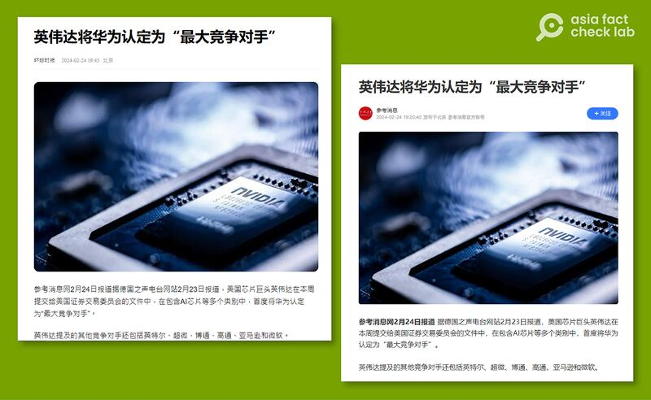
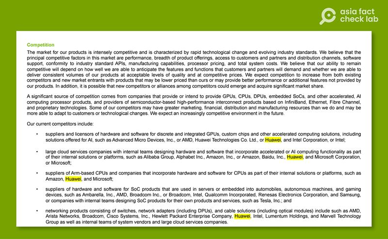

# Did NVIDIA describe Huawei as its ‘biggest competitor’?

## Verdict: Misleading

By Rita Cheng for Asia Fact Check Lab

2024.03.15

Washington

## China’s state-run media outlets claimed that American chipmaker NVIDIA had for the first time listed the Chinese tech company Huawei as its “biggest competitor” in its latest annual earnings report.

## But the claim is misleading. While NVIDIA did mention Huawei in the report for the first time, it was only cited as one of a number of competitors, not its biggest.

On Feb. 24, [China's state-controlled Reference News](https://new.qq.com/rain/a/20240224A06I5K00) said: "The U.S. chip giant identified Huawei as the 'biggest competitor' in its report submitted this week to the U.S. Securities and Exchange Commission."

Reference News cited a report by the German public broadcaster Deutsche Welle, or DW, published to back its claim.

Keyword searches found the report cited by Reference News published on the [website](https://www.dw.com/zh/nvidia%E5%9C%A8%E8%8F%AF%E5%8F%97%E9%98%BB-%E7%A8%B1%E8%8F%AF%E7%82%BA%E6%9C%80%E5%A4%A7%E7%AB%B6%E7%88%AD%E5%B0%8D%E6%89%8B/a-68348086) of DW Chinese on Feb. 23. It claimed that Nvidia lists Huawei as the biggest competitor in its annual report.

Chinese official media such as Reference News claimed that NVIDIA identified Huawei as its “biggest competitor” for the first time in its latest annual earnings report. (Screenshot/Reference News)

Santa Clara, California-based NVIDIA is a leading technology company known for its powerful graphics processing units, or GPUs, which are used in video gaming, artificial intelligence, and machine learning.

Shenzhen-based Huawei is a global telecommunications and electronics company known for its smartphones, networking equipment, and leading advancements in 5G technology.

While becoming a top producer of both telecom equipment and electronic devices, Huawei was caught in the crossfire of the U.S.-China trade war, [suffering a steep drop profit](https://www.nytimes.com/2023/03/31/business/huawei-annual-earnings-2022.html) after being [blacklisted](https://www.reuters.com/article/idUSKCN1SM2MG/) by the American government for buying unapproved parts from U.S. suppliers.

The claim about NVIDIA listing Huawei as the biggest competitor has been also shared in China's state-run *Global Times.* Other Chinese language media such as Singapore's [Lianhe Zaobao](https://www.zaobao.com.sg/realtime/china/story20240225-1470229) and Taiwan's [United Daily News](https://udn.com/news/story/7331/7795688) published similar reports.

## NVIDIA’s report

On page 9 of NVIDIA's [annual earnings report](https://d18rn0p25nwr6d.cloudfront.net/CIK-0001045810/1cbe8fe7-e08a-46e3-8dcc-b429fc06c1a4.pdf), it does mention Huawei in four of the five market areas where the company faces serious competition, including as a supplier of GPU hardware and as a cloud service featuring in house AI.

NVIDIA's earnings report does mention Huawei as a competitor in several market areas, but does not describe it as NVIDIA's “ largest competitor.” (Screenshot/NVIDIA official site)

However, the relevant section of the report does not describe Huawei as either its “biggest competitor” or as a “major competitor,” and instead lists it as one amongst many multinational tech companies such as U.S. companies like AMD and Intel.

Other Chinese companies mentioned as competitors in the 2024 report include Alibaba and Baidu. While this is the first time Huawei has appeared as a noted "competitor" in NVIDIA's annual report, Baidu appeared in the [2023 report](https://d18rn0p25nwr6d.cloudfront.net/CIK-0001045810/4e9abe7b-fdc7-4cd2-8487-dc3a99f30e98.pdf) while Alibaba was listed [as early as 2022](https://d18rn0p25nwr6d.cloudfront.net/CIK-0001045810/ca04d49f-caab-436f-9e6f-e8493c8e8515.pdf).

## *Translated by Shen Ke. Edited by Taejun Kang and Malcolm Foster.*

*Asia Fact Check Lab (AFCL) was established to counter disinformation in today's complex media environment. We publish fact-checks, media-watches and in-depth reports that aim to sharpen and deepen our readers' understanding of current affairs and public issues. If you like our content, you can also follow us on*   [*Facebook*](https://www.facebook.com/asiafactchecklabcn)  *,*   [*Instagram*](https://www.instagram.com/asiafactchecklab/)   *and*   [*X*](https://twitter.com/AFCL_eng)  *.*

[Original Source](https://www.rfa.org/english/news/afcl/fact-check-nvidia-huawei-03152024152712.html)