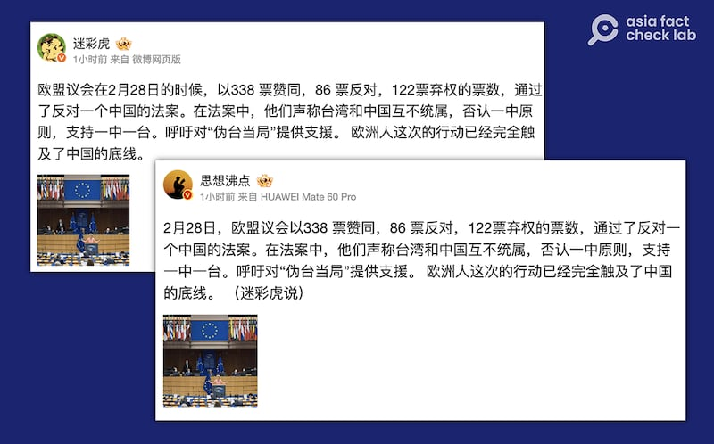
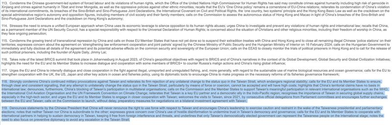

# Did the European Parliament pass a bill denying the ‘One China principle’?

## Verdict: Misleading

By Zhuang Jing for Asia Fact Check Lab

2024.03.19

Taipei, Taiwan

## A claim emerged in Chinese-language social media posts that the European Parliament passed a bill in February to oppose the “One China principle” and support “one China and one Taiwan.”

## But the claim is misleading. The “bill” mentioned is in fact a resolution for policy recommendations. While it acknowledges that Taiwan and China are not subordinate to one another, it highlights the European Union’s “One China policy,” recognizing the government of the People’s Republic of China as the sole legal government of China.

The claim was [shared](https://m.weibo.cn/detail/5008195479146574) on the popular Chinese social media platform Weibo on March 4.

“On Feb. 28, the EU Parliament passed a bill against one China … In the bill, they claimed that Taiwan and China are not subordinate to each other, denied the One China principle, and supported one China, one Taiwan,” the claim reads in part.

Weibo users claimed that the European Parliament “passed a bill against the One China policy.” (Screenshot/Weibo)

The People’s Republic of China considers Taiwan a renegade province over which it holds sovereignty, even though the distinct Republic of China, or ROC, government has had sovereignty over the island since 1949.

While the ROC currently only maintains official diplomatic relations with 12 countries, its government still [maintains](https://www.taiwanembassy.org/portalOfDiplomaticMission_en.html#ALL) many unofficial diplomatic missions around the world, among them both with the European Union and many of its individual member states. Under pressure from Beijing, most of Taiwan's diplomatic missions adopt the politically ambiguous term "Taipei" as their name.

In 2021, Taiwan [established](https://www.dw.com/en/taiwan-opens-representative-office-in-lithuania/a-59853874) its representative office in Lithuania under the name "The Taiwanese Representative Office in Lithuania," within the European Union member state.

This move provoked China, leading to a downgrade in diplomatic relations with Lithuania, as well as [import restriction](https://apnews.com/article/taiwan-technology-china-beijing-business-21547a18bcf4222b040a1180c0655e95)s and [sanctions](https://www.reuters.com/world/china-sanctions-lithuanian-deputy-minister-visiting-taiwan-2022-08-12/) against Lithuanian officials who visited Taiwan.

The similar claim has been also [shared](https://club.6parkbbs.com/military/index.php?app=forum&act=threadview&tid=18171753) in other Chinese-language social media posts, but it is misleading.

## Not a bill

Keyword searches found that the European Parliament [passed](https://www.europarl.europa.eu/thinktank/en/document/EPRS_ATA(2024)757598) the annual resolution of the Common Foreign and Security Policy on Feb. 28, not a bill.

The resolution outlines the European Parliament’s specific policy recommendations for the upcoming year.

Text of the CFSP report adopted by the European Parliament on February 28. (Screenshot/ European Parliament website)

A review of the resolution found no mention of the European Union opposing “One China” or supporting “one China and one Taiwan.”

Instead, the resolution reads that the European Union’s “One China policy” recognizes the government of the People’s Republic of China as the sole legal government of China.

However, articles 118 and 119 of the resolution do note that “Taiwan and China are not subordinate to one another” and that “only Taiwan’s democratically elected government can represent the Taiwanese people on the international stage.”

## One China policy vs principle

The “One China principle” is a core conviction of the People’s Republic of China – that Taiwan is an inalienable part of China and that it should be governed from Beijing.

But the United States and European Union hold to a distinct "One China *policy*," which takes no position on sovereignty over Taiwan.

In its annual resolution, the European Union said it remains committed to its “One China policy” and recognizes the government of the PRC as the sole government of China. Within the framework of this long-established policy, the bloc pursues cooperation and exchanges with Taiwan in areas of common interest.

## *Translated by Shen Ke. Edited by Taejun Kang and Malcolm Foster.*

*Asia Fact Check Lab (AFCL) was established to counter disinformation in today's complex media environment. We publish fact-checks, media-watches and in-depth reports that aim to sharpen and deepen our readers' understanding of current affairs and public issues. If you like our content, you can also follow us on*   [*Facebook*](https://www.facebook.com/asiafactchecklabcn)  *,*   [*Instagram*](https://www.instagram.com/asiafactchecklab/)   *and*   [*X*](https://twitter.com/AFCL_eng)  *.*

[Original Source](https://www.rfa.org/english/news/afcl/fact-check-eu-one-china-03192024131357.html)