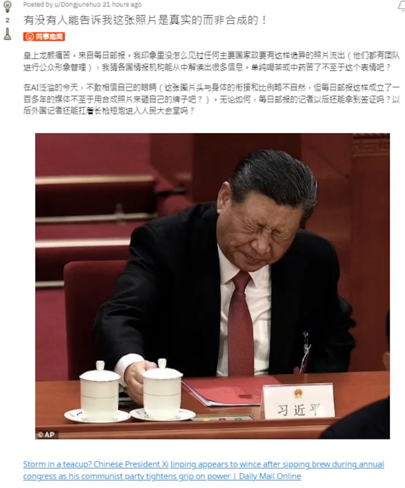
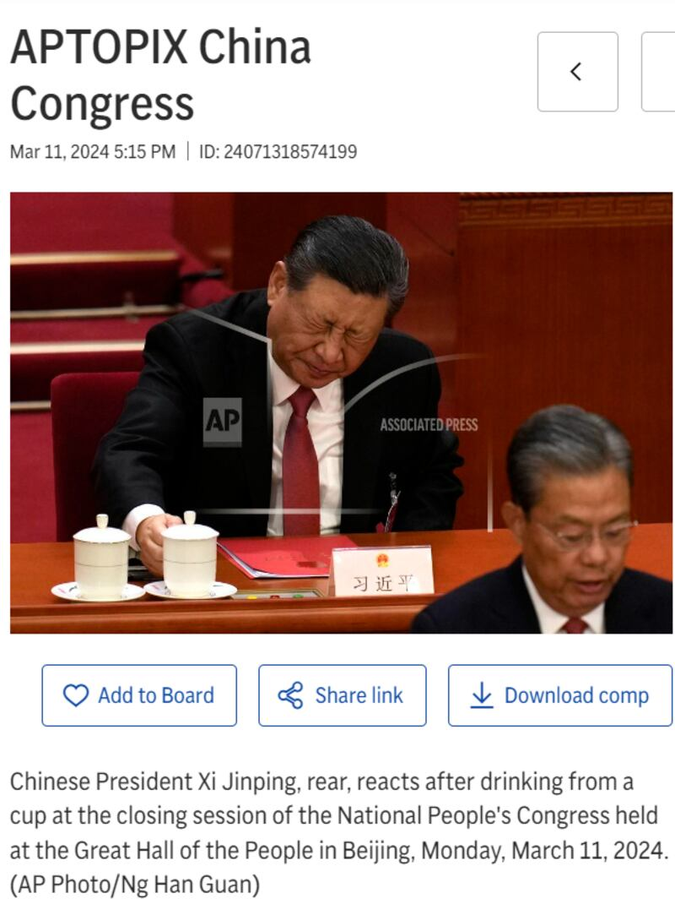

# Is the photo of Xi Jinping frowning genuine?

## Verdict: True

By Zhuang Jing for Asia Fact Check Lab

2024.03.25

Taipei, Taiwan

## A photo of Chinese President Xi Jinping with his eyes closed and frowning has been published by a number of media reports, sparking skepticism among Chinese-speaking social media users regarding its authenticity. Some claim that the photo has been digitally doctored.

## But AFCL found the photo to be genuine. It was taken at “two sessions” in Beijing in early March by the Associated Press.

The claim was [shared](https://twitter.com/i_loder/status/1767757977438896271) on X, formerly known as Twitter, on March 13, 2024.

“This should be a fake picture made by foreign forces using AI,” the claim reads.

The claim was shared alongside a photo of Chinese President Xi Jinping with his eyes closed and frowning.

Screenshot of the Reddit post where its user questions whether the photo of Xi Jinping is genuine or not. (Reddit)

The photo was taken from a report [published](https://www.dailymail.co.uk/news/article-13183627/Chinese-President-Xi-Jinping-annual-congress-communist-party.html) by the British tabloid Daily Mail Online on March 11.

“He [Xi] was spotted seemingly wincing after taking a sip of his brew while attending the closing session of the annual parliamentary meeting,” the caption of the photo reads.

The photo has triggered doubts among Chinese-speaking social media users about whether it is authentic.

“Can anyone tell me if this photo is real and not?” one user asked in the comment section of Reddit.

But AFCL found the photo to be genuine.

## Photo by AP

In the report by the Daily Mail, the publication attributed the photo to the Associated Press, or AP.

Keyword searches on AP’s archives found the corresponding photo published on March 11.

“Chinese President Xi Jinping, rear, reacts after drinking from a cup at the closing session of the National People’s Congress held at the Great Hall of the People in Beijing, Monday, March 11, 2024. (AP Photo),” the caption of the photo reads.

Screenshot of AP archives. (AP)

The photo was also featured in AP’s “Pictures of the Week Asia Photo Gallery” on March 15.

## ‘Rules’ in China

Radio Free Asia reported in 2011 that journalists in China have “rules” to follow when they report the activities of the country’s leaders.

According to the rules, seen by RFA at that time, the images of the leaders must be “clean,” and that no one can be filmed sitting in an indecent position, smoking, playing with a pen, talking on the phone, or eating.

Other “rules” include not taking photos of fruits or people who are reading while holding umbrellas.

A former journalist Liu Yiming told RFA at that time that although these “rules” had always been unwritten at China’s state media, the media would definitely be held accountable by the authorities once violated.

These regulations inevitably restrict press freedom. He said, adding that: “This definitely constitutes a restriction on press freedom.”

## *Edited by Taejun Kang and Malcolm Foster.*

*Asia Fact Check Lab (AFCL) was established to counter disinformation in today’s complex media environment. We publish fact-checks, media-watches and in-depth reports that aim to sharpen and deepen our readers’ understanding of current affairs and public issues. If you like our content, you can also follow us on [Facebook](https://www.facebook.com/asiafactchecklabcn), [Instagram](https://www.instagram.com/asiafactchecklab/) and [X](https://twitter.com/AFCL_eng).*

[Original Source](https://www.rfa.org/english/news/afcl/xi-jinping-frown-03252024105813.html)