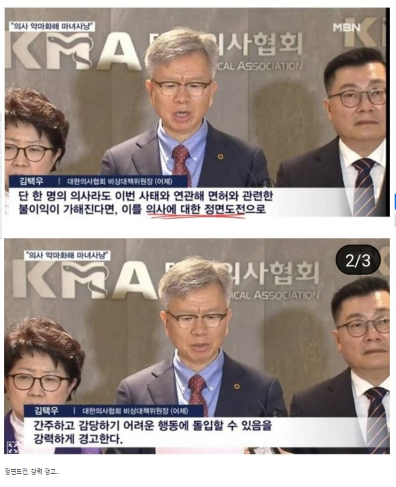
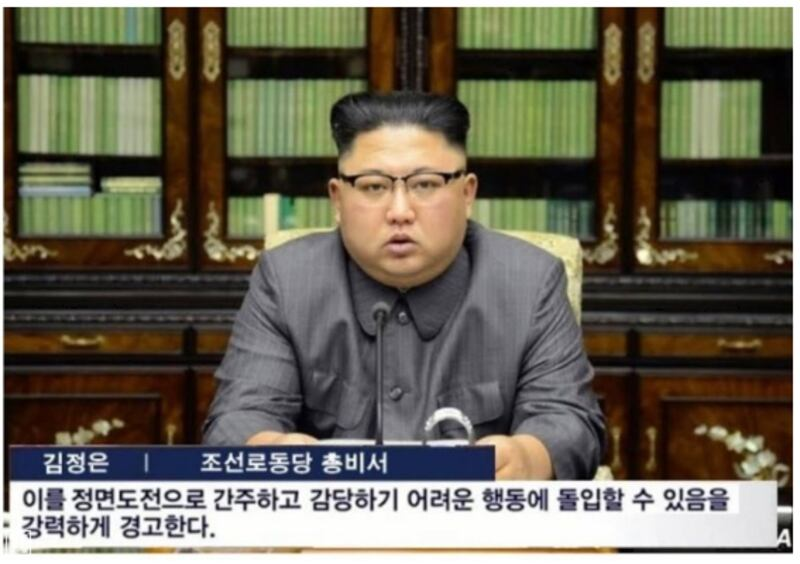

# Did South Korean medical group parrot Kim Jong Un’s remarks?

## Verdict: False

By Taejun Kang for RFA

2024.03.28

Taipei, Taiwan

## A false claim has emerged in Korean-language social media posts that the interim head of South Korea’s largest medical association parroted remarks of the North Korean leader Kim Jong Un.

## The post carried an image of Kim with a fake quote superimposed on it. The image of Kim cited by the claim was actually released in September 2017 with a statement criticizing then-U.S. President Donald Trump. No part of his statement matches what the head of the medical association said.

The claim was [shared](https://www.ppomppu.co.kr/zboard/view.php?id=freeboard&no=8680264) on South Korea's popular online forum Ppomppu, with more than 2.6 million members on Feb. 22.

“Direct challenge, stern warning … I’ve seen similar comments before quite often,” the claim reads.

The post was accompanied by three images.

The first two images at the top show what appears to be Kim Taek-woo, interim head of South Korea’s largest medical association, speaking at a press conference.

A caption under the photos reads: “If even a single doctor is penalized in terms of their license in relation to this incident, we will regard this as a direct challenge against doctors and sternly warn that we may enter into action that will be difficult to handle.”

Screenshot of Ppomppu’s post, taken on March 19, 2024.

The third image shows Kim Jong Un, with wording under it saying: “We regard this as a direct challenge and sternly warn that we may enter into action that will be difficult to handle.”

Screenshot of Ppomppu’s post, taken on March 19, 2024.

Some social media users noted the similarity of remarks and accused Kim Taek-woo of being under North Korean influence.

“He is a pinko,” one user wrote, using a derogatory term to refer to North Korean or communist sympathizers.

“Seems like he was coached [by North Korea],” another user said.

The claim spread amid a major protest by medical personnel in South Korea led by the medical association and other groups. Thousands of South Korean doctors have resigned to protest a government proposal to raise the medical school enrollment quota to address shortages and an aging population.

These striking trainees ignored a government ultimatum set for Feb. 29 to resume work or face legal consequences. Subsequently, on March 5, the government announced its intention to begin notifying the striking medical professionals that their licenses would be suspended.

## Kim Jong Un’s remarks

A Google reverse image search found the photo of Kim Jong Un corresponds to one released by North Korea's state-run Korean Central News Agency on Sept. 22, 2017.

An identical photo was also published by Reuters that day.

“North Korea’s leader Kim Jong Un makes a statement regarding U.S. President Donald Trump’s speech at the U.N. general assembly, in this undated photo released by North Korea’s Korean Central News Agency (KCNA) in Pyongyang September 22, 2017,” reads the caption of the photo.

At that time Trump threatened to “totally destroy North Korea” and branded the North Korean leader “Rocket Man.”

A review of the statement, published by KCNA in both English and Korean, found no part matching the caption seen in the image cited by social media posts.

## Kim Taek-woo’s remarks

A keyword search on Google found that Kim Taek-woo did make such remarks during a press briefing on Feb. 17 in response to warnings by the South Korean government it may cancel protesting doctors' medical licenses if they did not return to work.

The clip of the briefing was [published](https://www.youtube.com/watch?v=fUz5nbyGhUA) by the South Korean broadcaster YTN on Feb. 17.

The corresponding part begins at the 22-second mark of the clip.

Other South Korean news reports also featured his statement as seen [here](https://www.doctorsnews.co.kr/news/articleView.html?idxno=153457) and [here](https://www.mk.co.kr/news/it/10945472).

## *Edited by Malcolm Foster.*

*Asia Fact Check Lab, or AFCL, was established to counter disinformation in today's complex media environment. We publish fact-checks, media-watches and in-depth reports that aim to sharpen and deepen our readers' understanding of current affairs and public issues. If you like our content, you can also follow us on*   [*Facebook*](https://www.facebook.com/asiafactchecklabcn)  *,*   [*Instagram*](https://www.instagram.com/asiafactchecklab/)   *and*   [*X*](https://twitter.com/AFCL_eng)  *.*

[Original Source](https://www.rfa.org/english/news/afcl/fact-check-south-korea-kim-jong-un-03282024121932.html)