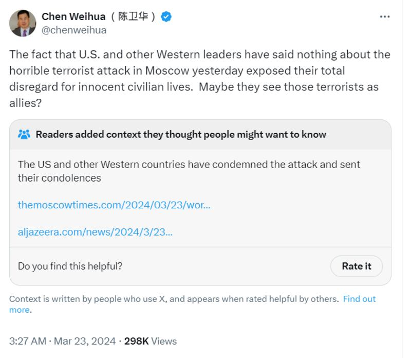
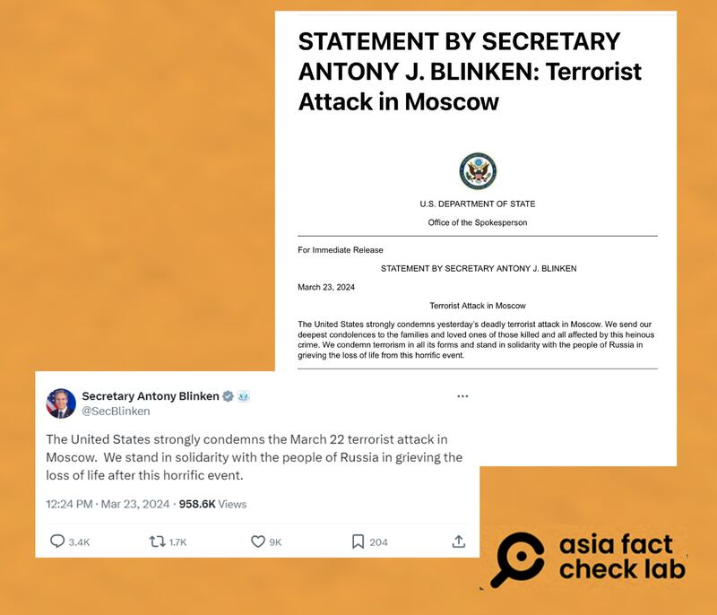
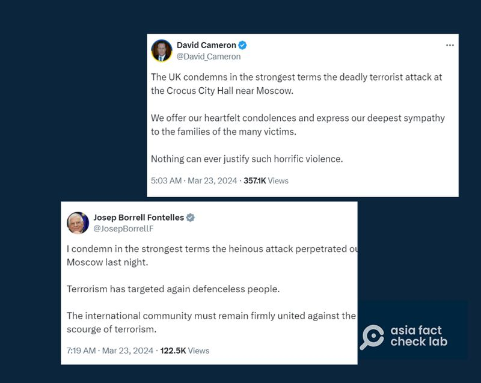
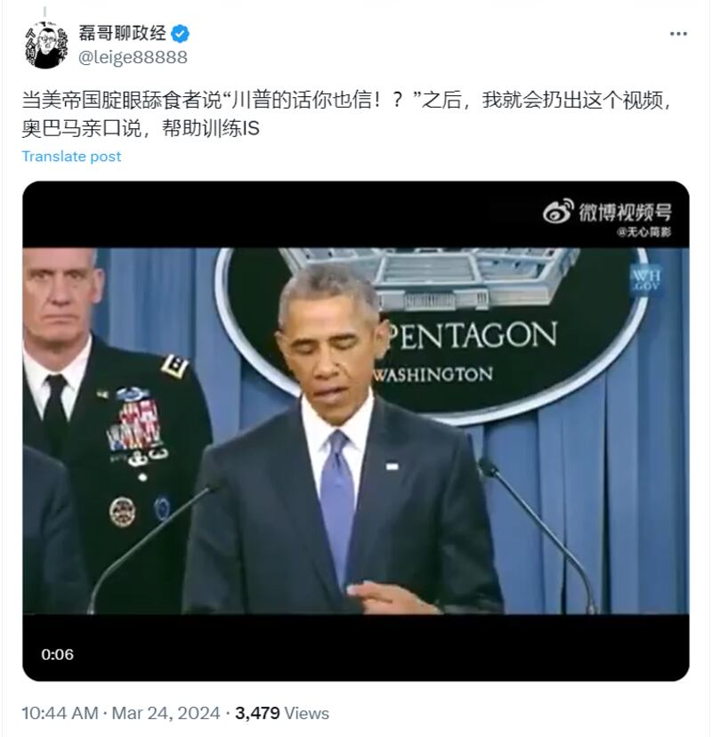
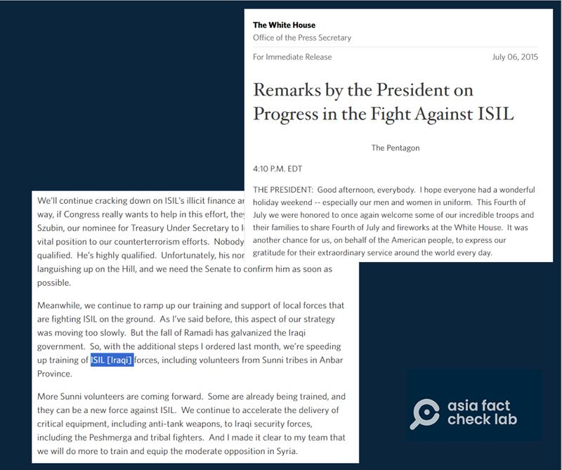
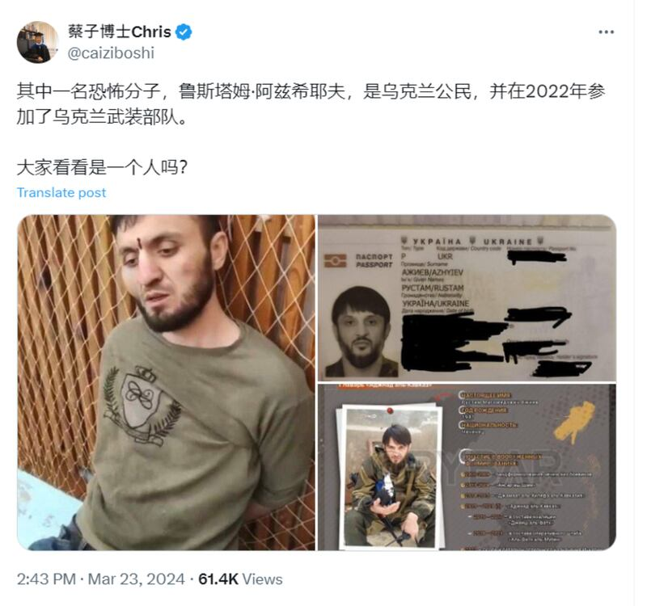

# Media Watch: Moscow attack fuels rumors on Ukraine, US involvement

## Officials and state-backed media in Russia and China are on the frontline, spreading unverified claims.

By Rita Cheng for Asia Fact Check Lab

2024.04.01

Washington

More than 133 people were killed and over 100 injured in last month’s brazen attack on concertgoers just before a performance by a Soviet-era rock band at Moscow’s Crocus City Hall.

Eleven people have been detained, including four people directly involved in the armed assault.

ISIL’s Afghan branch – also known as the Islamic State in Khorasan Province, ISKP (ISIS-K) – claimed responsibility for the March 22 attack and United States officials have confirmed the authenticity of that claim.

In the wake of the incident, a series of rumors emerged online, with Russian President Vladimir Putin and official Russian media outlets claiming that Ukraine and the U.S. had a hand in orchestrating the incident.

In China, the country’s official media outlets and social media influencers repeated similar narratives, making accusations against Western leaders that they turned blind eyes on the incident.

But such claims are either misleading or false. Below is what AFCL found.

## Did Western leaders ignore the casualties of the attack?

Chen Weihua, EU Bureau Chief of China Daily, a Chinese state-run English daily, [claimed in an X post](https://archive.ph/HV6mn) on March 23 that the U.S. and other Western leaders remained silent on the Moscow attack.

“The fact that U.S. and other Western leaders have said nothing about the horrible terrorist attack in Moscow yesterday exposed their total disregard for innocent civilian lives. Maybe they see those terrorists as allies?” the post reads.

Chen Weihua claimed that the U.S. and other Western leaders were silent about the attack. (Screenshot/X)

But his claim is false.

The U.S. State Department [released a statement](https://archive.ph/ycc3C) on March 23, expressing condolences for the victims of the shooting.

U.S. Secretary of State Anthony Blinken also [condemned](https://twitter.com/SecBlinken/status/1771573791459615088) the attack on the same day in an X post.

Separate statements released by the U.S. State Department’s official website (top) and U.S. Secretary of State Anthony Blinken’s official Twitter account (bottom)on March 23 both expressed condolences to the victims of the attack. (Screenshot/U.S. State Department & X)

In addition, the Community Notes attached to Chun’s post read: “The US and other Western countries have condemned the attack and sent their condolences.”

With X’s Community Notes function, users who meet eligibility criteria can rate and write notes. X does not control what shows up.

According to the Community Notes on Chun's post, which cited [Al Jazeera](https://www.aljazeera.com/news/2024/3/23/world-reaction-to-the-attacks-on-moscows-crocus-city-hall) and [The Moscow Times](https://www.themoscowtimes.com/2024/03/23/world-leaders-condemn-russian-concert-hall-attack-a84586), various officials from Western countries spoke out to condemn the terror attack and mourn the victims.

Leaders from various Western countries such as the UK (top) and organizations such as the EU (bottom) and other leaders speak out to condemn the terror attack and mourn the victims. (Screenshot/X)

## Did Obama admit that the U.S. trained ISIS?

A Chinese social media influencer on X called "Brother Lei" claimed in a [post](https://archive.ph/YdcIM) on March 24 that former U.S. President Barack Obama had previously admitted the U.S. helped train ISIS, attaching a clip of him speaking at a news conference as evidence.

A Chinese influencer on X account claimed that Obama admitted the U.S. “helped train ISIS.” (Screenshot/X)

The claim is misleading.

A combination of image and keyword search on Google found the clip was taken from Obama's U.S. Department of Defense news conference held on July 6, 2015, and the full video [published](https://www.dvidshub.net/video/413783/president-barack-obamas-statement-press) by the Pentagon.

At the five-minute and 40-second mark of the full video, Obama can be heard saying, “We are speeding up training of ISIL forces.”

However, a full verbatim transcript of the speech published by the White House made a correction, which indicated that Obama intended to say, “the U.S. was accelerating the training of ‘Iraqi’ forces” rather than ISIL.

The full text of Obama’s speech in July 2015 with the slip of the tongue corrected. (Screenshot/ White House website)

The key message of the news conference was the emphasis on the necessity of international collaboration to effectively tackle ISIS. Obama consistently highlighted the U.S.’s pivotal role in leading the efforts against the terrorist group.

## Ukrainian involvement?

Following the incident, both Russian and Chinese official media outlets claimed that Ukraine played a role in orchestrating the attack.

Such claims are currently unsupported by public evidence and both the [White House](https://apnews.com/article/russia-moscow-gunmen-concert-hall-injuries-fe7db5bb4ad4df17b6cbd04a3250faa1) and Ukrainian President [Volodymyr Zelenskyy](https://twitter.com/ZelenskyyUa/status/1771638417266257987?s=20) have denied any connection.

Separately, a Chinese YouTube "Dr. Cai" [claimed](https://archive.ph/03yNI) that one of the four arrested suspects named Rustam Azhyiev "is a Ukrainian citizen and joined the Ukrainian Armed Forces in 2022."

A Chinese social media influencer on X claims that one of the suspected perpetrators of the terrorist attack is a Ukrainian citizen. (Screenshot/X)

But this claim is unsupported by the currently known list of identified suspects.

Seven of the 11 suspects in custody have been identified, while the remaining four suspects remain unknown. Rustam Azhyiev is not among them, nor are any Ukrainian citizens.

[A report](https://web.archive.org/web/20240325181636/https:/tass.com/emergencies/1765607) by the Russian state-owned news agency TASS published on March 25 names three members of a single family accused of being involved in the terrorist attack, a father named Isroil Islomov and two brothers named Aminchon and Dilovar.

All of the Islomovs were born in Dushanbe, the capital of the former Central Asian Soviet republic and now independent nation of Tajikistan. Tajikistan borders Afghanistan and is part of ISKP’s claimed area of its activities.

The father holds Tajik citizenship while the two brothers are Russian citizens.

[Reports](https://apnews.com/article/russia-shooting-concert-hall-islamic-state-tajikistan-f593d4fb318198a7674a3f51fdd018c6) by the Associated Press further identified the four known suspected gunmen arrested by Russia as Dalerdzhon Mirzoyev, Saidakrami Rachabalizoda, Shamsidin Fariduni, and Mukhammadsobir Faizov. All four are also Tajik citizens.

## *Translated by Shen Ke. Edited by Taejun Kang and Matt Reed.*

## *Asia Fact Check Lab (AFCL) was established to counter disinformation in today’s complex media environment. We publish fact-checks, media-watches and in-depth reports that aim to sharpen and deepen our readers’ understanding of current affairs and public issues. If you like our content, you can also follow us on [Facebook](https：//www.facebook.com/asiafactchecklabcn), [Instagram](https：//www.instagram.com/asiafactchecklab/) and [X](https：//twitter.com/AFCL_eng).*

[Original Source](https://www.rfa.org/english/news/afcl/moscow-concert-attack-04012024122209.html)