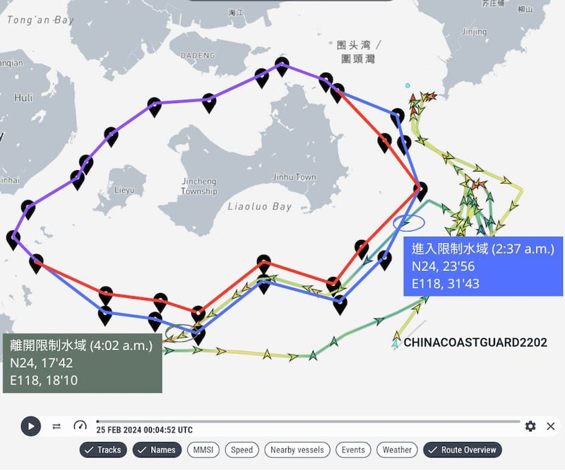
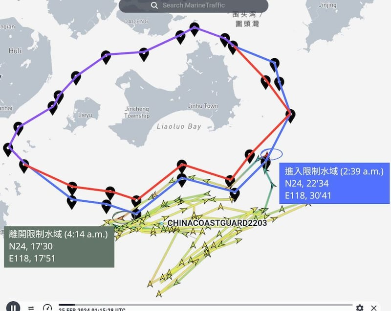
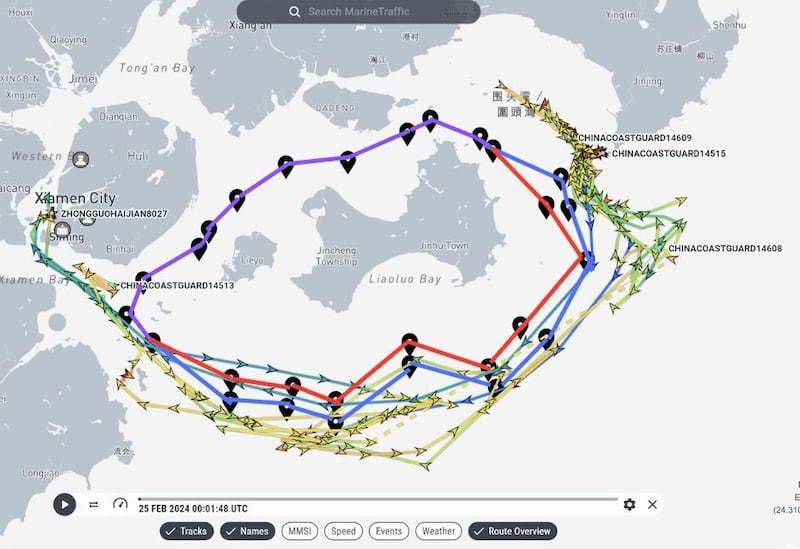
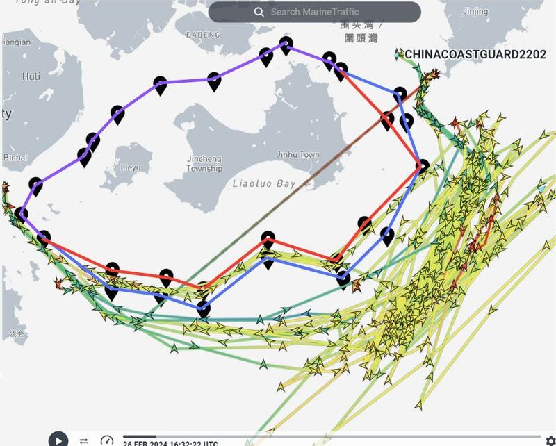
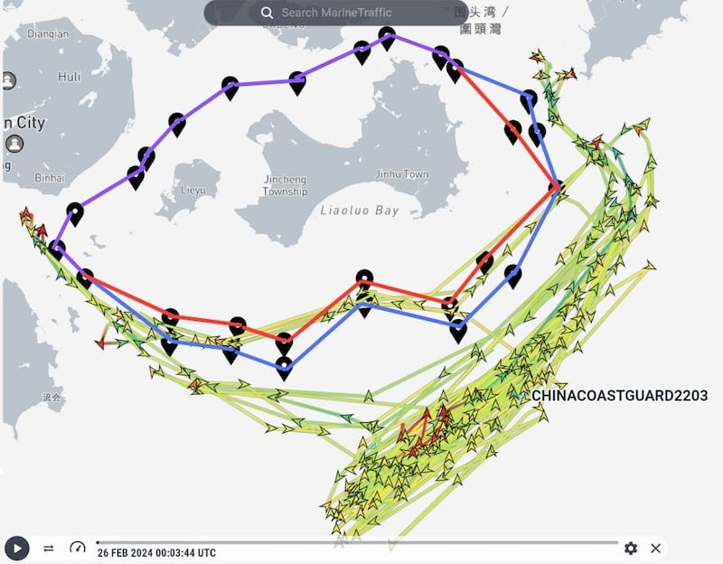
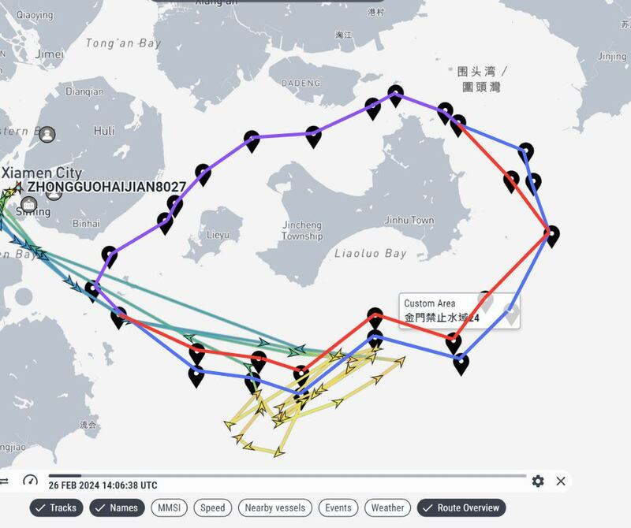
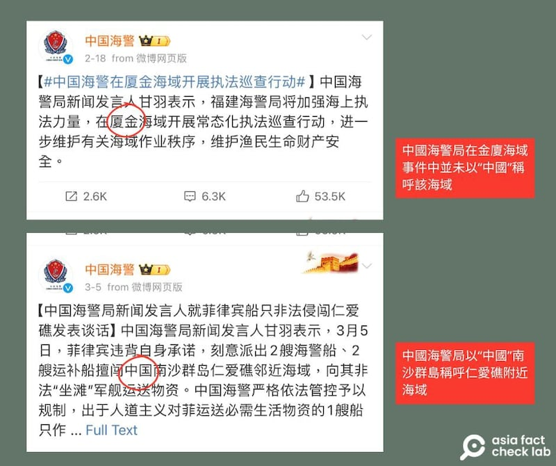

# Did China Coast Guard ships ignore ‘prohibited waters’ around Taiwan’s Kinmen area?

## Verdict: Misleading

By Alan Lu for Asia Fact Check Lab

2024.04.02

Taipei, Taiwan

## Tensions between China and Taiwan have flared following the death of two Chinese fishermen near the Taiwan-controlled Kinmen Island in early February.

## In the wake of that incident, Chinese-language media outlets claimed that China ignores Taiwanese boundaries around the island, and that Chinese Coast Guard vessels entered Taiwan’s “prohibited” waters, closer to the island, during Feb. 25 drills.

## However, a study of open-source intelligence that tracks ship movements showed that the coast guard vessels in fact mostly avoided crossing into “prohibited” waters, briefly doing so only twice between Feb. 25 and March 7.

## Two zones

Kinmen, which is just 10 kilometers (6 miles) from mainland China, is surrounded by two zones of ocean that Taiwan has barred mainland Chinese vessels from entering.

The zones are identical on Kinmen’s west and north coast, closer to mainland China, but they are split into two zones on the south and east side: an outer zone called “restricted waters” and an inner zone closer to the island called “prohibited waters.”

The latter line marking is considered a de facto sea border with China.

Riyue Tantian — a subsidiary social media account of China Central Television, or CCTV — [posted a video](https://weibo.com/7781698041/5005791757079242?layerid=5005791757079242) on Weibo on Feb 26, claiming that its live footage shows China Coast Guard vessels entering Taiwan's prohibited waters around Kinmen during drills conducted the day before.

Parts of both the [video](https://www.ccg.gov.cn/2024/hjyw_0225/2424.html) and [accompanying text](https://www.ccg.gov.cn/2024/hjyw_0225/2423.html) were taken from two separate coast guard press releases earlier that day.

Several [Taiwanese](https://www.chinatimes.com/opinion/20240226004263-262110?chdtv) [news](https://udn.com/news/story/9213/7791235) [outlets](https://www.ettoday.net/news/20240226/2689142.htm%23ixzz8SokhuvJ2) have also made similar claims about the purported intrusion from Chinese vessels, with one [political](https://www.youtube.com/watch?v=cLatoX9s3Hk) talk show even claiming that China has deployed "paramilitary operations" against Kinmen.

But the claims are misleading. Below is what AFCL found.

## Methodology

To pinpoint Chinese ships' exact location around Kinmen, AFCL sourced real-time location data for these ships from [Marine Traffic](https://www.marinetraffic.com/en/ais/home/centerx:108.2/centery:24.0/zoom:5) – an open-source platform regularly cited by [mainstream](https://www.nytimes.com/2017/03/31/business/billionaires-yachts-jets-tracking.html?utm_source=MTBlog&utm_campaign=Blog&utm_content=) [news](https://www.washingtonpost.com/graphics/2017/politics/ivanka-trump-overseas/?utm_term=.7321ef4b2099?utm_source=MTBlog&utm_campaign=Blog&utm_content=) outlets such as *The New York Times* and *The Washington Post*.

The platform only displays data for ships that broadcast their location using radio signals, which are typically relayed via satellites, also known as an open Automatic Identification System, or AIS.

While it’s common for most ships to emit these signals, there are instances where these signals are deliberately deactivated, often by military ships to maintain operational secrecy. AFCL’s analysis focuses on Chinese vessels whose AIS was recorded by Marine Traffic around Kinmen.

After taking screenshots of vessel movements, AFCL then manually added lines over screenshots, illustrating the locations of the relevant Chinese ships as well as “restricted” and “prohibited” waters around Kinmen based on official public data from Taiwan.

## What happened on Feb. 25?

Seven Chinese Coast Guard, or CCG, vessels are recorded as patrolling around Kinmen on Feb. 25, according to the Marine Traffic data.

They include two large former military ships (CCG 2202 and CCG 2203) and five normal patrol ships (CCG 14608, CCG 14609, CCG 14513, CCG 14515 and CMS 8027).

CMS, or China Marine Surveillance, was originally under China’s Ministry of Land and Resources, but later was integrated into the CCG.

Among them, CCG 2202 crossed into Kinmen’s restricted waters a little after 2:00 a.m. while sailing from the southeast towards the southwest.

Marine Traffic uses Coordinated Universal Time (UTC), which is 8 hours behind Taiwan time and 4 hours ahead of Washington time.

CCG 2202 entered restricted waters around Kinmen on the morning of Feb. 25. In this and all screenshots below, the purple line marks the shared restricted and prohibited waters along the west and north of Kinmen. Where the zones split along the island’s south and east sides, the blue line marks restricted waters and the red line prohibited waters. (Screenshot/ Marine Traffic)

At around the same time, CCG 2203 briefly crossed into and made a single pass within the restricted waters alongside the south of Kinmen as the graphic below shows.

CCG 2203 approached restricted waters around Kinmen from the south at the same time CCG 2202 was sailing from the north on Feb. 25. (Screenshot/Marine Traffic)

Both ships approached but never crossed into Kinmen’s prohibited waters, coming within less than 4 nautical miles of Kinmen at one point before veering off into open water at around 4:00 a.m. and continuing their patrols throughout the rest of the day at a distance.

Four of the five other Chinese vessels on patrol near Kinmen on Feb. 25 only entered the island’s restricted waters briefly.

CMS 8027, however, entered Kinmen’s prohibited waters a little before 1:00 a.m. on Feb. 25, the sole Chinese vessel that AFCL observed to have done so that day.

Amongst five other official ships patrolling around Kinmen on Feb. 25, one of them - CMS 8027, marked in indigo above - crossed into Kinmen’s prohibited waters. (Screenshot/Marine Traffic)

Huang Chung-ting, an associate research fellow at the Taiwanese military think tank Institute for National Defense and Security Research, said while the intrusion of CMS patrol ships into Kinmen’s prohibited waters is certainly a provocation towards Taiwan, it is not as strong a challenge as sending former navy vessels such as CCG 2202 and CCG 2203 into these waters.

Compared to regular law enforcement vessels such as CCG 2202 and 2203, the surveillance ships [such as a CMS] have the nature of general administrative purpose only, he explained.

In contrast, the CCG is still now a branch of China’s armed forces directed by the country’s Central Military Commission, which has led U.S. officials to previously state that they may treat the CCG as a part of the Chinese Navy, Huang added.

Huang said activities of CCG ships are likely to be concentrated in Kinmen’s south because the separate borders of the restricted and prohibited waters in that area allow China to perform more calculated escalatory naval movements compared to the northwest and west of the island, where the overlapping restricted and prohibited water limit such provocations.

## After Feb. 25

While China did launch “regular” patrols in the waters near Kinmen following Feb. 25, six of the vessels checked in this article (2202, 2203, 14608, 14609, 14513, and 14515) only crossed slightly over into Kinmen’s restricted waters or sailed a short distance away from it.

Marine Traffic data show that CCG 2202 sailed into Kinmen’s restricted waters again on Feb. 27. In the following week, the ship repeated a similar daily patrol straddling Kinmen’s restricted waters while gradually shifting the main course of its daily routes farther and farther towards the open sea southeast of the island.

CCG 2202 crossed through Kinmen’s restricted waters several times between Feb. 26 to March 6. The straight line running through the middle of Kinmen indicates that the AIS signal disappeared for a time between 8:54 a.m. and 10:02 p.m. on Feb. 29. (Screenshot/Marine Traffic)

CCG 2203’s course mirrored CCG 2202 during the same timeframe, entering Kinmen’s restricted waters on Feb. 27 while gradually shifting the main course of its daily patrols further away from Kinmen to the southeast.

CCG 2203 also sailed through Kinmen’s restricted waters several times from Feb. 26 to March 6. (Screenshot/Marine Traffic)

While CMS 8027 sailed through Kinmen’s prohibited waters again on both Feb. 26 and 27, there was overall very little change in the trajectory of CCG vessels on duty near Kinmen between Feb. 25 and March 7.

CMS 8027 sailed through Kinmen’s prohibited waters between Feb. 26 to March 6. (Screenshot/ Marine Traffic)

## ‘Talk tough and tread carefully’

Huang from the Institute for National Defense and Security Research told AFCL that he does not believe that the situation represents a “reversal” of the long-term status quo surrounding Kinmen, pointing to China’s decision to avoid sending multiple CCG vessels deep into Kinmen’s prohibited waters as evidence.

Huang pointed out that the specific language used in official CCG statements regarding maritime disputes with the Philippines in the South China Sea and with Japan over the Diaoyu Islands highlights a nuanced difference in China’s strategy towards Kinmen.

For instance, the CCG emphasizes that it is conducting patrols within “the range of China’s jurisdictional waters” in the South China Sea, but its statement concerning Kinmen only mentions the “waters around the island,” a sign of the Chinese government’s often used “talk tough and tread carefully” approach towards Taiwan, according to Huang.

The CCG statement about Kinmen only declares that the dispute is occurring in the “waters around Kinmen and Xiamen,” while a statement from the organization concerning a dispute with the Philippines in the South China Sea specifically calls the disputed area “China’s Nansha Islands.” (Screenshot/ CCG Official Weibo)

The variance in terminology and tone suggests that China adopts distinct diplomatic and tactical approaches in its maritime interactions with different neighbors, reflecting tailored strategies based on the unique geopolitical contexts of each dispute.

## *Translated by Shen Ke. Edited by Taejun Kang and Malcolm Foster.*

*Asia Fact Check Lab (AFCL) was established to counter disinformation in today's complex media environment. We publish fact-checks, media-watches and in-depth reports that aim to sharpen and deepen our readers' understanding of current affairs and public issues. If you like our content, you can also follow us on*   [*Facebook*](https://www.facebook.com/asiafactchecklabcn)  *,*   [*Instagram*](https://www.instagram.com/asiafactchecklab/)   *and*   [*X*](https://twitter.com/AFCL_eng)  *.*

[Original Source](https://www.rfa.org/english/news/afcl/fact-check-kinmen-boundary-waters-04022024202027.html)