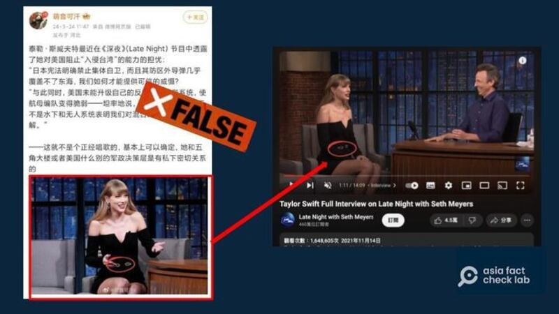

# Did Taylor Swift say the US couldn’t prevent an invasion of Taiwan?

## Verdict: False

By Dong Zhe for Asia Fact Check Lab

2024.04.03

Taipei, Taiwan

## A claim emerged in Chinese-language social media posts that American pop star Taylor Swift had recently stated on a talk show that the United States lacked the ability to prevent an invasion of Taiwan. The posts cited several screenshots purportedly taken from the episode of the show.

## But the claim is false. Screenshots were taken from an interview with Swift on “Late Night with Seth Meyers” aired in 2021. During the show, she made no mention of the U.S., Taiwan or an invasion.

The claim was [shared](https://archive.ph/XDITU) on the popular Chinese social media platform Weibo on March 25. It shared multiple screenshots of an [X post](https://archive.ph/dIhtR) uploaded a day before.

“Taylor Swift recently revealed her concern about our ability to deter an invasion of Taiwan on Late Night,” the post reads in part.

A Weibo influencer claiming that Taylor Swift said the U.S. was incapable of protecting Taiwan on Late Night with Seth Meyers attached screenshots from the purported episode. (Screenshot/ Official Youtube account of Late Night with Seth Meyers)

A reverse image search found the screenshots were taken from Swift’s 2021 appearance on “Late Night with Seth Meyers.” A review of the interview found Swift made no mention of the U.S., Taiwan or an invasion.

Keyword searches also found no credible reports to show that Swift ever stated the U.S. lacked the ability to prevent an invasion of Taiwan.

Clips taken from this same interview had [previously been used as material](https://www.youtube.com/watch?v=ArtqQkltlkI&ab_channel=AIToolsSearch) for a widely spread AI produced video of Swift speaking Mandarin.

## *Translated by Shen Ke. Edited by Taejun Kang and Malcolm Foster.*

*Asia Fact Check Lab (AFCL) was established to counter disinformation in today's complex media environment. We publish fact-checks, media-watches and in-depth reports that aim to sharpen and deepen our readers' understanding of current affairs and public issues. If you like our content, you can also follow us on*   [*Facebook*](https://www.facebook.com/asiafactchecklabcn)  *,*   [*Instagram*](https://www.instagram.com/asiafactchecklab/)   *and*   [*X*](https://twitter.com/AFCL_eng)  *.*

[Original Source](https://www.rfa.org/english/news/afcl/fact-check-taylor-swift-taiwan-04032024103426.html)