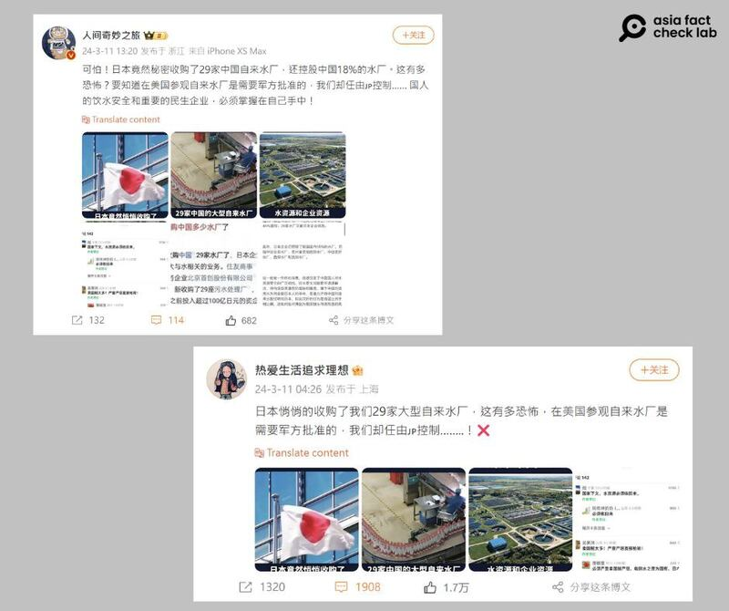
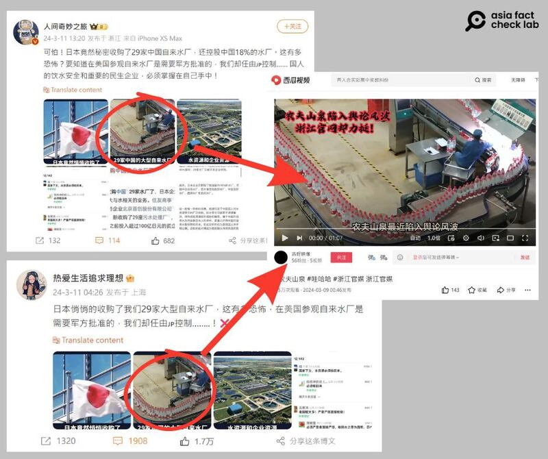

# Does Japan control Chinese water purification plants?

## Verdict: Lack of evidence

By Dong Zhe for Asia Fact Check Lab

2024.04.08

Taipei, Taiwan

## A claim circulating on Chinese-language social media posts says that Japan has an 18% stake in Chinese water purification plants and has secretly acquired ownership of 29 of them.

## But the claim is misleading and also lacks evidence. Several Japanese companies do run joint ventures with 29 Chinese sewage treatment firms – not water purification plants – but Chinese companies control them. And there are no credible reports that show Japanese companies own an 18% stake in Chinese municipal drinking water purification plants.

The claim was [shared](https://archive.ph/WD421) on the popular social media platform Weibo on March 11.

“Scary! Japan has gone so far as to secretly acquire 29 Chinese [drinking] water [purification] plants and also hold 18% shares in such plants in China. How scary is that?” the claim reads in part.

“In the U.S., a military approval is needed to visit such plants. Our national water security and people’s livelihood are in Japan’s hands,” it reads further.

The claim was shared alongside three images. Among them, two appear to show a water purification plant in China.

An influencer on Weibo claimed that Japan secretly acquired ownership of 29 water plants in China, and 18% of domestic water plants. (Screenshot/Weibo)

## Sewage treatment, not drinking water purification

AFCL’s research found that several Japanese companies do run joint ventures with 29 Chinese sewage treatment firms, but these are not drinking water purification plants.

And those sewage treatment joint ventures are [owned](https://zh.cn.nikkei.com/industry/manufacturing/47045-2021-12-21-05-00-40.html) 60% by China's Capital Summit and 40% by Japan's Sumitomo.

AFCL also found no credible reports or statements that show Japan has a controlling stake of 18% in municipal drinking water purification plants in China.

In addition, the photos shared in a misleading Weibo post in fact show promotional material of a mineral water packaging plant of a Chinese company. They are irrelevant to sewage treatment firms or drinking water purification plants.

Pictures of the supposed Sino-Japanese joint owned sewage treatment plants are in reality pictures of unrelated mineral water packaging plants. (Screenshots/Sina Weibo and Xigua Video)

## No military approval needed in the U.S.

AFCL also found that no U.S. water purification plants or sewage treatment facilities require military approval for entrance.

Many of such facilities welcome visitors and offer [walking tour programs](https://www.nashville.gov/departments/water/about-us/tours), although some may impose restrictions like age limits for safety.

These tours usually require that visitors provide their name and contact details but don’t need military authorization.

## *Translated by Shen Ke. Edited by Taejun Kang and Malcolm Foster.*

*Asia Fact Check Lab (AFCL) was established to counter disinformation in today's complex media environment. We publish fact-checks, media-watches and in-depth reports that aim to sharpen and deepen our readers' understanding of current affairs and public issues. If you like our content, you can also follow us on*   [*Facebook*](https://www.facebook.com/asiafactchecklabcn)  *,*   [*Instagram*](https://www.instagram.com/asiafactchecklab/)   *and*   [*X*](https://twitter.com/AFCL_eng)  *.*

[Original Source](https://www.rfa.org/english/news/afcl/fact-check-japan-china-water-treatment-plants-04082024094917.html)