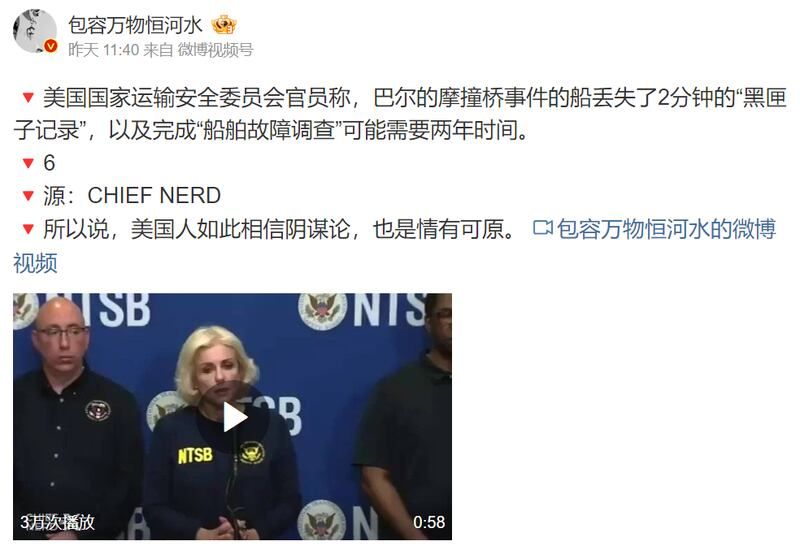
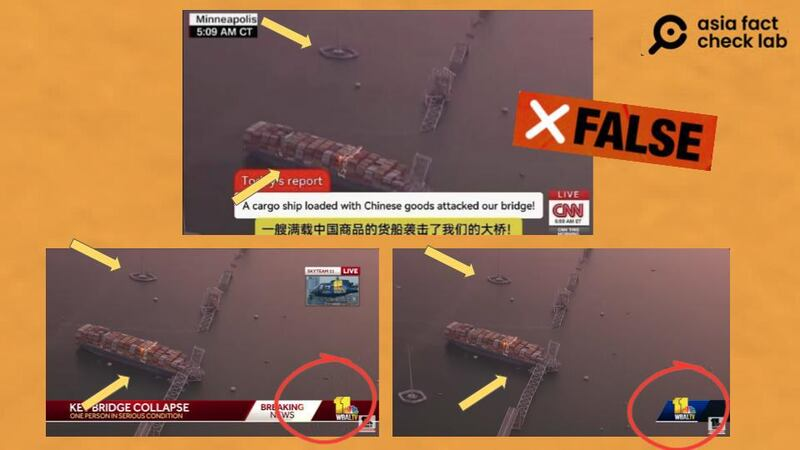

# Media Watch: Baltimore bridge collapse floods internet with rumors

## The incident fuels rumors and inaccurate information both in English and Chinese media outlets.

By Zhuang Jing and Dong Zhe for Asia Fact Check Lab

2024.04.09

Taipei, Taiwan

The Francis Scott Key Bridge in Baltimore collapsed on March 26 after being accidentally hit by a large cargo ship named the Dali. In the aftermath of this incident, rumors and inaccurate information emerged in both Chinese and English media outlets, adding further confusion to the incident.

AFCL checked and investigated some of the most widespread claims and rumors surrounding the incident. Below is what AFCL found.

## Did key information about the Dali before the collision go missing?

A Weibo user [claimed](https://web.archive.org/web/20240403142307/https://m.weibo.cn/detail/5018314292332942) on April 1 that U.S. authorities said they were unable to obtain key positional data from the ship's voyage data recorder, also referred to as a black box, in the minutes leading up to the ship's collision with the bridge.

But this is misleading. Although motion sensors on the ship did stop briefly for about a minute in the time leading up to the collision, the National Transportation Safety Board, or NTSB, was still able to obtain audio of steering commands and rudder movements recorded by the black box during that time.

A Weibo influencer claimed that two minutes of important positional data from the Dali's black box went missing. (Screenshot/Weibo)

Marcel Muise, the NTSB chief investigator for the incident, noted in a report issued by CNN that the ship’s recorder stopped recording sensor data for about one minute at 1:25 a.m. on March 26 – about four and half minutes before the actual collision occurred.

During this time, however, audio on the ship – including rudder orders and steering commands – continued to be recorded without interruption using a backup power source.

## Did CNN report that the Dali was full of Chinese goods?

[Several](https://archive.ph/hfb1L) [influencers](https://archive.ph/3yPUE) on Weibo and Douyin [claimed](https://archive.ph/dmepM) that CNN had reported the Dali was full of Chinese goods when it hit the bridge, citing purported screenshots taken from news broadcast by the American broadcaster.

Chinese influencers claimed CNN reported the vessel that hit the bridge was a Chinese cargo ship. (Screenshot/Weibo)

This is false. The screenshots superimposed a fake CNN headline over footage from a separate Baltimore local news outlet.

A closer look at the screenshots revealed notable differences, including font style, subtitle design, headline presentation, and the appearance of the “LIVE” marker, which diverge from CNN’s authentic standards.

Several details in a purported screenshot of a CNN report on the fall of the bridge - including subtitles and the segment caption - are distinct from the outlet’s standard formatting. (Screenshots/ Weibo & CNN official Youtube channel)

A reverse image search found the screenshots in fact were taken from WBAL-TV, a television station in Baltimore.

The purported CNN screenshot was actually taken from a report by a local Baltimore news station. (Screenshots/ Weibo & WBAL-TV Youtube Channel)

## Did the US Secretary of Transportation request paternity leave after the incident?

One more widespread [claim](https://weibo.com/2624755655/O77Hiq8M8?refer_flag=1001030103_) on Weibo is that the U.S. Secretary of Transportation Pete Buttigieg asked for paternity leave right after the collapse of the bridge.

A screenshot of a Chinese language news report claiming that Buttigieg announced he planned to take three months leave at an emergency news conference was attached below the post.

The report is dated to March 26, 2024, and is sourced from The Babylon Bee.

This is false. The Babylon Bee is a satirical news site, [self described](https://babylonbee.com/about) as "the definitive source of fake news you can trust."

Keyword searches found no credible reports or official announcement about Buttigieg’s paternity leave request.

Weibo influencers cited a satirical news site claiming the Secretary of Transportation asked for paternity leave following the collapse of the bridge as fact. (Screenshot/ Weibo)

## *Translated by Shen Ke. Edited by Taejun Kang and Matt Reed.*

*Asia Fact Check Lab (AFCL) was established to counter disinformation in today's complex media environment. We publish fact-checks, media-watches and in-depth reports that aim to sharpen and deepen our readers' understanding of current affairs and public issues. If you like our content, you can also follow us on*   [*Facebook*](https://www.facebook.com/asiafactchecklabcn)  *,*   [*Instagram*](https://www.instagram.com/asiafactchecklab/)   *and*   [*X*](https://twitter.com/AFCL_eng)  *.*

[Original Source](https://www.rfa.org/english/news/afcl/baltimore-bridge-collapse-04092024093249.html)