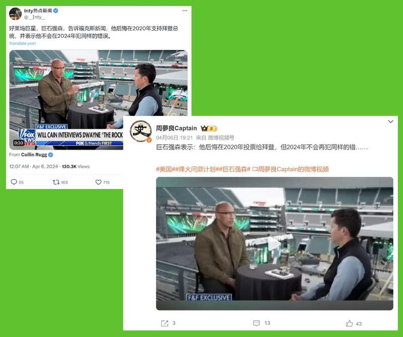
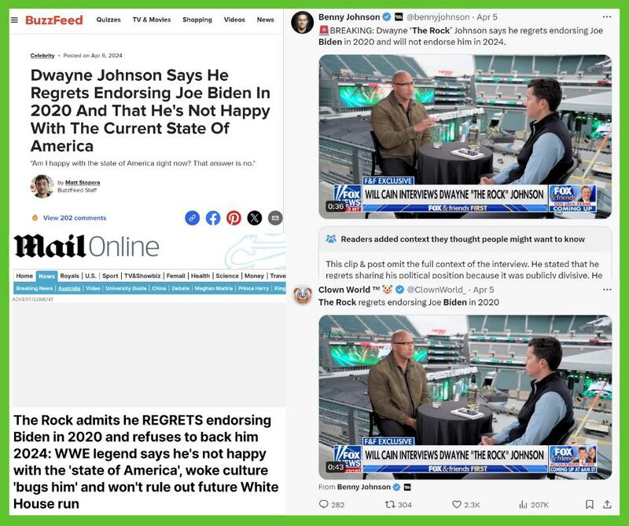
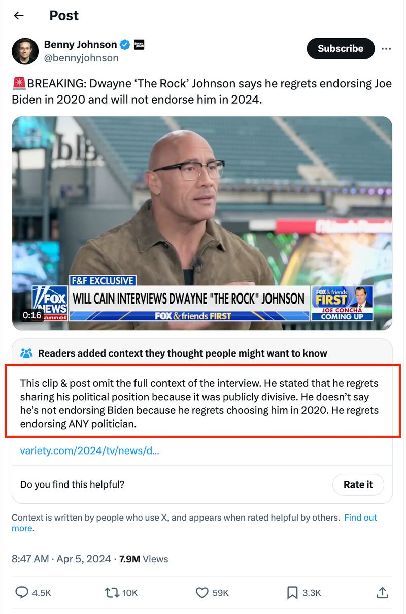

# Did Dwayne Johnson say he regretted supporting Biden in 2020?

## Verdict: Misleading

By Alan Lu for Asia Fact Check Lab

2024.04.15

## As the United States approaches its upcoming presidential elections, certain celebrities have begun to be more vocal about which candidates they will support in November’s vote.

## In this vein, several Chinese influencers on social media have claimed that professional wrestler-turned-actor Dwayne “The Rock” Johnson has said he regrets supporting President Joe Biden in the 2020 presidential election.

## One account on X with over 500,000 followers   [posted a clip](https：//x.com/__Inty__/status/1776280462350262584)   on April 6 taken from an interview Johnson conducted with Fox News earlier that month. The accompanying text stated that in addition to regretting his support of Biden in 2020, Johnson vowed he "won't make the same mistake in 2024."

## Similar claims were subsequently   [made](https：//weibo.com/u/3970333582?tabtype=home&layerid=5020242303256195)   by a widely followed influencer on the Chinese social media site Weibo.

**This is out of context.** In the interview, Johnson did not state he regretted supporting Biden, but rather that he regretted publicly endorsing any candidate in 2020, due to it further dividing an already polarized American society.

Chinese influencers on X and Weibo claimed that Johnson regrets supporting Biden in 2020. (Screenshot/X & Weibo)

During the leadup to the previous U.S. presidential election, Johnson [tweeted](https://twitter.com/TheRock/status/1310198847835000834) a public video endorsement of Biden and Vice President Kamala Harris in September 2020, emphasizing that he was an independent voter who had previously supported candidates from both parties.

Johnson’s original response in the Fox News video was:

“The takeaway after that months and months and months… I started to realize, like oh man, that caused an incredible amount of division in our country. So I realize now going into this election. I’m not going to do that because my goal is to bring our country together. I believe in that in my DNA. So in the spirit of that, there’s going to be no endorsement.”

Johnson never explicitly said he “regretted” his earlier endorsement of the Democratic candidates in 2020. Rather, he only said he will not publicly endorse any candidate in this year’s election, in order to avoid further exacerbating political divisions within the country.

Several English-language popular media outlets such as [Buzzfeed](https://www.buzzfeed.com/mjs538/dwayne-johnson-on-biden), [Daily Mail](https://www.dailymail.co.uk/news/article-13275891/dwayne-rock-johnson-regrets-endorsing-joe-biden-2024-election.html) and [Entertainment Weekly](https://ew.com/dwayne-johnson-regrets-endorsing-joe-biden-in-2020-8627973) also published similar misleading statements about Johnson's message, as have several [social](https://x.com/bennyjohnson/status/1776230142404162011) [media](https://x.com/CitizenFreePres/status/1776231879449993224) [influencers](https://x.com/ClownWorld_/status/1776239334171308104) on X.

A number of English-language social media influencers and news outlets also claimed Johnson stated he regretted his previous endorsement of Biden. (Screenshots/ Buzzfeed, Daily Feed & X)

One such tweet by the conservative U.S. political commentator [Benny Johnson](https://x.com/bennyjohnson/status/1776230142404162011) has reached nearly 8 million views as of press time. X itself placed an official reminder below the tweet informing readers that the post ignored the interview's context.

One popular post from a political commentator on X claiming that Jonhson “regrets endorsing Biden” was tagged with an official alert saying the claim was taken out of context. (Screenshot/X)

## *Translated & edited by Shen Ke. Additional editing by Malcolm Foster.*

*Asia Fact Check Lab (AFCL) was established to counter disinformation in today's complex media environment. We publish fact-checks, media-watches and in-depth reports that aim to sharpen and deepen our readers' understanding of current affairs and public issues. If you like our content, you can also follow us on*   [*Facebook*](https://www.facebook.com/asiafactchecklabcn)  *,*   [*Instagram*](https://www.instagram.com/asiafactchecklab/)   *and*   [*X*](https://twitter.com/AFCL_eng)  *.*

[Original Source](https://www.rfa.org/english/news/afcl/fact-check-biden-the-rock-04152024134709.html)