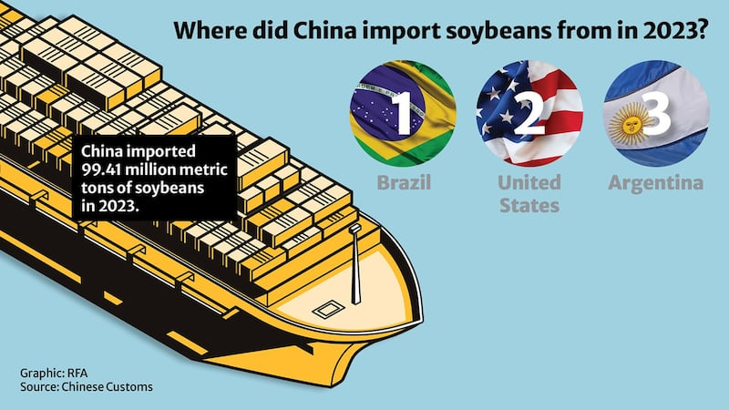
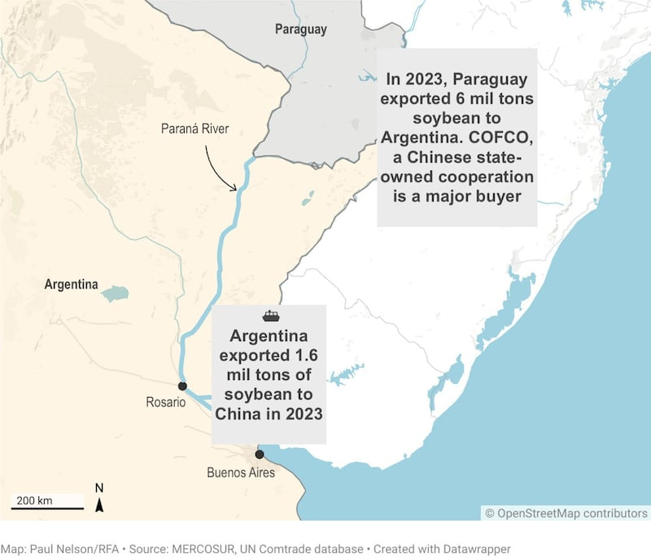

# Does China import zero soybeans from Paraguay?

## Verdict: Missing Context

By Rita Cheng in Washington

2024.04.17

## Paraguay is the only South American country that maintains diplomatic relations with Taiwan – which means it doesn't have diplomatic ties with mainland China. But President Santiago Peña Palacios   [stated](https：//x.com/PresidenciaPy/status/1771289178258448885?s=20)   in March that this has not affected its commercial ties with China, citing its soybean exports as an example.

## However, Chinese Foreign Ministry spokesperson Lin Jian   [denied](https：//x.com/MFA_China/status/1772263335603671238?s=20)   these claims, saying on March 25 that official statistics prove China had not imported any soybeans from Paraguay in recent years.

## Later that same day, Paraguayan presidential spokesperson Paula Carro   [reiterated](https：//www.youtube.com/live/txRbpWUn2Js?feature=shared&t=682)   Peña's original claim at a press conference, saying： "China is one of Paraguay's major importers, and our food products are often exported there through middlemen."

## Both statements are true.

While China has indeed not imported any soybeans directly from Paraguay, large numbers of soybeans originally grown in Paraguay and then shipped to ports in neighboring Uruguay or Argentina have then been exported to China.

Paraguay is a major soybean producer – the world’s sixth-largest producer of soybeans and soybean oil.

China, meanwhile, is the [largest world's largest importer of soybeans](http://www.geichina.org/wp-content/uploads/2019/03/%E5%85%B3%E4%BA%8E%E4%BF%83%E8%BF%9B%E4%B8%AD%E5%9B%BD%E5%A4%A7%E8%B1%86%E8%BF%9B%E5%8F%A3%E5%8F%AF%E6%8C%81%E7%BB%AD%E8%B4%B8%E6%98%93%E7%9A%84%E6%94%BF%E7%AD%96%E6%A2%B3%E7%90%86%E4%B8%8E%E5%88%86%E6%9E%90.pdf), which are used to make tofu and a wide variety of food in Chinese cuisine.

However, as one of only two landlocked countries in South America (the other being neighboring Bolivia), Paraguay must [first ship](https://web.archive.org/web/20220202145315/https:/www.reuters.com/article/paraguay-china-soybeans-idUKL1N1RW1Q9/) its products by river to coastal ports -- typically in Argentina or Uruguay -- before shipping them abroad.

## Intermediary Trade Stops

According to [Chinese customs data](http://www.customs.gov.cn/customs/302249/zfxxgk/2799825/302274/302277/302276/5637474/index.html), the top three source countries for the country's imported 99.4 million tons of soybeans in 2023 were Brazil, the United States and Argentina.

While China and Paraguay [do engage in minimal trade](http://www.customs.gov.cn/customs/302249/zfxxgk/2799825/302274/302277/302276/5637259/index.html) (a little over $250 million total in 2023), statistics from [Chinese custom](http://www.customs.gov.cn/customs/302249/zfxxgk/2799825/302274/302277/302276/5637259/index.html)s and the [Common Market of the South](https://estadisticas.mercosur.int/?language=en), or MERCOSUR -- a South American trade bloc currently composed of full member states Brazil, Argentina, Uruguay and Paraguay – shows that China does not directly import any soybeans from Paraguay.

However, previous Paraguayan officials have made statements similar to those of Peña which clarify the roundabout trade route these beans take.

Former Paraguayan Minister of Industry and Commerce Gustavo Leite [pointed out](https://web.archive.org/web/20220202145315/https:/www.reuters.com/article/paraguay-china-soybeans-idUKL1N1RW1Q9/) in a 2018 interview that Chinese agricultural firms import Paraguayan soybeans from ports in Argentina or Uruguay.

Statistics on the MERCOSUR [database](https://estadisticas.mercosur.int/?language=en) show that soybeans account for more than 80% of Paraguay's exports to Argentina, totaling about 6 million tons in 2023.

Because of its location near both the Atlantic and Pacific Oceans, Argentina [plays an important role](https://trase.earth/insights/argentina-the-overlooked-hub-of-south-american-soy) as a transit point for South American soybeans leaving the continent.

Leite explained that while not technically counted as direct trade between China and Paraguay, these exports still make up a substantial portion of Paraguay's total soybean exports.

## State owned enterprises

Argentina exported 16.05 million tons of soybeans to China in 2023. Although no publicly available data shows exactly what percentage of those exported beans originated in Paraguay, a [report](https://trase.earth/insights/soy-deforestation-risk-in-paraguay-continues-despite-decline) from the agricultural trade data platform Trace that the state-owned China Oil and Foodstuffs Corporation, or COFCO, was the fourth-largest exporter of soybeans from Paraguay in 2019, with more than 70% of those beans shipped to Argentina.

Of the Chinese agricultural companies operating in Paraguay, COFCO alone comprised nearly 10% of Paraguay's soybean production following its [acquisition](https://web.archive.org/web/20190918081444/https:/www.ft.com/content/459671b4-a37a-11e3-aa85-00144feab7de) of the agricultural division of the Hong Kong-based commodity trading company Noble Group in 2014, an enterprise that had been a long term [key buyer and processor](https://web.archive.org/web/20190918081444/https:/www.ft.com/content/459671b4-a37a-11e3-aa85-00144feab7de) of Paraguayan soybeans.

Accounting for nearly 12% of China's domestic soybean market, COFCO's official website [states](https://web.archive.org/web/20240119090541/https:/www.cofcointernational.com/products-services/grains-oilseeds/) that it sources products directly from South American farmers and notes that it has barge facilities in Paraguay as well as ports in Argentina and Brazil. Exports from these ports [have direct access](https://www.cofcointernational.com/media/fyqjkhiq/cof_factsheet_en_052023.pdf) to the Chinese market.

## Paraguay’s diplomatic dance

China requires any country wishing to establish diplomatic relations with it to drop recognition of Taiwan as a separate country since Beijing claims it as its own – even though it doesn’t control the self-governing island.

While not completely shutting off trade with countries recognizing Taiwan, Beijing attempts to minimize such economic ties as a means to its end of diplomatically isolating Taiwan.

Paraguay’s diplomatic ties with Taiwan – and whether the country should recognize China to boost its economic prospects – is a hot topic at every election.

Peña, inaugurated as president in September 2023, has repeatedly said that Paraguay will maintain diplomatic relations with Taiwan, but is open to strengthening trade with China.

According to the Argentine media outlet [La Politica Online](https://web.archive.org/web/20240329214245/https:/www.lapoliticaonline.com/paraguay/economia-py/285801/), Peña met with senior Chinese telecom executives from Huawei during a visit to Spain in February 2024.

## *Translated and edited by Shen Ke. Additional editing by Taejun Kang and Malcolm Foster.*

*Asia Fact Check Lab (AFCL) was established to counter disinformation in today's complex media environment. We publish fact-checks, media-watches and in-depth reports that aim to sharpen and deepen our readers' understanding of current affairs and public issues. If you like our content, you can also follow us on*   [*Facebook*](https://www.facebook.com/asiafactchecklabcn)  *,*   [*Instagram*](https://www.instagram.com/asiafactchecklab/)   *and*   [*X*](https://twitter.com/AFCL_eng)  *.*

[Original Source](https://www.rfa.org/english/news/afcl/fact-check-china-paraguay-soy-beans-04172024144837.html)